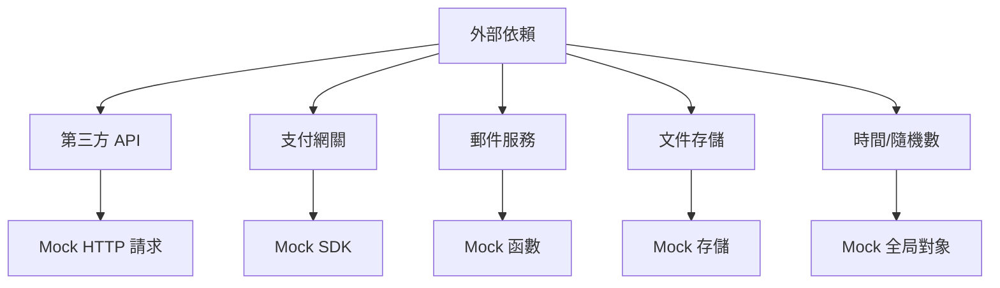

# 9.3.4 外部依賴怎麼辦——Mock 策略：外部依賴的模擬

**Mock 的目的是隔離測試，讓你專注於測試自己的代碼，而不是第三方服務的行爲。**

## 需要 Mock 的場景



## Jest Mock 基礎

### 模擬函數

```typescript
// 創建 Mock 函數
const mockFn = jest.fn();

// 設置返回值
mockFn.mockReturnValue('hello');
mockFn.mockReturnValueOnce('first').mockReturnValueOnce('second');

// 設置異步返回值
mockFn.mockResolvedValue({ data: 'async result' });
mockFn.mockRejectedValue(new Error('failed'));

// 驗證調用
expect(mockFn).toHaveBeenCalled();
expect(mockFn).toHaveBeenCalledWith('arg1', 'arg2');
expect(mockFn).toHaveBeenCalledTimes(2);
```

### 模擬模塊

```typescript
// 自動模擬整個模塊
jest.mock('@/lib/stripe');

// 手動實現模擬
jest.mock('@/lib/email', () => ({
  sendEmail: jest.fn().mockResolvedValue({ success: true }),
  sendBulkEmail: jest.fn().mockResolvedValue({ sent: 10 }),
}));
```

## 常見 Mock 場景

### 場景一：Mock HTTP 請求

```typescript
// 方法一：使用 msw（推薦）
// test/mocks/handlers.ts
import { rest } from 'msw';

export const handlers = [
  rest.get('https://api.example.com/users/:id', (req, res, ctx) => {
    return res(
      ctx.status(200),
      ctx.json({ id: req.params.id, name: 'Test User' })
    );
  }),
  
  rest.post('https://api.example.com/orders', async (req, res, ctx) => {
    const body = await req.json();
    return res(
      ctx.status(201),
      ctx.json({ id: 'order-123', ...body })
    );
  }),
];

// test/mocks/server.ts
import { setupServer } from 'msw/node';
import { handlers } from './handlers';

export const server = setupServer(...handlers);

// jest.setup.ts
import { server } from './test/mocks/server';

beforeAll(() => server.listen());
afterEach(() => server.resetHandlers());
afterAll(() => server.close());
```

```typescript
// 方法二：Mock fetch
global.fetch = jest.fn().mockResolvedValue({
  ok: true,
  json: async () => ({ data: 'mocked' }),
});
```

### 場景二：Mock 支付服務

```typescript
// __mocks__/stripe.ts
export const createPaymentIntent = jest.fn().mockResolvedValue({
  id: 'pi_test_123',
  client_secret: 'secret_123',
  status: 'requires_payment_method',
});

export const confirmPayment = jest.fn().mockResolvedValue({
  id: 'pi_test_123',
  status: 'succeeded',
});

export const refundPayment = jest.fn().mockResolvedValue({
  id: 're_test_123',
  status: 'succeeded',
});

// 測試中使用
jest.mock('@/lib/stripe');

describe('PaymentService', () => {
  it('應創建支付意圖', async () => {
    const result = await paymentService.createIntent(1000, 'CNY');
    
    expect(createPaymentIntent).toHaveBeenCalledWith({
      amount: 1000,
      currency: 'CNY',
    });
    expect(result.client_secret).toBe('secret_123');
  });
});
```

### 場景三：Mock 郵件服務

```typescript
// services/email.service.ts
export class EmailService {
  async sendWelcomeEmail(user: User): Promise<void> {
    await this.send({
      to: user.email,
      subject: '歡迎加入',
      template: 'welcome',
      data: { name: user.name },
    });
  }
}

// __tests__/services/email.service.test.ts
import { EmailService } from '@/services/email.service';

jest.mock('@/lib/mailer', () => ({
  send: jest.fn().mockResolvedValue({ messageId: 'msg-123' }),
}));

import { send } from '@/lib/mailer';

describe('EmailService', () => {
  it('應發送歡迎郵件', async () => {
    const emailService = new EmailService();
    const user = { email: 'test@example.com', name: 'Test' };
    
    await emailService.sendWelcomeEmail(user);
    
    expect(send).toHaveBeenCalledWith(
      expect.objectContaining({
        to: 'test@example.com',
        subject: '歡迎加入',
      })
    );
  });
});
```

### 場景四：Mock 時間

```typescript
// __tests__/services/subscription.service.test.ts
describe('SubscriptionService', () => {
  beforeEach(() => {
    jest.useFakeTimers();
    jest.setSystemTime(new Date('2024-01-15'));
  });

  afterEach(() => {
    jest.useRealTimers();
  });

  it('應正確計算訂閱到期日', async () => {
    const subscription = await subscriptionService.create({
      userId: 'user-1',
      plan: 'monthly',
    });

    expect(subscription.expiresAt).toEqual(new Date('2024-02-15'));
  });

  it('應識別過期訂閱', async () => {
    const subscription = await createSubscription({
      expiresAt: new Date('2024-01-10'), // 已過期
    });

    expect(subscription.isExpired()).toBe(true);
  });
});
```

### 場景五：Mock 文件上傳

```typescript
// __mocks__/@/lib/storage.ts
export const uploadFile = jest.fn().mockResolvedValue({
  url: 'https://cdn.example.com/files/test.jpg',
  key: 'files/test.jpg',
});

export const deleteFile = jest.fn().mockResolvedValue(undefined);

// 測試
describe('FileService', () => {
  it('應上傳文件並返回 URL', async () => {
    const file = new File(['test'], 'test.jpg', { type: 'image/jpeg' });
    
    const result = await fileService.upload(file);
    
    expect(result.url).toBe('https://cdn.example.com/files/test.jpg');
    expect(uploadFile).toHaveBeenCalledWith(file, expect.any(Object));
  });
});
```

## Mock 最佳實踐

### 1. 只 Mock 邊界

```typescript
// ✅ 好：Mock 外部服務邊界
jest.mock('@/lib/stripe');

// ❌ 壞：Mock 內部模塊
jest.mock('@/services/order.service');
```

### 2. 驗證 Mock 被調用

```typescript
it('應調用支付服務', async () => {
  await orderService.checkout(orderId);
  
  // 驗證外部服務被正確調用
  expect(createPaymentIntent).toHaveBeenCalledWith(
    expect.objectContaining({
      amount: 1000,
      currency: 'CNY',
    })
  );
});
```

### 3. 測試錯誤場景

```typescript
it('支付失敗時應回滾訂單', async () => {
  confirmPayment.mockRejectedValueOnce(new Error('Card declined'));
  
  await expect(orderService.checkout(orderId)).rejects.toThrow('支付失敗');
  
  const order = await prisma.order.findUnique({ where: { id: orderId } });
  expect(order?.status).toBe('CANCELLED');
});
```

### 4. 清理 Mock 狀態

```typescript
// jest.config.ts
export default {
  clearMocks: true,    // 每次測試後清理調用記錄
  restoreMocks: true,  // 每次測試後恢復原始實現
};

// 或手動清理
afterEach(() => {
  jest.clearAllMocks();
});
```

## 本節小結

Mock 是隔離測試的重要工具。只 Mock 外部邊界（第三方 API、支付、郵件等），保持內部邏輯的真實測試。使用 MSW 處理 HTTP 請求，使用 `jest.fn()` 處理函數調用，使用 `jest.useFakeTimers()` 處理時間相關測試。記住：**Mock 越少越好，但邊界必須 Mock**。
