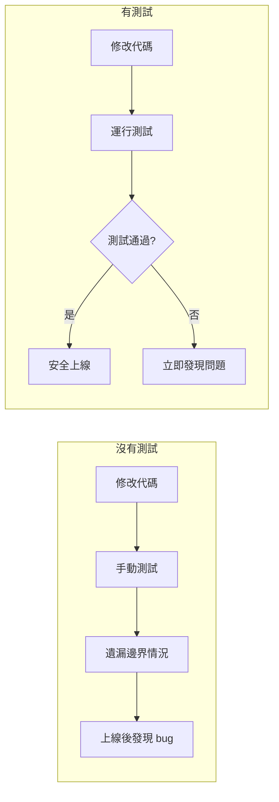

# 9.3 給你的代碼上保險——單元測試/集成測試：Jest + Test DB；seed 前置

**自動化測試是你代碼的保險單——每次改動都能自動驗證是否破壞了已有功能。**

## 爲什麼需要自動化測試



## 本節技術棧

| 工具 | 用途 | 選擇理由 |
|------|------|---------|
| Jest | 測試框架 | 零配置、快照測試、Mock 支持 |
| ts-jest | TypeScript 支持 | 直接運行 TS 測試 |
| @testing-library | React 測試 | 面向用戶行爲的測試 |
| supertest | API 測試 | 簡潔的 HTTP 斷言 |

## 快速開始配置

```bash
# 安裝依賴
npm install -D jest ts-jest @types/jest

# 初始化配置
npx ts-jest config:init
```

```typescript
// jest.config.ts
import type { Config } from 'jest';

const config: Config = {
  preset: 'ts-jest',
  testEnvironment: 'node',
  roots: ['<rootDir>/src', '<rootDir>/__tests__'],
  testMatch: ['**/*.test.ts', '**/*.spec.ts'],
  setupFilesAfterEnv: ['<rootDir>/jest.setup.ts'],
  moduleNameMapper: {
    '^@/(.*)$': '<rootDir>/src/$1',
  },
};

export default config;
```

## 本節核心內容

| 小節 | 主題 | 解決的問題 |
|------|------|-----------|
| 9.3.1 | Jest 配置 | 如何配置測試框架和斷言庫 |
| 9.3.2 | 測試數據庫 | 內存數據庫 vs 真實數據庫的選擇 |
| 9.3.3 | Seed 數據 | 如何準備測試用例所需的數據 |
| 9.3.4 | Mock 策略 | 如何模擬外部依賴 |

## 測試文件組織

```
project/
├── src/
│   ├── services/
│   │   └── order.service.ts
│   └── utils/
│       └── price.ts
├── __tests__/
│   ├── services/
│   │   └── order.service.test.ts
│   ├── api/
│   │   └── orders.test.ts
│   └── helpers/
│       ├── factory.ts
│       └── cleanup.ts
├── jest.config.ts
└── jest.setup.ts
```

## 本節小結

自動化測試是現代軟件開發的基礎設施。通過 Jest 和測試數據庫的配合，可以實現從單元測試到集成測試的完整覆蓋。關鍵是選擇合適的工具、組織好測試代碼、準備好測試數據。接下來的小節將詳細介紹每個環節的具體實現。
