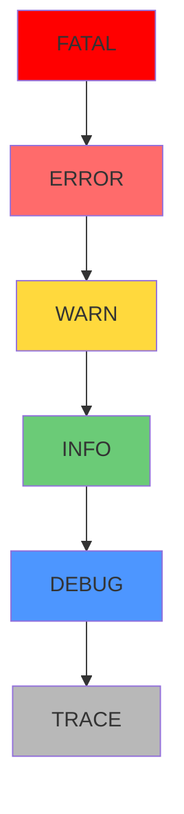

# 9.4.1 錯誤也分等級——日誌級別：ERROR/WARN/INFO/DEBUG 使用

**日誌級別決定了什麼信息該記錄、什麼時候該告警。**

## 日誌級別層次



## 級別使用指南

| 級別 | 使用場景 | 是否告警 | 示例 |
|------|----------|----------|------|
| ERROR | 需要人工介入的錯誤 | ✅ 立即 | 支付失敗、數據庫連接斷開 |
| WARN | 潛在問題但可恢復 | ⚠️ 聚合 | 重試成功、降級處理 |
| INFO | 重要業務事件 | ❌ | 用戶註冊、訂單創建 |
| DEBUG | 開發調試信息 | ❌ | SQL 查詢、函數參數 |

## ERROR：需要立即處理

```typescript
// ✅ 正確使用 ERROR
try {
  await stripe.charges.create(paymentData);
} catch (err) {
  logger.error({
    err,
    userId,
    orderId,
    amount,
  }, '支付處理失敗，需要人工介入');
  
  // 同時發送告警
  await alertService.sendCritical({
    title: '支付失敗',
    details: { orderId, error: err.message },
  });
  
  throw new PaymentError('支付失敗，請稍後重試');
}

// ❌ 錯誤示例：不是所有異常都是 ERROR
try {
  const user = await prisma.user.findUnique({ where: { id } });
  if (!user) {
    logger.error('用戶不存在'); // ❌ 這應該是業務邏輯，不是 ERROR
  }
} catch (err) {
  // ...
}
```

## WARN：值得關注但不緊急

```typescript
// ✅ 正確使用 WARN
async function getInventory(productId: string) {
  try {
    return await inventoryService.getStock(productId);
  } catch (err) {
    logger.warn({
      productId,
      err,
      fallback: 'cache',
    }, '庫存服務不可用，使用緩存數據');
    
    return await cache.get(`inventory:${productId}`);
  }
}

// ✅ 重試成功的情況
async function sendEmailWithRetry(email: EmailData) {
  for (let i = 0; i < 3; i++) {
    try {
      return await emailService.send(email);
    } catch (err) {
      if (i < 2) {
        logger.warn({
          attempt: i + 1,
          email: email.to,
          err,
        }, '郵件發送失敗，正在重試');
        await sleep(1000 * (i + 1));
      } else {
        throw err;
      }
    }
  }
}
```

## INFO：業務關鍵事件

```typescript
// ✅ 正確使用 INFO
export async function createOrder(userId: string, items: OrderItem[]) {
  const order = await prisma.order.create({
    data: {
      userId,
      items: { create: items },
      status: 'PENDING',
    },
  });
  
  logger.info({
    action: 'order.created',
    orderId: order.id,
    userId,
    itemCount: items.length,
    total: order.total,
  }, '訂單創建成功');
  
  return order;
}

// ✅ 用戶認證事件
logger.info({
  action: 'user.login',
  userId,
  method: 'password',
  ip: req.ip,
}, '用戶登錄成功');

logger.info({
  action: 'user.logout',
  userId,
  sessionDuration: Date.now() - session.createdAt,
}, '用戶登出');
```

## DEBUG：開發調試

```typescript
// ✅ 正確使用 DEBUG
export async function searchProducts(query: SearchQuery) {
  logger.debug({ query }, '搜索參數');
  
  const results = await prisma.product.findMany({
    where: buildWhereClause(query),
    orderBy: buildOrderBy(query.sort),
    take: query.limit,
    skip: query.offset,
  });
  
  logger.debug({
    query,
    resultCount: results.length,
    executionTime: Date.now() - startTime,
  }, '搜索完成');
  
  return results;
}
```

## 環境配置

```typescript
// lib/logger.ts
import pino from 'pino';

const levels = {
  production: 'info',
  development: 'debug',
  test: 'warn',
};

export const logger = pino({
  level: process.env.LOG_LEVEL || levels[process.env.NODE_ENV] || 'info',
});
```

```bash
# .env.production
LOG_LEVEL=info

# .env.development
LOG_LEVEL=debug

# .env.test
LOG_LEVEL=warn
```

## 常見錯誤

```typescript
// ❌ 用 console.log 代替日誌
console.log('用戶創建成功', user);

// ✅ 使用結構化日誌
logger.info({ action: 'user.created', userId: user.id }, '用戶創建成功');

// ❌ 所有錯誤都用 ERROR
logger.error('用戶不存在'); // 這是正常業務邏輯

// ✅ 區分業務邏輯和系統錯誤
if (!user) {
  logger.debug({ userId }, '用戶不存在');
  throw new NotFoundError('用戶不存在');
}

// ❌ DEBUG 日誌太詳細
logger.debug({ request: req }); // 包含敏感信息

// ✅ 只記錄必要信息
logger.debug({ 
  method: req.method, 
  path: req.path,
  query: req.query,
}, '收到請求');
```

## 本節小結

日誌級別是分類信息的工具：ERROR 需要立即處理，WARN 值得關注，INFO 記錄業務事件，DEBUG 用於開發調試。正確使用級別能讓告警更精準，排查問題更高效。
