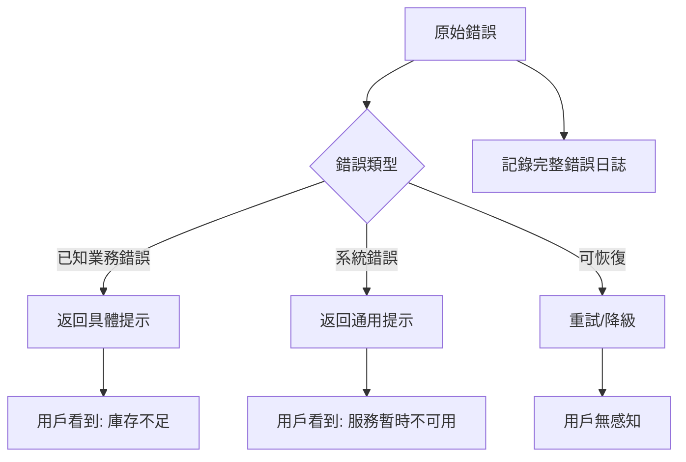

# 9.4.4 崩了也要優雅——錯誤恢復：異常處理與用戶提示

**用戶不需要知道數據庫連接超時——他們只需要知道"請稍後重試"。**

## 錯誤處理層次



## 自定義錯誤類

```typescript
// lib/errors.ts
export class AppError extends Error {
  constructor(
    message: string,
    public code: string,
    public statusCode: number = 500,
    public isOperational: boolean = true
  ) {
    super(message);
    this.name = 'AppError';
  }
}

export class ValidationError extends AppError {
  constructor(message: string, public field?: string) {
    super(message, 'VALIDATION_ERROR', 400);
  }
}

export class NotFoundError extends AppError {
  constructor(resource: string) {
    super(`${resource}不存在`, 'NOT_FOUND', 404);
  }
}

export class AuthenticationError extends AppError {
  constructor(message = '請先登錄') {
    super(message, 'UNAUTHORIZED', 401);
  }
}

export class ForbiddenError extends AppError {
  constructor(message = '沒有權限執行此操作') {
    super(message, 'FORBIDDEN', 403);
  }
}

export class ConflictError extends AppError {
  constructor(message: string) {
    super(message, 'CONFLICT', 409);
  }
}

export class RateLimitError extends AppError {
  constructor() {
    super('請求太頻繁，請稍後再試', 'RATE_LIMIT', 429);
  }
}
```

## 全局錯誤處理

```typescript
// lib/error-handler.ts
import { NextResponse } from 'next/server';
import { logger } from './logger';
import { AppError } from './errors';

export function handleError(err: unknown) {
  // 已知業務錯誤
  if (err instanceof AppError) {
    logger.warn({
      code: err.code,
      message: err.message,
      statusCode: err.statusCode,
    }, '業務錯誤');
    
    return NextResponse.json(
      { error: { code: err.code, message: err.message } },
      { status: err.statusCode }
    );
  }
  
  // Prisma 錯誤
  if (err instanceof Prisma.PrismaClientKnownRequestError) {
    return handlePrismaError(err);
  }
  
  // 未知錯誤
  logger.error({ err }, '未處理的錯誤');
  
  return NextResponse.json(
    { error: { code: 'INTERNAL_ERROR', message: '服務暫時不可用，請稍後重試' } },
    { status: 500 }
  );
}

function handlePrismaError(err: Prisma.PrismaClientKnownRequestError) {
  switch (err.code) {
    case 'P2002':
      return NextResponse.json(
        { error: { code: 'DUPLICATE', message: '數據已存在' } },
        { status: 409 }
      );
    case 'P2025':
      return NextResponse.json(
        { error: { code: 'NOT_FOUND', message: '數據不存在' } },
        { status: 404 }
      );
    default:
      logger.error({ err, code: err.code }, 'Prisma 錯誤');
      return NextResponse.json(
        { error: { code: 'DATABASE_ERROR', message: '數據庫操作失敗' } },
        { status: 500 }
      );
  }
}
```

## API 路由使用

```typescript
// app/api/orders/route.ts
import { handleError } from '@/lib/error-handler';
import { ValidationError, NotFoundError } from '@/lib/errors';

export async function POST(request: NextRequest) {
  try {
    const body = await request.json();
    
    // 業務驗證
    if (!body.items?.length) {
      throw new ValidationError('請選擇商品', 'items');
    }
    
    // 檢查庫存
    const outOfStock = await checkStock(body.items);
    if (outOfStock.length) {
      throw new ValidationError(
        `以下商品庫存不足：${outOfStock.join('、')}`
      );
    }
    
    const order = await orderService.create(body);
    return NextResponse.json(order, { status: 201 });
    
  } catch (err) {
    return handleError(err);
  }
}
```

## 重試機制

```typescript
// lib/retry.ts
interface RetryOptions {
  maxRetries?: number;
  delay?: number;
  backoff?: number;
  shouldRetry?: (err: Error) => boolean;
}

export async function withRetry<T>(
  fn: () => Promise<T>,
  options: RetryOptions = {}
): Promise<T> {
  const {
    maxRetries = 3,
    delay = 1000,
    backoff = 2,
    shouldRetry = () => true,
  } = options;
  
  let lastError: Error;
  
  for (let attempt = 0; attempt <= maxRetries; attempt++) {
    try {
      return await fn();
    } catch (err) {
      lastError = err as Error;
      
      if (attempt === maxRetries || !shouldRetry(lastError)) {
        throw lastError;
      }
      
      logger.warn({
        attempt: attempt + 1,
        maxRetries,
        error: lastError.message,
      }, '操作失敗，準備重試');
      
      await sleep(delay * Math.pow(backoff, attempt));
    }
  }
  
  throw lastError!;
}
```

```typescript
// 使用重試
const result = await withRetry(
  () => externalApi.call(data),
  {
    maxRetries: 3,
    delay: 1000,
    shouldRetry: (err) => err.message.includes('timeout'),
  }
);
```

## 降級處理

```typescript
// services/recommendation.service.ts
export async function getRecommendations(userId: string) {
  try {
    return await recommendationApi.get(userId);
  } catch (err) {
    logger.warn({ err, userId }, '推薦服務不可用，使用降級數據');
    
    // 降級到熱門商品
    return await getPopularProducts();
  }
}
```

## 用戶友好的錯誤消息

```typescript
// lib/user-messages.ts
const errorMessages: Record<string, string> = {
  VALIDATION_ERROR: '請檢查輸入信息',
  NOT_FOUND: '找不到相關內容',
  UNAUTHORIZED: '請先登錄',
  FORBIDDEN: '沒有權限',
  RATE_LIMIT: '操作太頻繁，請稍後再試',
  PAYMENT_FAILED: '支付失敗，請重試或更換支付方式',
  STOCK_INSUFFICIENT: '庫存不足',
  INTERNAL_ERROR: '服務暫時不可用，請稍後重試',
};

export function getUserMessage(code: string): string {
  return errorMessages[code] || '發生未知錯誤，請稍後重試';
}
```

## 前端錯誤處理

```typescript
// lib/api-client.ts
export async function apiRequest<T>(url: string, options?: RequestInit): Promise<T> {
  const response = await fetch(url, options);
  
  if (!response.ok) {
    const error = await response.json();
    
    // 顯示用戶友好的錯誤消息
    toast.error(error.error?.message || '請求失敗');
    
    throw new ApiError(
      error.error?.code || 'UNKNOWN',
      error.error?.message || '請求失敗',
      response.status
    );
  }
  
  return response.json();
}
```

## 本節小結

錯誤恢復的核心是**對外友好、對內詳細**。用戶看到的是簡潔的錯誤提示，開發者看到的是完整的錯誤上下文。通過自定義錯誤類區分業務錯誤和系統錯誤，通過重試和降級提高系統韌性。
