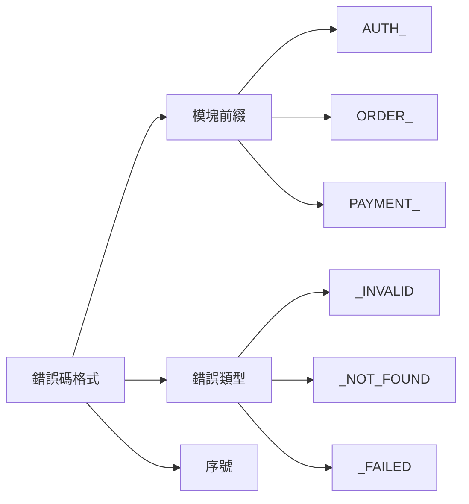

# 9.4.5 錯誤要記錄在案——文檔同步：錯誤碼文檔與處理指南

**錯誤碼文檔是前後端協作的"合同"——改了代碼必須更新文檔。**

## 錯誤碼設計規範



## 錯誤碼定義

```typescript
// lib/error-codes.ts
export const ErrorCodes = {
  // 認證錯誤 (1xxx)
  AUTH_INVALID_CREDENTIALS: {
    code: 'AUTH_1001',
    message: '郵箱或密碼錯誤',
    httpStatus: 401,
  },
  AUTH_TOKEN_EXPIRED: {
    code: 'AUTH_1002',
    message: '登錄已過期，請重新登錄',
    httpStatus: 401,
  },
  AUTH_INSUFFICIENT_PERMISSION: {
    code: 'AUTH_1003',
    message: '沒有權限執行此操作',
    httpStatus: 403,
  },
  
  // 訂單錯誤 (2xxx)
  ORDER_NOT_FOUND: {
    code: 'ORDER_2001',
    message: '訂單不存在',
    httpStatus: 404,
  },
  ORDER_ALREADY_PAID: {
    code: 'ORDER_2002',
    message: '訂單已支付',
    httpStatus: 409,
  },
  ORDER_STOCK_INSUFFICIENT: {
    code: 'ORDER_2003',
    message: '庫存不足',
    httpStatus: 400,
  },
  
  // 支付錯誤 (3xxx)
  PAYMENT_FAILED: {
    code: 'PAYMENT_3001',
    message: '支付失敗，請重試',
    httpStatus: 400,
  },
  PAYMENT_TIMEOUT: {
    code: 'PAYMENT_3002',
    message: '支付超時',
    httpStatus: 408,
  },
  
  // 系統錯誤 (9xxx)
  SYSTEM_ERROR: {
    code: 'SYSTEM_9001',
    message: '服務暫時不可用，請稍後重試',
    httpStatus: 500,
  },
  SYSTEM_MAINTENANCE: {
    code: 'SYSTEM_9002',
    message: '系統維護中，請稍後訪問',
    httpStatus: 503,
  },
} as const;

export type ErrorCode = keyof typeof ErrorCodes;
```

## 使用錯誤碼

```typescript
// lib/errors.ts
import { ErrorCodes, ErrorCode } from './error-codes';

export class AppError extends Error {
  public code: string;
  public httpStatus: number;
  
  constructor(errorCode: ErrorCode, customMessage?: string) {
    const errorDef = ErrorCodes[errorCode];
    super(customMessage || errorDef.message);
    
    this.code = errorDef.code;
    this.httpStatus = errorDef.httpStatus;
  }
}

// 使用
throw new AppError('ORDER_STOCK_INSUFFICIENT');
throw new AppError('ORDER_NOT_FOUND', `訂單 ${orderId} 不存在`);
```

## 自動生成文檔

```typescript
// scripts/generate-error-docs.ts
import { ErrorCodes } from '../lib/error-codes';
import * as fs from 'fs';

function generateErrorDocs() {
  const grouped = groupByModule(ErrorCodes);
  
  let markdown = '# API 錯誤碼文檔\n\n';
  markdown += `> 更新時間: ${new Date().toISOString()}\n\n`;
  
  for (const [module, errors] of Object.entries(grouped)) {
    markdown += `## ${module}\n\n`;
    markdown += '| 錯誤碼 | HTTP 狀態 | 描述 | 處理建議 |\n';
    markdown += '|--------|----------|------|----------|\n';
    
    for (const [key, error] of Object.entries(errors)) {
      markdown += `| ${error.code} | ${error.httpStatus} | ${error.message} | ${getHandlingTip(key)} |\n`;
    }
    
    markdown += '\n';
  }
  
  fs.writeFileSync('docs/api/error-codes.md', markdown);
  console.log('錯誤碼文檔已生成');
}

function groupByModule(codes: typeof ErrorCodes) {
  const groups: Record<string, typeof ErrorCodes> = {};
  
  for (const [key, value] of Object.entries(codes)) {
    const module = key.split('_')[0];
    if (!groups[module]) groups[module] = {};
    groups[module][key] = value;
  }
  
  return groups;
}

function getHandlingTip(key: string): string {
  const tips: Record<string, string> = {
    AUTH_INVALID_CREDENTIALS: '檢查郵箱和密碼是否正確',
    AUTH_TOKEN_EXPIRED: '重新登錄獲取新 Token',
    ORDER_STOCK_INSUFFICIENT: '減少購買數量或選擇其他商品',
    PAYMENT_FAILED: '檢查支付信息或更換支付方式',
    SYSTEM_ERROR: '稍後重試，如持續出現請聯繫客服',
  };
  
  return tips[key] || '請聯繫客服';
}

generateErrorDocs();
```

## CI 檢查文檔同步

```yaml
# .github/workflows/check-error-docs.yml
name: Check Error Docs

on:
  pull_request:
    paths:
      - 'lib/error-codes.ts'

jobs:
  check:
    runs-on: ubuntu-latest
    steps:
      - uses: actions/checkout@v4
      
      - name: Setup Node
        uses: actions/setup-node@v4
        with:
          node-version: '20'
      
      - name: Install dependencies
        run: npm ci
      
      - name: Generate docs
        run: npx ts-node scripts/generate-error-docs.ts
      
      - name: Check for changes
        run: |
          if git diff --exit-code docs/api/error-codes.md; then
            echo "✅ 錯誤碼文檔已同步"
          else
            echo "❌ 錯誤碼已更改，請更新文檔"
            echo "運行: npm run generate:error-docs"
            exit 1
          fi
```

## 錯誤碼文檔模板

```markdown
# API 錯誤碼文檔

## 認證模塊 (AUTH)

| 錯誤碼 | HTTP 狀態 | 描述 | 處理建議 |
|--------|----------|------|----------|
| AUTH_1001 | 401 | 郵箱或密碼錯誤 | 檢查郵箱和密碼 |
| AUTH_1002 | 401 | 登錄已過期 | 重新登錄 |
| AUTH_1003 | 403 | 沒有權限 | 聯繫管理員 |

## 訂單模塊 (ORDER)

| 錯誤碼 | HTTP 狀態 | 描述 | 處理建議 |
|--------|----------|------|----------|
| ORDER_2001 | 404 | 訂單不存在 | 檢查訂單號 |
| ORDER_2002 | 409 | 訂單已支付 | 無需重複支付 |
| ORDER_2003 | 400 | 庫存不足 | 減少數量 |

## 前端處理示例

\`\`\`typescript
try {
  await api.createOrder(data);
} catch (err) {
  if (err.code === 'ORDER_2003') {
    showStockWarning(err.message);
  } else {
    showError(err.message);
  }
}
\`\`\`
```

## 版本管理

```typescript
// lib/error-codes.ts
export const ERROR_CODES_VERSION = '1.2.0';

// 更新日誌
export const CHANGELOG = {
  '1.2.0': ['新增 PAYMENT_TIMEOUT 錯誤碼'],
  '1.1.0': ['新增 ORDER_STOCK_INSUFFICIENT 錯誤碼'],
  '1.0.0': ['初始版本'],
};
```

## 本節小結

錯誤碼文檔是前後端協作的基礎。通過代碼定義錯誤碼（單一數據源），自動生成文檔（保持同步），CI 檢查（強制更新）。改錯誤碼的同時必須更新文檔，這是團隊協作的基本紀律。
