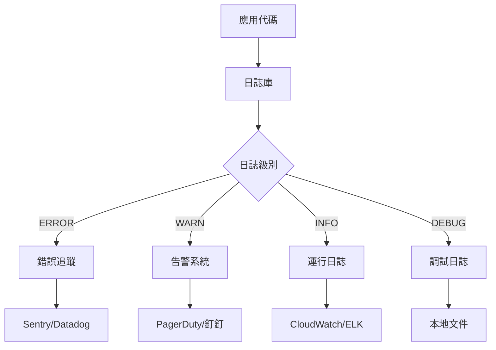

# 9.4 出了錯如何快速定位——錯誤處理與日誌規範：級別/上下文/脫敏；修復 → 文檔同步

**好的日誌是生產環境的"黑匣子"——出問題時能快速定位，平時不礙事。**

## 日誌系統架構



## 本章內容

| 小節 | 主題 | 核心內容 |
|------|------|----------|
| 9.4.1 | 日誌級別 | ERROR/WARN/INFO/DEBUG 的正確使用 |
| 9.4.2 | 上下文信息 | 請求 ID、用戶 ID、操作類型的注入 |
| 9.4.3 | 敏感信息脫敏 | 密碼、Token、身份證號的安全處理 |
| 9.4.4 | 錯誤恢復 | 異常處理與用戶友好提示 |
| 9.4.5 | 文檔同步 | 錯誤碼文檔的維護與更新 |

## 日誌庫選擇

| 庫 | 特點 | 適用場景 |
|----|------|----------|
| pino | 高性能 JSON 日誌 | 生產環境 |
| winston | 功能豐富，可擴展 | 複雜需求 |
| console | 零依賴 | 開發調試 |

## 快速配置

```typescript
// lib/logger.ts
import pino from 'pino';

export const logger = pino({
  level: process.env.LOG_LEVEL || 'info',
  transport: process.env.NODE_ENV === 'development' 
    ? { target: 'pino-pretty' } 
    : undefined,
  redact: ['password', 'token', 'authorization'],
});
```

```typescript
// 使用示例
import { logger } from '@/lib/logger';

// 記錄不同級別的日誌
logger.error({ err, userId }, '支付處理失敗');
logger.warn({ orderId }, '庫存不足，已降級處理');
logger.info({ action: 'login', userId }, '用戶登錄');
logger.debug({ query }, '數據庫查詢');
```

## 核心原則

1. **生產環境只記錄 INFO 及以上**：DEBUG 日誌量太大
2. **結構化日誌**：使用 JSON 格式，便於搜索和聚合
3. **敏感信息必須脫敏**：密碼、Token、個人信息
4. **錯誤要有上下文**：誰、在哪、做什麼、爲什麼失敗
5. **文檔與代碼同步**：錯誤碼變更時更新文檔

## 本節小結

日誌是生產環境的"眼睛"。通過分級記錄、結構化輸出、敏感信息脫敏，讓日誌既能幫助排查問題，又不會泄露用戶隱私。接下來的小節會詳細講解每個方面的實現細節。
