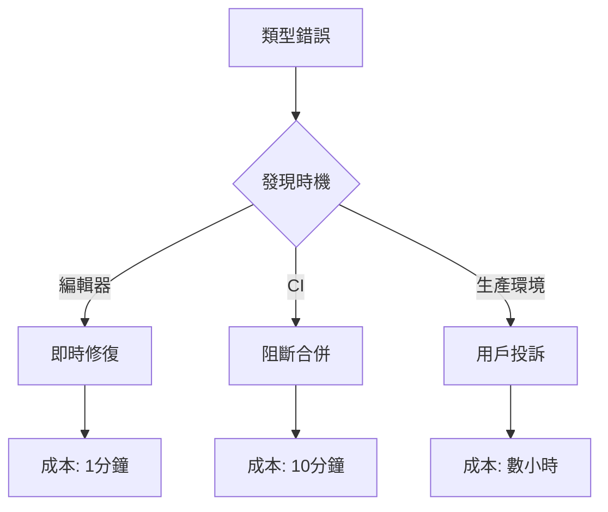

# 9.5.1 TS 編譯通不過——類型檢查：TypeScript 編譯驗證

**類型檢查是 CI 的第一道防線——類型錯誤就是 Bug，必須在合併前消滅。**

## 類型檢查的價值



## 配置 tsconfig.json

```json
{
  "compilerOptions": {
    "target": "ES2022",
    "lib": ["dom", "dom.iterable", "esnext"],
    "allowJs": true,
    "skipLibCheck": true,
    "strict": true,
    "noEmit": true,
    "esModuleInterop": true,
    "module": "esnext",
    "moduleResolution": "bundler",
    "resolveJsonModule": true,
    "isolatedModules": true,
    "jsx": "preserve",
    "incremental": true,
    "plugins": [{ "name": "next" }],
    "paths": {
      "@/*": ["./*"]
    }
  },
  "include": ["next-env.d.ts", "**/*.ts", "**/*.tsx", ".next/types/**/*.ts"],
  "exclude": ["node_modules"]
}
```

## 嚴格模式選項

```json
{
  "compilerOptions": {
    // strict 包含以下所有
    "strict": true,
    
    // 或單獨配置
    "noImplicitAny": true,
    "strictNullChecks": true,
    "strictFunctionTypes": true,
    "strictBindCallApply": true,
    "strictPropertyInitialization": true,
    "noImplicitThis": true,
    "alwaysStrict": true,
    
    // 額外的嚴格檢查
    "noUnusedLocals": true,
    "noUnusedParameters": true,
    "noImplicitReturns": true,
    "noFallthroughCasesInSwitch": true,
    "noUncheckedIndexedAccess": true
  }
}
```

## CI 配置

```yaml
# .github/workflows/ci.yml
jobs:
  type-check:
    runs-on: ubuntu-latest
    steps:
      - uses: actions/checkout@v4
      
      - uses: actions/setup-node@v4
        with:
          node-version: '20'
          cache: 'npm'
      
      - run: npm ci
      
      - name: Type check
        run: npx tsc --noEmit
```

## package.json 腳本

```json
{
  "scripts": {
    "type-check": "tsc --noEmit",
    "type-check:watch": "tsc --noEmit --watch"
  }
}
```

## 常見類型錯誤

### 1. 隱式 any

```typescript
// ❌ 錯誤：參數隱式 any
function greet(name) {
  return `Hello, ${name}`;
}

// ✅ 正確：顯式類型
function greet(name: string): string {
  return `Hello, ${name}`;
}
```

### 2. 可能爲空

```typescript
// ❌ 錯誤：未處理 null
const user = await prisma.user.findUnique({ where: { id } });
console.log(user.name); // user 可能爲 null

// ✅ 正確：處理空值
const user = await prisma.user.findUnique({ where: { id } });
if (!user) {
  throw new NotFoundError('用戶不存在');
}
console.log(user.name);
```

### 3. 類型不匹配

```typescript
// ❌ 錯誤：類型不匹配
interface User {
  id: string;
  name: string;
}

const user: User = {
  id: 123, // number 不能賦值給 string
  name: 'Test',
};

// ✅ 正確：類型一致
const user: User = {
  id: '123',
  name: 'Test',
};
```

## 增量類型檢查

```json
{
  "compilerOptions": {
    "incremental": true,
    "tsBuildInfoFile": ".tsbuildinfo"
  }
}
```

```yaml
# CI 緩存 tsBuildInfo
- name: Cache TypeScript build info
  uses: actions/cache@v3
  with:
    path: .tsbuildinfo
    key: ${{ runner.os }}-tsbuildinfo-${{ hashFiles('**/*.ts', '**/*.tsx') }}
```

## 生成類型聲明

```json
{
  "compilerOptions": {
    "declaration": true,
    "declarationDir": "./dist/types"
  }
}
```

## 調試類型錯誤

```bash
# 查看詳細錯誤
npx tsc --noEmit --extendedDiagnostics

# 只檢查特定文件
npx tsc --noEmit src/services/user.service.ts

# 查看類型推斷
npx tsc --noEmit --generateTrace ./trace
```

## 本節小結

類型檢查是最基礎的質量門禁。開啓 `strict` 模式，在 CI 中運行 `tsc --noEmit`，確保所有類型錯誤在合併前被發現。類型錯誤越早發現，修復成本越低。
