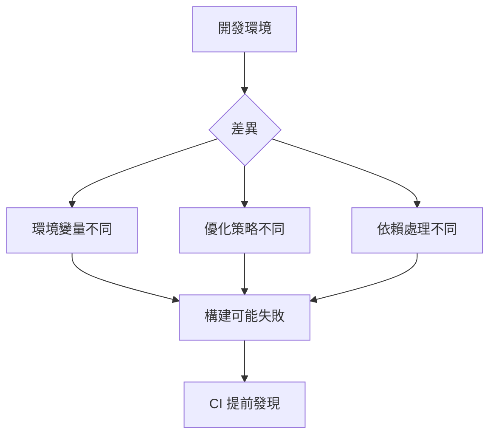

# 9.5.3 項目能打包成功嗎——構建驗證：生產構建成功性檢查

**開發環境能跑不代表生產環境能跑——每次合併前都必須驗證生產構建。**

## 構建驗證的必要性



## Next.js 構建配置

```typescript
// next.config.ts
import type { NextConfig } from 'next';

const nextConfig: NextConfig = {
  // 嚴格模式
  reactStrictMode: true,
  
  // TypeScript 嚴格檢查
  typescript: {
    ignoreBuildErrors: false,
  },
  
  // ESLint 檢查
  eslint: {
    ignoreDuringBuilds: false,
  },
  
  // 輸出配置
  output: 'standalone',
  
  // 實驗性功能
  experimental: {
    typedRoutes: true,
  },
};

export default nextConfig;
```

## CI 構建配置

```yaml
# .github/workflows/ci.yml
jobs:
  build:
    runs-on: ubuntu-latest
    
    steps:
      - uses: actions/checkout@v4
      
      - uses: actions/setup-node@v4
        with:
          node-version: '20'
          cache: 'npm'
      
      - run: npm ci
      
      - name: Build
        run: npm run build
        env:
          # 構建時需要的環境變量
          NEXT_PUBLIC_API_URL: https://api.example.com
          DATABASE_URL: ${{ secrets.DATABASE_URL }}
      
      - name: Check bundle size
        run: |
          du -sh .next/static
          du -sh .next/server
```

## 環境變量驗證

```typescript
// lib/env.ts
import { z } from 'zod';

const envSchema = z.object({
  DATABASE_URL: z.string().url(),
  NEXT_PUBLIC_API_URL: z.string().url(),
  JWT_SECRET: z.string().min(32),
});

// 構建時驗證
export const env = envSchema.parse({
  DATABASE_URL: process.env.DATABASE_URL,
  NEXT_PUBLIC_API_URL: process.env.NEXT_PUBLIC_API_URL,
  JWT_SECRET: process.env.JWT_SECRET,
});
```

```typescript
// next.config.ts
import './lib/env'; // 構建時驗證環境變量
```

## 構建產物檢查

```yaml
# .github/workflows/ci.yml
- name: Verify build output
  run: |
    # 檢查關鍵文件存在
    test -f .next/BUILD_ID
    test -d .next/static
    test -d .next/server
    
    # 檢查構建大小
    SIZE=$(du -sm .next | cut -f1)
    if [ "$SIZE" -gt 500 ]; then
      echo "Warning: Build size ${SIZE}MB exceeds 500MB"
    fi
```

## 構建緩存

```yaml
# .github/workflows/ci.yml
- name: Cache Next.js build
  uses: actions/cache@v3
  with:
    path: |
      .next/cache
    key: ${{ runner.os }}-nextjs-${{ hashFiles('**/package-lock.json') }}-${{ hashFiles('**/*.ts', '**/*.tsx') }}
    restore-keys: |
      ${{ runner.os }}-nextjs-${{ hashFiles('**/package-lock.json') }}-
      ${{ runner.os }}-nextjs-
```

## 常見構建錯誤

### 1. 環境變量缺失

```typescript
// ❌ 構建時報錯
const apiUrl = process.env.NEXT_PUBLIC_API_URL!;
// 如果未設置，構建會通過但運行時出錯

// ✅ 構建時驗證
if (!process.env.NEXT_PUBLIC_API_URL) {
  throw new Error('Missing NEXT_PUBLIC_API_URL');
}
```

### 2. 服務端/客戶端代碼混淆

```typescript
// ❌ 客戶端代碼使用服務端模塊
'use client';
import { prisma } from '@/lib/prisma'; // 構建失敗

// ✅ 通過 API 調用
'use client';
const data = await fetch('/api/users').then(r => r.json());
```

### 3. 動態導入問題

```typescript
// ❌ 構建時找不到模塊
const Component = dynamic(() => import('./Component'), {
  ssr: false,
});

// ✅ 確保路徑正確且模塊存在
const Component = dynamic(() => import('@/components/Component'), {
  ssr: false,
  loading: () => <Skeleton />,
});
```

## 構建分析

```json
// package.json
{
  "scripts": {
    "build": "next build",
    "build:analyze": "ANALYZE=true next build"
  }
}
```

```typescript
// next.config.ts
import bundleAnalyzer from '@next/bundle-analyzer';

const withBundleAnalyzer = bundleAnalyzer({
  enabled: process.env.ANALYZE === 'true',
});

export default withBundleAnalyzer(nextConfig);
```

## 本節小結

構建驗證是部署前的最後一道檢查。確保 `next.config.ts` 不忽略 TypeScript 和 ESLint 錯誤，在 CI 中設置必要的環境變量，驗證構建產物完整性。構建失敗必須阻斷 PR 合併。
