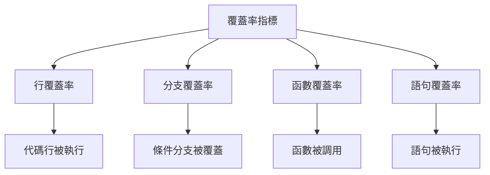

# 9.5.4 測試覆蓋了多少代碼——測試覆蓋率：代碼覆蓋率閾值設置

**覆蓋率不是目標，而是指標——80% 的覆蓋率比 100% 的虛假覆蓋更有價值。**

## 覆蓋率類型



## Jest 覆蓋率配置

```typescript
// jest.config.ts
import type { Config } from 'jest';

const config: Config = {
  collectCoverage: true,
  coverageDirectory: 'coverage',
  coverageProvider: 'v8',
  
  collectCoverageFrom: [
    'src/**/*.{ts,tsx}',
    '!src/**/*.d.ts',
    '!src/**/*.test.{ts,tsx}',
    '!src/**/*.stories.{ts,tsx}',
    '!src/types/**/*',
  ],
  
  coverageThreshold: {
    global: {
      branches: 80,
      functions: 80,
      lines: 80,
      statements: 80,
    },
    // 關鍵模塊更高要求
    './src/services/': {
      branches: 90,
      functions: 90,
      lines: 90,
      statements: 90,
    },
  },
  
  coverageReporters: ['text', 'lcov', 'html'],
};

export default config;
```

## CI 配置

```yaml
# .github/workflows/ci.yml
jobs:
  test:
    runs-on: ubuntu-latest
    
    steps:
      - uses: actions/checkout@v4
      
      - uses: actions/setup-node@v4
        with:
          node-version: '20'
          cache: 'npm'
      
      - run: npm ci
      
      - name: Run tests with coverage
        run: npm run test:ci
      
      - name: Upload coverage to Codecov
        uses: codecov/codecov-action@v3
        with:
          token: ${{ secrets.CODECOV_TOKEN }}
          files: ./coverage/lcov.info
          fail_ci_if_error: true
          verbose: true
```

## package.json 腳本

```json
{
  "scripts": {
    "test": "jest",
    "test:ci": "jest --ci --coverage --maxWorkers=2",
    "test:coverage": "jest --coverage --coverageReporters=text"
  }
}
```

## Codecov 配置

```yaml
# codecov.yml
coverage:
  status:
    project:
      default:
        target: 80%
        threshold: 2%
    patch:
      default:
        target: 80%

comment:
  layout: "reach,diff,flags,tree"
  behavior: default
  require_changes: true

ignore:
  - "**/*.test.ts"
  - "**/*.d.ts"
  - "src/types/**"
```

## 合理的覆蓋率目標

| 代碼類型 | 建議覆蓋率 | 原因 |
|----------|-----------|------|
| 業務服務 | 90%+ | 核心邏輯必須充分測試 |
| API 路由 | 80%+ | 接口契約需要驗證 |
| 工具函數 | 95%+ | 純函數容易測試 |
| UI 組件 | 60-70% | 視覺測試更重要 |
| 配置文件 | 忽略 | 無需測試 |

## 避免虛假覆蓋

```typescript
// ❌ 虛假覆蓋：只調用不驗證
it('should create user', async () => {
  await userService.create({ email: 'test@example.com' });
  // 沒有斷言，覆蓋率高但沒價值
});

// ✅ 真實覆蓋：驗證行爲
it('should create user with hashed password', async () => {
  const user = await userService.create({
    email: 'test@example.com',
    password: 'secret',
  });
  
  expect(user.email).toBe('test@example.com');
  expect(user.password).not.toBe('secret');
  expect(await bcrypt.compare('secret', user.password)).toBe(true);
});
```

## 覆蓋率報告分析

```bash
# 查看覆蓋率報告
npm run test:coverage

# 打開 HTML 報告
open coverage/lcov-report/index.html
```

```
-------------------|---------|----------|---------|---------|
File               | % Stmts | % Branch | % Funcs | % Lines |
-------------------|---------|----------|---------|---------|
All files          |   85.23 |    78.45 |   82.14 |   85.67 |
 services/         |   92.45 |    88.23 |   90.12 |   92.78 |
  user.service.ts  |   95.12 |    92.34 |   94.56 |   95.45 |
  order.service.ts |   89.78 |    84.12 |   85.67 |   90.12 |
 lib/              |   78.34 |    68.45 |   74.23 |   78.89 |
-------------------|---------|----------|---------|---------|
```

## 漸進式提升

```yaml
# codecov.yml
coverage:
  status:
    project:
      default:
        # 只要求不降低覆蓋率
        target: auto
        threshold: 1%
    patch:
      default:
        # 新代碼必須 80% 覆蓋
        target: 80%
```

## 本節小結

覆蓋率是代碼質量的參考指標，不是目標。設置合理的閾值（80% 是常見選擇），關注新增代碼的覆蓋率，避免虛假覆蓋。使用 Codecov 集成到 PR 流程，讓覆蓋率變化可視化。
