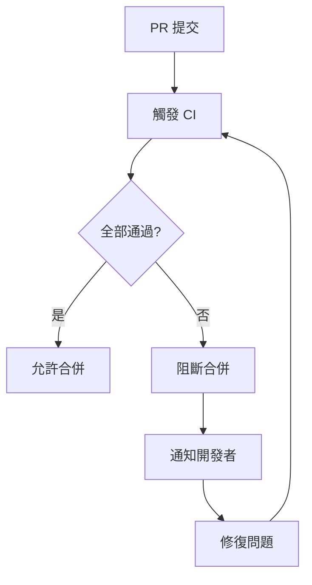

# 9.5.5 不合格的代碼不準合併——門禁策略：失敗阻斷與通知機制

**質量門禁的核心是"硬性阻斷"——檢查不通過就不能合併，沒有例外。**

## 門禁流程



## GitHub 分支保護

```yaml
# 在 GitHub 倉庫設置中配置：
# Settings > Branches > Add branch protection rule

# 分支名稱模式
Branch name pattern: main

# 保護規則
✅ Require a pull request before merging
  ✅ Require approvals (1)
  ✅ Dismiss stale pull request approvals when new commits are pushed

✅ Require status checks to pass before merging
  ✅ Require branches to be up to date before merging
  Required checks:
    - type-check
    - lint
    - test
    - build

✅ Require conversation resolution before merging

❌ Allow force pushes
❌ Allow deletions
```

## 必需的 CI 檢查

```yaml
# .github/workflows/ci.yml
name: CI

on:
  pull_request:
    branches: [main, develop]

jobs:
  type-check:
    runs-on: ubuntu-latest
    steps:
      - uses: actions/checkout@v4
      - uses: actions/setup-node@v4
        with:
          node-version: '20'
          cache: 'npm'
      - run: npm ci
      - run: npm run type-check
  
  lint:
    runs-on: ubuntu-latest
    steps:
      - uses: actions/checkout@v4
      - uses: actions/setup-node@v4
        with:
          node-version: '20'
          cache: 'npm'
      - run: npm ci
      - run: npm run lint
  
  test:
    runs-on: ubuntu-latest
    steps:
      - uses: actions/checkout@v4
      - uses: actions/setup-node@v4
        with:
          node-version: '20'
          cache: 'npm'
      - run: npm ci
      - run: npm run test:ci
  
  build:
    runs-on: ubuntu-latest
    needs: [type-check, lint, test]
    steps:
      - uses: actions/checkout@v4
      - uses: actions/setup-node@v4
        with:
          node-version: '20'
          cache: 'npm'
      - run: npm ci
      - run: npm run build
```

## 失敗通知

### Slack 通知

```yaml
# .github/workflows/ci.yml
- name: Notify on failure
  if: failure()
  uses: slackapi/slack-github-action@v1
  with:
    channel-id: 'C01234567'
    slack-message: |
      :x: CI 失敗
      PR: ${{ github.event.pull_request.title }}
      作者: ${{ github.event.pull_request.user.login }}
      鏈接: ${{ github.event.pull_request.html_url }}
  env:
    SLACK_BOT_TOKEN: ${{ secrets.SLACK_BOT_TOKEN }}
```

### 釘釘通知

```yaml
- name: Notify on failure
  if: failure()
  run: |
    curl -X POST '${{ secrets.DINGTALK_WEBHOOK }}' \
      -H 'Content-Type: application/json' \
      -d '{
        "msgtype": "markdown",
        "markdown": {
          "title": "CI 失敗",
          "text": "### CI 構建失敗\n- PR: ${{ github.event.pull_request.title }}\n- 作者: ${{ github.event.pull_request.user.login }}\n- [查看詳情](${{ github.event.pull_request.html_url }})"
        }
      }'
```

## PR 狀態檢查

```yaml
# .github/workflows/ci.yml
- name: Add PR comment on failure
  if: failure() && github.event_name == 'pull_request'
  uses: actions/github-script@v7
  with:
    script: |
      github.rest.issues.createComment({
        issue_number: context.issue.number,
        owner: context.repo.owner,
        repo: context.repo.repo,
        body: `## ❌ CI 檢查失敗

請檢查以下問題：
- 類型錯誤：\`npm run type-check\`
- Lint 錯誤：\`npm run lint\`
- 測試失敗：\`npm run test\`
- 構建失敗：\`npm run build\`

[查看詳細日誌](${context.payload.repository.html_url}/actions/runs/${context.runId})`
      })
```

## 並行檢查優化

```yaml
# .github/workflows/ci.yml
jobs:
  changes:
    runs-on: ubuntu-latest
    outputs:
      src: ${{ steps.filter.outputs.src }}
      tests: ${{ steps.filter.outputs.tests }}
    steps:
      - uses: actions/checkout@v4
      - uses: dorny/paths-filter@v2
        id: filter
        with:
          filters: |
            src:
              - 'src/**'
            tests:
              - '**/*.test.ts'
  
  type-check:
    needs: changes
    if: needs.changes.outputs.src == 'true'
    runs-on: ubuntu-latest
    # ...
  
  test:
    needs: changes
    if: needs.changes.outputs.src == 'true' || needs.changes.outputs.tests == 'true'
    runs-on: ubuntu-latest
    # ...
```

## 緊急繞過（僅限特殊情況）

```yaml
# 添加 [skip ci] 到 commit message 可跳過 CI
# 但分支保護仍會阻止合併

# 緊急情況需要管理員權限繞過
# Settings > Branches > Branch protection rules
# ❌ Do not allow bypassing the above settings
# 建議保持關閉，如需繞過由管理員手動操作
```

## 門禁檢查清單

| 檢查項 | 失敗處理 | 通知方式 |
|--------|----------|----------|
| TypeScript 編譯 | 阻斷 | PR 評論 |
| ESLint | 阻斷 | PR 評論 |
| 單元測試 | 阻斷 | Slack/釘釘 |
| 覆蓋率閾值 | 阻斷 | Codecov 評論 |
| 構建驗證 | 阻斷 | Slack/釘釘 |

## 本節小結

質量門禁是團隊代碼質量的最後防線。通過 GitHub 分支保護配置必需的 CI 檢查，失敗時自動通知開發者。門禁必須"硬性"——沒有繞過機制，確保不合格的代碼永遠進不了主分支。
