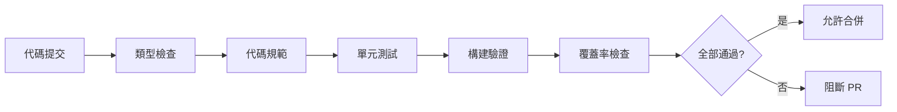

# 9.5 讓機器人幫你守住質量——CI 質量門禁與 GitHub Actions

**CI 質量門禁是代碼的"安檢口"——不合格的代碼永遠進不了主分支。**

## 質量門禁流程



## 本章內容

| 小節 | 主題 | 核心內容 |
|------|------|----------|
| 9.5.1 | 類型檢查 | TypeScript 編譯驗證 |
| 9.5.2 | 代碼規範 | ESLint/Prettier 自動檢查 |
| 9.5.3 | 構建驗證 | 生產構建成功性檢查 |
| 9.5.4 | 覆蓋率 | 代碼覆蓋率閾值設置 |
| 9.5.5 | 門禁策略 | 失敗阻斷與通知機制 |

## 完整 GitHub Actions 配置

```yaml
# .github/workflows/ci.yml
name: CI

on:
  push:
    branches: [main, develop]
  pull_request:
    branches: [main, develop]

jobs:
  quality:
    runs-on: ubuntu-latest
    
    steps:
      - uses: actions/checkout@v4
      
      - name: Setup Node.js
        uses: actions/setup-node@v4
        with:
          node-version: '20'
          cache: 'npm'
      
      - name: Install dependencies
        run: npm ci
      
      - name: Type check
        run: npm run type-check
      
      - name: Lint
        run: npm run lint
      
      - name: Test
        run: npm run test:ci
      
      - name: Build
        run: npm run build
      
      - name: Upload coverage
        uses: codecov/codecov-action@v3
        with:
          fail_ci_if_error: true
```

## package.json 腳本

```json
{
  "scripts": {
    "type-check": "tsc --noEmit",
    "lint": "eslint . --ext .ts,.tsx --max-warnings 0",
    "lint:fix": "eslint . --ext .ts,.tsx --fix",
    "test": "jest",
    "test:ci": "jest --ci --coverage --maxWorkers=2",
    "build": "next build"
  }
}
```

## 質量標準

| 檢查項 | 閾值 | 失敗處理 |
|--------|------|----------|
| TypeScript 錯誤 | 0 | 阻斷 |
| ESLint 警告 | 0 | 阻斷 |
| 測試失敗 | 0 | 阻斷 |
| 覆蓋率 | 80% | 阻斷 |
| 構建失敗 | 0 | 阻斷 |

## 本地預檢

在推送前運行完整檢查：

```bash
# 安裝 husky
npm install -D husky lint-staged
npx husky init

# .husky/pre-commit
npm run type-check && npm run lint && npm run test

# .husky/pre-push
npm run build
```

## 本節小結

CI 質量門禁是團隊代碼質量的守護者。通過自動化檢查（類型、規範、測試、構建），確保每次合併的代碼都符合標準。接下來的小節會詳細講解每個門禁的配置和最佳實踐。
