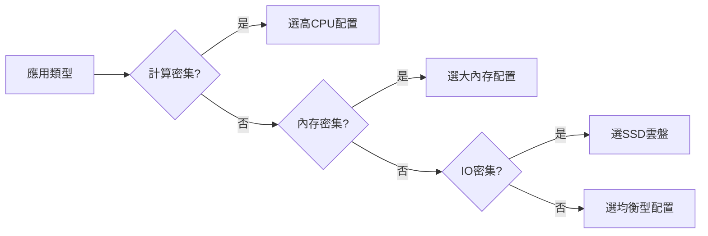

# 10.1.1 服務器放哪——雲服務選擇：計算/存儲/網絡資源規劃

選對服務器，是省錢省心的第一步。

## 雲服務商對比

對於個人開發者和小團隊，國內主流選擇如下：

| 服務商 | 產品名稱 | 優勢 | 適用場景 |
|--------|----------|------|----------|
| 阿里雲 | ECS/輕量 | 生態完善，文檔齊全 | 生產環境首選 |
| 騰訊雲 | CVM/輕量 | 價格實惠，新人優惠多 | 個人項目 |
| 華爲雲 | ECS | 企業級穩定性 | 企業項目 |

::: tip 新手建議
剛開始推薦用**輕量應用服務器**，價格便宜（月付 50-100 元），預裝鏡像開箱即用。等流量上來了再升級到 ECS。
:::

## 配置選擇指南

### 按項目規模選配置

| 項目規模 | CPU | 內存 | 系統盤 | 帶寬 | 月成本估算 |
|----------|-----|------|--------|------|------------|
| 個人博客/演示 | 1核 | 2G | 40G | 3M | 50-80元 |
| 小型應用 | 2核 | 4G | 60G | 5M | 100-200元 |
| 生產環境 | 4核 | 8G | 100G | 10M | 300-500元 |

### 資源規劃原則



## 網絡配置要點

### 帶寬選擇

| 帶寬 | 下載速度 | 適用場景 |
|------|----------|----------|
| 1M | 128KB/s | 純API服務 |
| 3M | 384KB/s | 小型網站 |
| 5M | 640KB/s | 中等流量 |
| 10M+ | 1.25MB/s+ | 高併發/多媒體 |

::: warning 注意
雲服務商的帶寬指的是**出網帶寬**（服務器→用戶），入網帶寬通常不限。1M 帶寬意味着用戶每秒最多隻能從你服務器下載 128KB 數據。
:::

### 安全組配置

購買服務器後必須配置安全組，否則外網無法訪問：

| 端口 | 協議 | 用途 |
|------|------|------|
| 22 | TCP | SSH 遠程登錄 |
| 80 | TCP | HTTP 網站訪問 |
| 443 | TCP | HTTPS 加密訪問 |
| 3000 | TCP | Next.js 開發端口 |
| 3001 | TCP | NestJS API 端口 |

## 存儲規劃

### 系統盤 vs 數據盤

| 類型 | 用途 | 建議大小 |
|------|------|----------|
| 系統盤 | 操作系統 + 應用程序 | 40-60G |
| 數據盤 | 數據庫 + 用戶文件 | 按需擴展 |

::: tip 最佳實踐
數據庫和用戶上傳文件應放在**數據盤**，方便後期擴容和備份。系統盤只裝應用，保持乾淨。
:::

### 對象存儲（OSS）

用戶上傳的圖片、視頻等靜態文件建議存到對象存儲：

| 優勢 | 說明 |
|------|------|
| 無限擴容 | 不佔服務器磁盤 |
| CDN 加速 | 全國節點分發 |
| 成本低 | 按量付費，比雲盤便宜 |
| 高可用 | 11個9的數據可靠性 |

## AI 協作指南

向 AI 描述你的部署需求時，提供以下關鍵信息：

```
我需要部署一個 Next.js + NestJS + PostgreSQL 的應用，
預計日活用戶 1000 人，需要存儲用戶上傳的圖片。
請幫我規劃雲服務器配置和成本估算。
```

**關鍵術語**：ECS、輕量應用服務器、安全組、彈性公網IP、對象存儲、按量付費

## 實用建議

1. **先買輕量後升級**：輕量服務器便宜，等業務起來了再遷移
2. **選擇就近地域**：用戶在哪，服務器就買在哪
3. **關注促銷活動**：雙11、618 等大促能省一大筆
4. **設置費用預警**：避免被惡意攻擊導致流量費用爆炸
