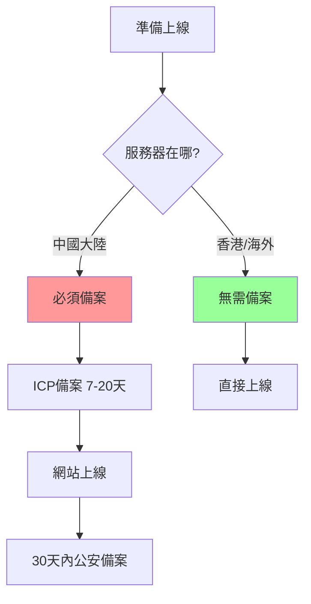

# 10.1.2 網站要備案嗎——合規要求：ICP 備案與公安備案

一句話：服務器在中國大陸，就必須備案。

## 備案的本質

備案是國家對互聯網信息服務的管理手段，主要包含兩個部分：

| 備案類型 | 管理部門 | 時機 | 必要性 |
|----------|----------|------|--------|
| ICP 備案 | 工信部 | 網站上線前 | 強制 |
| 公安備案 | 公安部 | 網站上線後30天內 | 強制 |



## ICP 備案流程

### 準備材料

| 材料 | 個人備案 | 企業備案 |
|------|----------|----------|
| 身份證 | ✓ | ✓ (法人+網站負責人) |
| 營業執照 | ✗ | ✓ |
| 域名證書 | ✓ | ✓ |
| 幕布照/人臉覈驗 | ✓ | ✓ |
| 網站建設方案書 | 看情況 | 部分省份要求 |

### 備案步驟

1. **域名實名認證**：在域名註冊商完成，需 3 個工作日
2. **服務商初審**：阿里雲/騰訊雲後臺提交，1-2 天
3. **管局審覈**：各省通信管理局，7-20 個工作日
4. **備案成功**：獲得 ICP 備案號，如 `京ICP備12345678號`

::: warning 重要提醒
- 備案期間網站**不能訪問**
- 域名必須**已實名認證 3 天以上**
- 個人備案**不能有經營性內容**
- 不同省份審覈標準和時間不同
:::

## 公安備案流程

網站上線後 30 天內，需要到[全國互聯網安全管理服務平臺](http://www.beian.gov.cn)完成公安備案。

### 操作步驟

1. 註冊賬號並實名認證
2. 新辦網站申請
3. 填寫網站信息（名稱、域名、IP、服務內容等）
4. 下載安全協議並簽字蓋章
5. 提交審覈，等待通知

### 備案後要求

備案成功後，需要在網站底部展示：

```html
<footer>
  <a href="https://beian.miit.gov.cn/" target="_blank">
    京ICP備12345678號
  </a>
  <a href="http://www.beian.gov.cn/portal/registerSystemInfo?recordcode=11010502000000" target="_blank">
    京公網安備 11010502000000號
  </a>
</footer>
```

## 不備案的選擇

如果你的項目面向海外用戶，或者只是個人學習/演示項目，可以選擇不備案：

| 方案 | 優點 | 缺點 |
|------|------|------|
| 香港服務器 | 無需備案，速度尚可 | 價格略貴，穩定性參差 |
| 海外服務器 | 無需備案，價格便宜 | 國內訪問慢 |
| Vercel/Netlify | 免費託管，自動部署 | 國內訪問不穩定 |

::: tip 什麼時候必須備案
- 面向國內用戶的商業網站
- 需要接入微信支付、支付寶等服務
- 需要接入微信公衆號/小程序
- 需要良好的 SEO 排名
:::

## 備案常見問題

### Q: 備案要多久？

| 階段 | 時間 |
|------|------|
| 域名實名認證 | 3 個工作日 |
| 服務商初審 | 1-2 個工作日 |
| 管局審覈 | 7-20 個工作日 |
| **合計** | **10-25 個工作日** |

### Q: 個人備案能做什麼網站？

個人備案只能做**非經營性網站**，如個人博客、技術分享、作品展示等。不能有：
- 購物/支付功能
- 論壇/社區功能
- 用戶註冊登錄（有爭議，看地區）
- 廣告/盈利內容

### Q: 備案被駁回怎麼辦？

常見駁回原因：
1. **網站內容與備案信息不符** → 修改網站內容
2. **域名未完成實名認證** → 等 3 天后重新提交
3. **照片不清晰** → 重新拍攝上傳
4. **網站已可訪問** → 關閉網站後重新提交

## 實用建議

1. **提前備案**：項目開發階段就開始，別等上線前臨時抱佛腳
2. **用雲服務商的備案系統**：流程清晰，客服響應快
3. **保持手機暢通**：管局可能會電話覈實
4. **備案信息要真實**：虛假信息會被註銷，甚至拉黑
