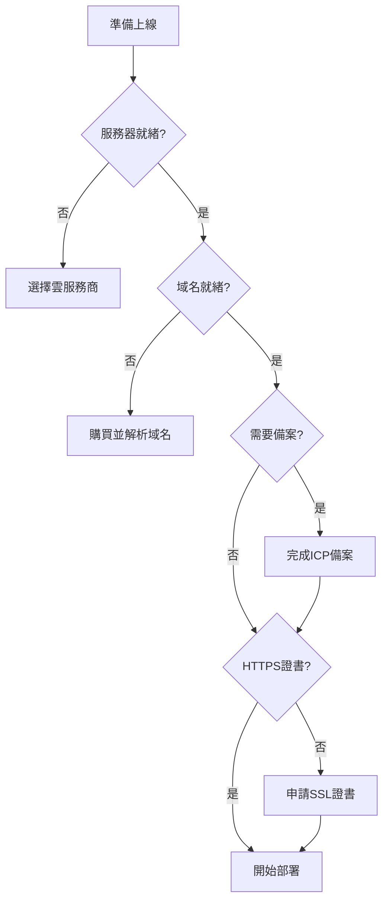

# 10.1 上線前必須知道的事——雲服務/網絡/域名/證書

代碼能跑只是開始，上線前還有一堆"行政手續"要辦。

## 爲什麼需要"飛行前檢查"

很多開發者第一次部署時會遇到這樣的困境：代碼推上去了，服務起來了，但用戶就是訪問不了。原因往往不是技術問題，而是**域名沒解析**、**端口沒開放**、**備案沒完成**這些前置工作沒做。



## 上線前清單

| 檢查項 | 說明 | 預計耗時 |
|--------|------|----------|
| 雲服務器 | 購買並配置 ECS/CVM | 30分鐘 |
| 域名 | 購買並完成實名認證 | 1-3天 |
| ICP 備案 | 中國大陸服務器必須 | 7-20天 |
| 公安備案 | 網站上線後30天內完成 | 3-7天 |
| SSL 證書 | 啓用 HTTPS 加密 | 10分鐘 |
| 安全組 | 開放必要端口 | 10分鐘 |

## 核心概念速覽

### 雲服務的三層結構

| 層級 | 資源類型 | 對應雲產品 |
|------|----------|------------|
| 計算層 | CPU + 內存 | ECS、CVM、輕量應用服務器 |
| 存儲層 | 磁盤 + 對象存儲 | 雲盤、OSS/COS |
| 網絡層 | 帶寬 + IP | 彈性公網IP、負載均衡 |

### 域名解析流程

```
用戶輸入 www.example.com
    ↓
DNS 服務器查詢
    ↓
返回 IP 地址 (如 1.2.3.4)
    ↓
瀏覽器訪問該 IP
```

## 本節目錄

- **10.1.1 服務器放哪** — 雲服務商選擇與資源規劃
- **10.1.2 網站要備案嗎** — ICP 備案與公安備案流程

## 避坑指南

::: warning 常見坑點
1. **域名備案週期長**：至少預留 2-3 周時間
2. **海外服務器不用備案**：但訪問速度慢，SEO 也受影響
3. **輕量服務器有流量限制**：月流量超了會額外計費
4. **安全組默認全關**：別忘了開放 80/443 端口
:::
