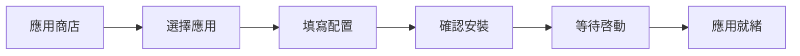
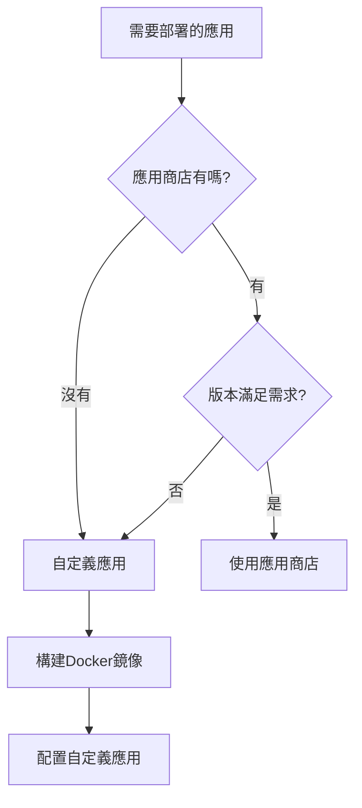

# 10.2.1 應用商店還是自定義——界面操作：應用商店 vs 自定義應用

1Panel 的精髓在於：把 Docker 的複雜命令變成了可視化表單。

## 兩種部署方式對比

| 特性 | 應用商店 | 自定義應用 |
|------|----------|------------|
| 配置複雜度 | 低，表單填寫 | 中，需理解 Docker |
| 可選版本 | 有限，商店提供的 | 任意，自己指定鏡像 |
| 適用場景 | 標準化服務（數據庫、中間件） | 自研項目、特殊需求 |
| 維護成本 | 低，一鍵升級 | 中，需手動更新 |

## 應用商店：開箱即用

### 應用商店能裝什麼

| 分類 | 常用應用 |
|------|----------|
| 數據庫 | MySQL、PostgreSQL、Redis、MongoDB |
| Web服務 | Nginx、OpenResty、Caddy |
| 開發工具 | Node.js、Python、Go |
| 存儲 | MinIO（對象存儲） |
| 監控 | Prometheus、Grafana |

### 安裝步驟

1. 進入 **應用商店** → 選擇應用（如 PostgreSQL）
2. 點擊 **安裝**
3. 填寫基本信息：
   - 應用名稱（用於標識）
   - 版本選擇
   - 端口映射
   - 數據庫用戶名/密碼
4. 點擊 **確認安裝**

### 安裝 PostgreSQL 示例

| 配置項 | 示例值 | 說明 |
|--------|--------|------|
| 應用名稱 | `postgres-main` | 自定義，便於識別 |
| 版本 | `15` | 推薦使用最新穩定版 |
| 端口 | `5432` | 默認端口，可修改 |
| 用戶名 | `postgres` | 超級管理員 |
| 密碼 | `SecurePass123!` | 務必使用強密碼 |
| 數據目錄 | `/opt/1panel/apps/postgres/data` | 自動配置 |

## 自定義應用：完全掌控

當你需要部署自己開發的 Next.js 或 NestJS 項目時，就需要使用自定義應用。

### 創建自定義應用

1. 進入 **容器** → **容器管理** → **創建容器**
2. 或進入 **容器** → **編排** → **創建編排**（推薦，支持多容器）

### 自定義應用配置項

| 配置項 | 作用 | 示例 |
|--------|------|------|
| 鏡像名稱 | 指定 Docker 鏡像 | `node:18-alpine` |
| 容器名稱 | 容器標識 | `my-nextjs-app` |
| 端口映射 | 外部訪問端口 | `3000:3000` |
| 卷掛載 | 持久化數據 | `/app/data:/data` |
| 環境變量 | 運行時配置 | `NODE_ENV=production` |
| 啓動命令 | 覆蓋默認命令 | `npm run start` |
| 重啓策略 | 容器退出時行爲 | `always`（自動重啓） |

### 何時用自定義應用

## 實戰：部署基礎環境

一個典型的 Web 應用需要以下基礎服務：

| 服務 | 安裝方式 | 用途 |
|------|----------|------|
| PostgreSQL | 應用商店 | 主數據庫 |
| Redis | 應用商店 | 緩存/會話 |
| OpenResty | 應用商店 | 反向代理 |
| Next.js 應用 | 自定義 | 前端服務 |
| NestJS 應用 | 自定義 | 後端 API |

### 推薦安裝順序

1. **先裝基礎服務**：PostgreSQL、Redis
2. **再裝 Web 服務**：OpenResty
3. **最後部署應用**：Next.js、NestJS

::: tip 爲什麼要這個順序
應用啓動時會嘗試連接數據庫和緩存，如果這些服務還沒準備好，應用會啓動失敗。
:::

## 避坑指南

### 常見問題

| 問題 | 原因 | 解決方案 |
|------|------|----------|
| 端口衝突 | 多個應用用同一端口 | 修改端口映射 |
| 應用無法啓動 | 依賴服務未就緒 | 檢查數據庫/Redis 狀態 |
| 數據丟失 | 未配置卷掛載 | 重新創建並掛載數據卷 |
| 無法訪問 | 安全組未開放 | 雲服務商後臺開放端口 |

### 最佳實踐

1. **統一命名規範**：如 `prod-postgres`、`prod-redis`
2. **使用強密碼**：數據庫密碼至少 16 位，包含特殊字符
3. **定期備份**：1Panel 支持定時備份，務必開啓
4. **資源監控**：關注 CPU、內存使用率，及時擴容
