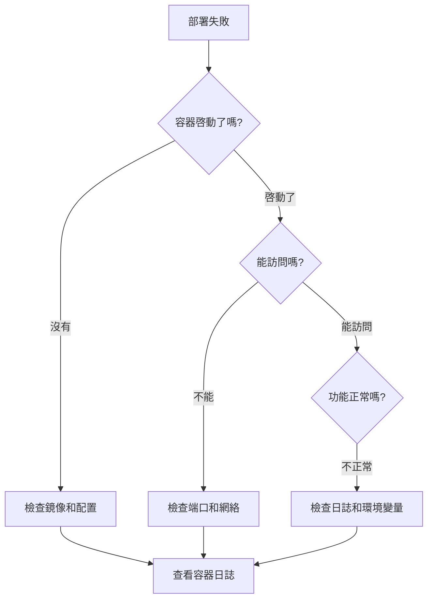

# 10.2.5 部署失敗了怎麼辦——常見問題：端口衝突/環境變量/權限問題

部署出問題不可怕，可怕的是不知道怎麼排查。

## 故障排查流程



## 第一步：查看容器日誌

```bash
# 查看最近100行日誌
docker logs --tail 100 容器名

# 即時跟蹤日誌
docker logs -f 容器名

# 在 1Panel 中
# 容器管理 → 選擇容器 → 日誌
```

## 常見問題及解決方案

### 問題一：端口衝突

**錯誤信息**：
```
Error: listen EADDRINUSE: address already in use :::3000
```

**排查步驟**：
```bash
# 查看端口占用
netstat -tlnp | grep 3000
# 或
lsof -i :3000
```

**解決方案**：

| 方案 | 操作 |
|------|------|
| 停止佔用進程 | `kill -9 PID` |
| 修改端口映射 | 改爲 `3001:3000` |
| 檢查其他容器 | `docker ps` 查看 |

### 問題二：環境變量不生效

**排查步驟**：
```bash
# 進入容器查看環境變量
docker exec -it 容器名 sh
env | grep DATABASE
```

**常見原因**：

| 原因 | 解決方案 |
|------|----------|
| 變量名拼寫錯誤 | 仔細檢查大小寫 |
| 引號問題 | 特殊字符需要轉義 |
| NEXT_PUBLIC_ 前綴 | 構建時注入，非運行時 |
| 變量未傳入容器 | 檢查 1Panel 配置 |

### 問題三：數據庫連接失敗

**錯誤信息**：
```
Error: Can't reach database server at 'localhost:5432'
```

**常見原因與解決**：

| 原因 | 解決方案 |
|------|----------|
| 使用了 `localhost` | 改爲容器名，如 `postgres` |
| 容器不在同一網絡 | 將容器加入同一 Docker 網絡 |
| 數據庫未啓動 | 檢查數據庫容器狀態 |
| 密碼錯誤 | 覈對 DATABASE_URL |

```bash
# 檢查網絡
docker network ls
docker network inspect 1panel-network

# 測試連接
docker exec -it nestjs-api sh
nc -zv postgres 5432
```

### 問題四：權限問題

**錯誤信息**：
```
Error: EACCES: permission denied, open '/app/logs/app.log'
```

**解決方案**：
```bash
# 修改目錄權限
chmod -R 755 /path/to/directory

# 修改目錄所有者
chown -R 1000:1000 /path/to/directory
```

### 問題五：內存不足

**錯誤信息**：
```
FATAL ERROR: CALL_AND_RETRY_LAST Allocation failed - JavaScript heap out of memory
```

**解決方案**：

```bash
# 方案一：增加 Node.js 內存限制
NODE_OPTIONS=--max-old-space-size=2048

# 方案二：Docker 限制內存
docker run -m 2g ...
```

### 問題六：鏡像拉取失敗

**錯誤信息**：
```
Error response from daemon: pull access denied
```

**解決方案**：

| 原因 | 解決方案 |
|------|----------|
| 未登錄私有倉庫 | `docker login registry.xxx.com` |
| 鏡像名錯誤 | 檢查倉庫地址和標籤 |
| 網絡問題 | 配置鏡像加速器 |

```bash
# 配置阿里雲鏡像加速
sudo tee /etc/docker/daemon.json <<-'EOF'
{
  "registry-mirrors": ["https://xxx.mirror.aliyuncs.com"]
}
EOF
sudo systemctl restart docker
```

## 快速診斷命令

```bash
# 容器狀態
docker ps -a

# 容器詳情
docker inspect 容器名

# 容器資源使用
docker stats

# 查看容器內進程
docker top 容器名

# 進入容器調試
docker exec -it 容器名 sh
```

## 1Panel 日誌位置

| 日誌類型 | 位置 |
|----------|------|
| 1Panel 自身日誌 | `/opt/1panel/log/` |
| 容器日誌 | 容器管理 → 日誌 |
| Nginx 日誌 | `/opt/1panel/apps/openresty/logs/` |
| 應用日誌 | 掛載的日誌目錄 |

## 重啓策略

當應用異常退出時，正確的重啓策略可以自動恢復：

| 策略 | 說明 | 適用場景 |
|------|------|----------|
| `no` | 不自動重啓 | 調試階段 |
| `on-failure` | 僅失敗時重啓 | 有狀態服務 |
| `always` | 總是重啓 | 生產環境 |
| `unless-stopped` | 除非手動停止 | 推薦使用 |

## 故障排查清單

遇到問題時，按順序檢查：

- [ ] 容器是否啓動成功 (`docker ps`)
- [ ] 容器日誌有無錯誤 (`docker logs`)
- [ ] 端口是否正確映射 (`docker port`)
- [ ] 環境變量是否正確 (`docker exec ... env`)
- [ ] 網絡是否連通 (`docker network inspect`)
- [ ] 磁盤空間是否充足 (`df -h`)
- [ ] 內存是否充足 (`free -m`)
- [ ] 安全組是否開放端口

## AI 協作指南

向 AI 描述問題時，提供：

```
環境：1Panel + Docker + Next.js
現象：訪問返回 502
容器狀態：[docker ps 輸出]
容器日誌：[docker logs 輸出]
Nginx 日誌：[error.log 內容]
請幫我分析原因。
```

越詳細的信息，越能快速定位問題。
