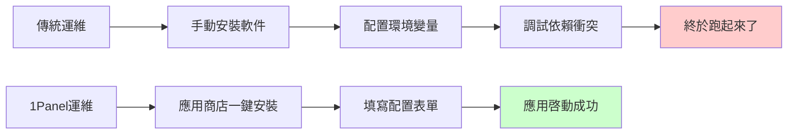
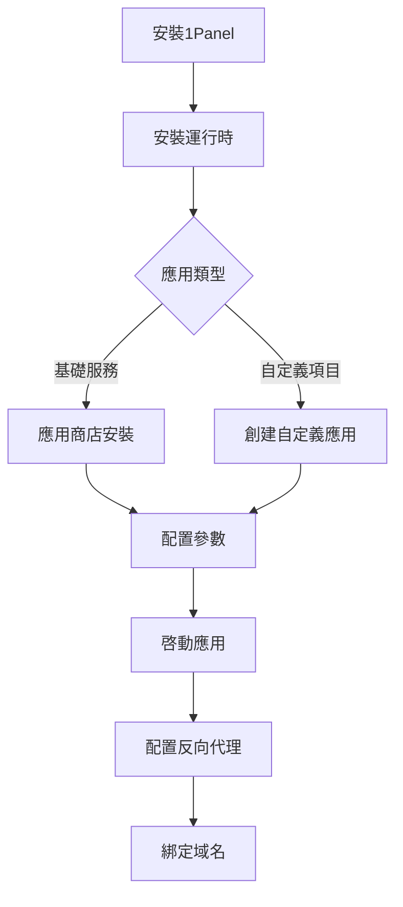

# 10.2 點點鼠標就上線——1Panel 可視化部署：從零到上線

不會敲命令？沒關係，點點鼠標也能把應用部署上線。

## 什麼是 1Panel

1Panel 是一個現代化的 Linux 服務器運維管理面板，它的核心理念是：**運行環境 = 預配置的 Docker 容器**。



## 核心優勢

| 特性 | 說明 |
|------|------|
| 可視化界面 | 所有操作通過 Web 界面完成 |
| 應用商店 | 一鍵安裝常用服務（MySQL、Redis、Nginx 等） |
| 容器管理 | 基於 Docker，環境隔離，互不干擾 |
| 自動備份 | 定時備份應用數據和配置 |
| 安全加固 | 內置防火牆、SSH 管理 |

## 安裝 1Panel

在全新的 Linux 服務器上執行：

```bash
curl -sSL https://resource.fit2cloud.com/1panel/package/quick_start.sh -o quick_start.sh && sudo bash quick_start.sh
```

安裝完成後會顯示：
- 訪問地址：`http://服務器IP:端口`
- 用戶名和密碼

::: warning 安全提醒
1. 首次登錄後立即修改默認密碼
2. 開啓二次認證（2FA）
3. 將面板端口改爲非默認值
4. 安全組中限制訪問來源 IP
:::

## 本節目錄

- **10.2.1 應用商店還是自定義** — 選擇合適的部署方式
- **10.2.2 部署到底要填什麼** — 配置要素詳解
- **10.2.3 Next.js 項目怎麼部署** — 前端應用部署實戰
- **10.2.4 NestJS 項目怎麼部署** — 後端 API 部署實戰
- **10.2.5 部署失敗了怎麼辦** — 常見問題排查

## 核心概念

### 1Panel 中的關鍵配置項

| 配置項 | Docker 對應 | 說明 |
|--------|-------------|------|
| 鏡像 | `image` | 應用的 Docker 鏡像名稱 |
| 端口映射 | `-p` | 外部端口:容器內端口 |
| 卷掛載 | `-v` | 宿主機目錄:容器目錄 |
| 環境變量 | `-e` | 傳遞給應用的配置參數 |
| 啓動命令 | `command` | 容器啓動時執行的命令 |

### 應用商店 vs 自定義應用

| 方式 | 適用場景 | 優點 | 缺點 |
|------|----------|------|------|
| 應用商店 | MySQL、Redis、Nginx 等基礎服務 | 一鍵安裝，配置預設 | 版本選擇有限 |
| 自定義應用 | 自己開發的項目 | 完全控制 | 需要自己寫配置 |

## 快速上手流程



## AI 協作指南

當遇到 1Panel 部署問題時，向 AI 提供：

```
我在 1Panel 中部署 Next.js 應用遇到問題：
- 使用的鏡像：node:18-alpine
- 端口映射：3000:3000
- 錯誤信息：[具體錯誤日誌]
請幫我分析原因並給出解決方案。
```

**關鍵術語**：1Panel、Docker 容器、端口映射、卷掛載、環境變量、OpenResty
