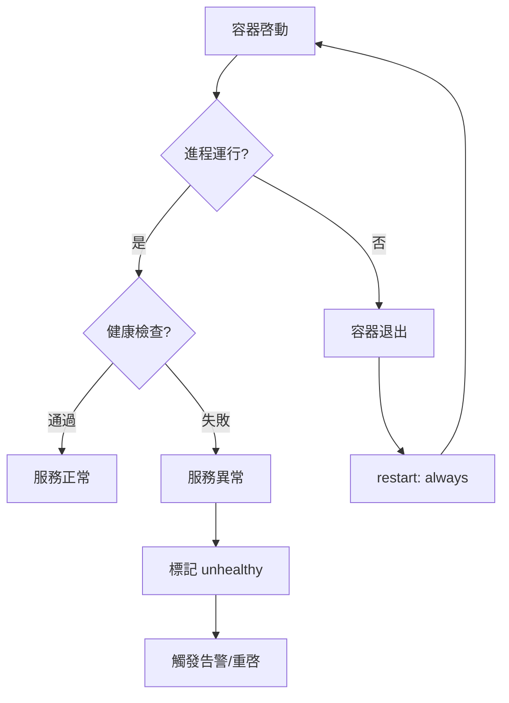
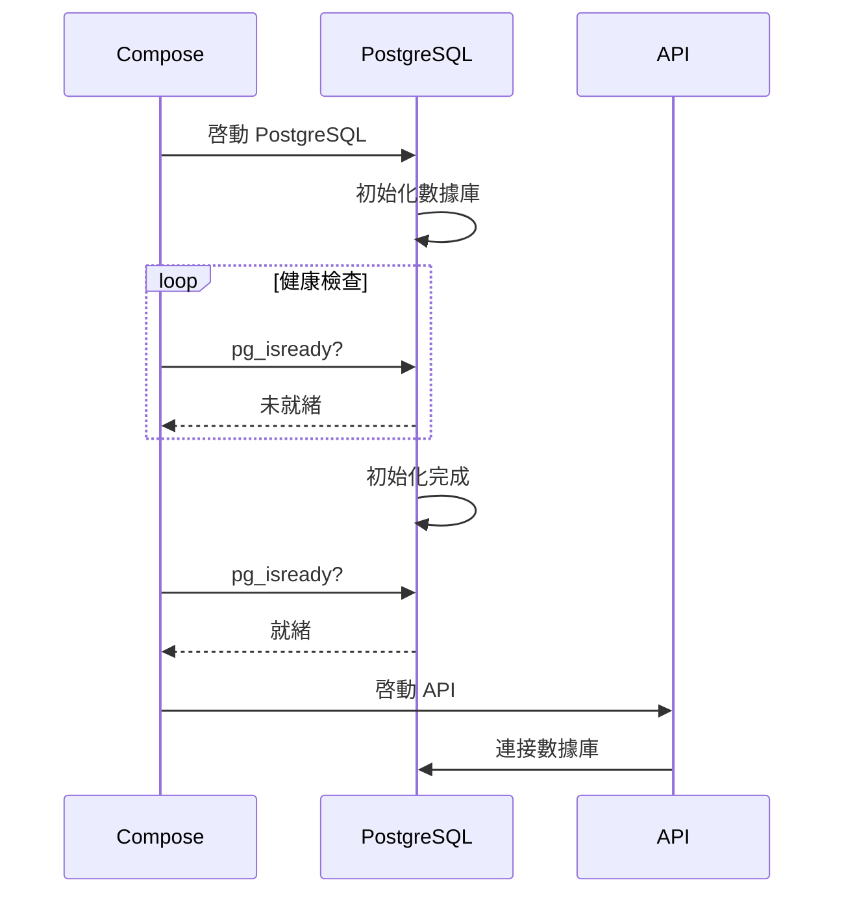

# 10.3.4 服務掛了能自動重啓嗎——健康檢查：服務可用性監控與自動重啓

進程在跑不代表服務正常，健康檢查纔是判斷依據。

## 爲什麼需要健康檢查



| 場景 | 進程狀態 | 實際狀態 | 健康檢查 |
|------|----------|----------|----------|
| 正常運行 | 運行中 | 正常 | 通過 |
| 死循環 | 運行中 | 卡死 | 失敗 |
| 等待依賴 | 運行中 | 未就緒 | 失敗 |
| 內存泄漏 | 運行中 | 響應慢 | 可能失敗 |

## 健康檢查配置

### 基本語法

```yaml
services:
  api:
    healthcheck:
      test: ["CMD", "curl", "-f", "http://localhost:3001/health"]
      interval: 30s      # 檢查間隔
      timeout: 10s       # 超時時間
      retries: 3         # 失敗重試次數
      start_period: 40s  # 啓動等待期（不計入失敗）
```

### 檢查方式

```yaml
# 方式一：CMD 數組格式（推薦）
healthcheck:
  test: ["CMD", "curl", "-f", "http://localhost:3001/health"]

# 方式二：CMD-SHELL 格式
healthcheck:
  test: ["CMD-SHELL", "curl -f http://localhost:3001/health || exit 1"]

# 方式三：禁用健康檢查
healthcheck:
  disable: true
```

## 常見服務的健康檢查

### Node.js 應用

```yaml
services:
  api:
    healthcheck:
      test: ["CMD", "curl", "-f", "http://localhost:3001/health"]
      interval: 30s
      timeout: 10s
      retries: 3
```

應用代碼中添加健康檢查端點：

```typescript
// NestJS
@Controller('health')
export class HealthController {
  constructor(
    private prisma: PrismaService,
    private redis: RedisService,
  ) {}

  @Get()
  async check() {
    // 檢查數據庫連接
    await this.prisma.$queryRaw`SELECT 1`;
    // 檢查 Redis 連接
    await this.redis.ping();
    
    return { status: 'ok', timestamp: new Date().toISOString() };
  }
}
```

### PostgreSQL

```yaml
services:
  postgres:
    healthcheck:
      test: ["CMD-SHELL", "pg_isready -U postgres"]
      interval: 10s
      timeout: 5s
      retries: 5
```

### Redis

```yaml
services:
  redis:
    healthcheck:
      test: ["CMD", "redis-cli", "ping"]
      interval: 10s
      timeout: 5s
      retries: 3
```

### Nginx

```yaml
services:
  nginx:
    healthcheck:
      test: ["CMD", "curl", "-f", "http://localhost/health"]
      interval: 30s
      timeout: 10s
      retries: 3
```

## 依賴健康檢查

確保服務按正確順序啓動：

```yaml
services:
  api:
    depends_on:
      postgres:
        condition: service_healthy  # 等待健康檢查通過
      redis:
        condition: service_started  # 只等待容器啓動

  postgres:
    healthcheck:
      test: ["CMD-SHELL", "pg_isready -U postgres"]
      interval: 5s
      timeout: 5s
      retries: 10
      start_period: 30s
```



## 自動重啓策略

```yaml
services:
  api:
    restart: always  # 配合健康檢查使用
    healthcheck:
      test: ["CMD", "curl", "-f", "http://localhost:3001/health"]
      interval: 30s
      timeout: 10s
      retries: 3
```

| 重啓策略 | 行爲 |
|----------|------|
| `no` | 不自動重啓 |
| `always` | 總是重啓（包括手動停止後 Docker 重啓） |
| `on-failure` | 僅非正常退出時重啓 |
| `unless-stopped` | 除非手動停止，否則總是重啓 |

## 查看健康狀態

```bash
# 查看容器健康狀態
docker compose ps

# NAME        STATUS              HEALTH
# api         Up 5 minutes        healthy
# postgres    Up 5 minutes        healthy
# redis       Up 5 minutes        (none)

# 查看健康檢查歷史
docker inspect --format='{{json .State.Health}}' 容器名 | jq
```

## 健康檢查最佳實踐

### 1. 檢查內容要全面

```typescript
@Get('health')
async check() {
  const checks = {
    database: await this.checkDatabase(),
    redis: await this.checkRedis(),
    diskSpace: await this.checkDiskSpace(),
  };
  
  const isHealthy = Object.values(checks).every(c => c.status === 'ok');
  
  return {
    status: isHealthy ? 'ok' : 'degraded',
    checks,
    timestamp: new Date().toISOString(),
  };
}
```

### 2. 區分存活和就緒

| 類型 | 用途 | 失敗處理 |
|------|------|----------|
| Liveness | 進程是否存活 | 重啓容器 |
| Readiness | 是否可接收請求 | 從負載均衡移除 |

### 3. 合理設置參數

| 參數 | 建議值 | 說明 |
|------|--------|------|
| interval | 10-30s | 太頻繁會增加負擔 |
| timeout | 5-10s | 要小於 interval |
| retries | 3-5 | 避免瞬時抖動觸發 |
| start_period | 30-60s | 根據應用啓動時間設置 |

## 故障排查

```bash
# 查看健康檢查日誌
docker inspect 容器名 --format='{{range .State.Health.Log}}{{.Output}}{{end}}'

# 手動執行健康檢查
docker exec 容器名 curl -f http://localhost:3001/health
```
