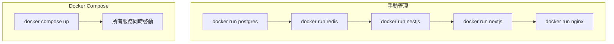

# 10.3 一鍵啓動所有服務——Docker Compose 編排：多服務協同

一個命令，啓動整個應用棧。

## 爲什麼需要 Docker Compose

當你的應用不只有一個容器時（前端 + 後端 + 數據庫 + 緩存），手動一個個啓動既繁瑣又容易出錯。Docker Compose 讓你用一個 YAML 文件定義所有服務，然後一鍵啓動。



## 核心優勢

| 特性 | 說明 |
|------|------|
| 聲明式配置 | 用 YAML 描述期望狀態，而非命令序列 |
| 一鍵操作 | `up` 啓動、`down` 停止、`restart` 重啓 |
| 依賴管理 | 自動按順序啓動有依賴關係的服務 |
| 網絡隔離 | 自動創建專屬網絡，服務間用名稱通信 |
| 環境一致 | 開發和生產使用相同的編排文件 |

## 典型應用棧

```yaml
# docker-compose.yml
services:
  frontend:    # Next.js 前端
  api:         # NestJS 後端
  postgres:    # PostgreSQL 數據庫
  redis:       # Redis 緩存
  nginx:       # 反向代理
```

## 本節目錄

- **10.3.1 編排文件怎麼寫** — Compose 文件結構詳解
- **10.3.2 服務之間如何對話** — 網絡與數據卷配置
- **10.3.3 開發和生產用一套配置嗎** — 多環境配置策略
- **10.3.4 服務掛了能自動重啓嗎** — 健康檢查與自愈

## 常用命令速查

| 命令 | 作用 |
|------|------|
| `docker compose up -d` | 後臺啓動所有服務 |
| `docker compose down` | 停止並刪除容器 |
| `docker compose ps` | 查看服務狀態 |
| `docker compose logs -f` | 即時查看日誌 |
| `docker compose restart api` | 重啓指定服務 |
| `docker compose pull` | 拉取最新鏡像 |
| `docker compose build` | 構建自定義鏡像 |

## 快速上手

```bash
# 1. 創建 docker-compose.yml
# 2. 啓動所有服務
docker compose up -d

# 3. 查看狀態
docker compose ps

# 4. 查看日誌
docker compose logs -f api

# 5. 停止服務
docker compose down
```

::: tip 版本說明
Docker Compose V2 已集成到 Docker CLI，命令從 `docker-compose` 變爲 `docker compose`（去掉了連字符）。
:::
