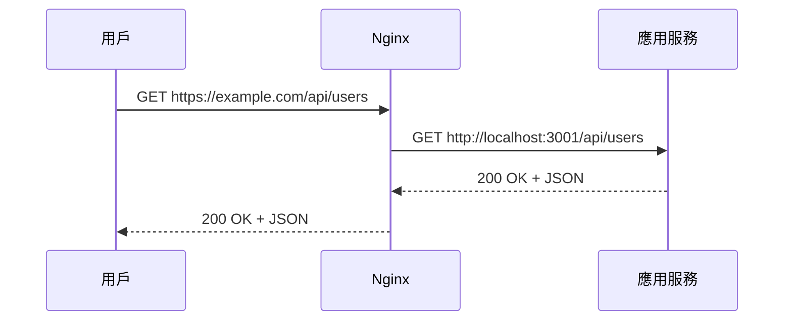

# 10.4.1 請求該轉發給誰——反向代理：upstream 配置與請求轉發

反向代理的核心：用戶看到的是 Nginx，真正幹活的是後端服務。

## 反向代理原理



用戶不知道後端服務的存在，所有請求都通過 Nginx 中轉。

## 基礎配置

### 最簡單的反向代理

```nginx
server {
    listen 80;
    server_name www.example.com;
    
    location / {
        proxy_pass http://127.0.0.1:3000;
    }
}
```

### 完整的反向代理配置

```nginx
server {
    listen 80;
    server_name www.example.com;
    
    location / {
        proxy_pass http://127.0.0.1:3000;
        
        # 傳遞原始請求信息
        proxy_set_header Host $host;
        proxy_set_header X-Real-IP $remote_addr;
        proxy_set_header X-Forwarded-For $proxy_add_x_forwarded_for;
        proxy_set_header X-Forwarded-Proto $scheme;
        
        # HTTP 版本和連接
        proxy_http_version 1.1;
        proxy_set_header Upgrade $http_upgrade;
        proxy_set_header Connection "upgrade";
        
        # 超時設置
        proxy_connect_timeout 60s;
        proxy_send_timeout 60s;
        proxy_read_timeout 60s;
    }
}
```

## 關鍵配置說明

### proxy_set_header 詳解

| Header | 作用 |
|--------|------|
| `Host` | 傳遞原始域名 |
| `X-Real-IP` | 傳遞用戶真實 IP |
| `X-Forwarded-For` | 傳遞代理鏈路 |
| `X-Forwarded-Proto` | 傳遞原始協議（http/https） |
| `Upgrade` | 支持 WebSocket |
| `Connection` | 支持連接升級 |

### 後端獲取真實 IP

在 NestJS 中獲取用戶真實 IP：

```typescript
@Get()
getUsers(@Req() req: Request) {
  const realIP = req.headers['x-real-ip'] || req.ip;
  console.log('User IP:', realIP);
}
```

## 多服務代理

### 按路徑分發

```nginx
server {
    listen 80;
    server_name example.com;
    
    # 前端應用
    location / {
        proxy_pass http://127.0.0.1:3000;
    }
    
    # 後端 API
    location /api/ {
        proxy_pass http://127.0.0.1:3001;
    }
    
    # 靜態資源
    location /_next/static/ {
        alias /var/www/static/;
        expires 1y;
    }
}
```

### 按子域名分發

```nginx
# 前端 www.example.com
server {
    listen 80;
    server_name www.example.com;
    
    location / {
        proxy_pass http://127.0.0.1:3000;
    }
}

# API api.example.com
server {
    listen 80;
    server_name api.example.com;
    
    location / {
        proxy_pass http://127.0.0.1:3001;
    }
}
```

## upstream 配置

當後端有多個實例時，使用 `upstream` 定義服務組：

```nginx
upstream frontend {
    server 127.0.0.1:3000;
}

upstream backend {
    server 127.0.0.1:3001;
    server 127.0.0.1:3002;  # 多實例
}

server {
    listen 80;
    server_name example.com;
    
    location / {
        proxy_pass http://frontend;
    }
    
    location /api/ {
        proxy_pass http://backend;
    }
}
```

## 路徑重寫

### 去掉路徑前綴

```nginx
# 請求 /api/users → 轉發到 /users
location /api/ {
    proxy_pass http://127.0.0.1:3001/;  # 注意末尾的 /
}
```

### 保留路徑前綴

```nginx
# 請求 /api/users → 轉發到 /api/users
location /api/ {
    proxy_pass http://127.0.0.1:3001;  # 沒有末尾的 /
}
```

## 1Panel 中配置反向代理

1. 網站 → 創建網站 → 反向代理
2. 填寫配置：
   - 主域名：`www.example.com`
   - 代理地址：`http://127.0.0.1:3000`

系統會自動生成配置文件，可在"配置文件"中查看和修改。

## 常見問題

| 問題 | 原因 | 解決方案 |
|------|------|----------|
| 502 Bad Gateway | 後端服務未啓動 | 檢查應用是否運行 |
| 504 Gateway Timeout | 後端響應超時 | 增加 `proxy_read_timeout` |
| 獲取不到真實 IP | 未設置 header | 添加 `X-Real-IP` 配置 |
| WebSocket 斷開 | 未配置 Upgrade | 添加 `Upgrade` 和 `Connection` |

## AI 協作指南

向 AI 描述需求時：

```
請幫我配置 Nginx 反向代理：
- 域名：www.example.com 代理到 localhost:3000
- api.example.com 代理到 localhost:3001
- 需要支持 WebSocket
- 需要傳遞用戶真實 IP
```

**關鍵術語**：proxy_pass、upstream、proxy_set_header、location
