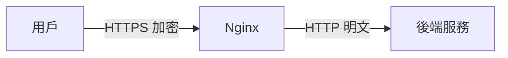
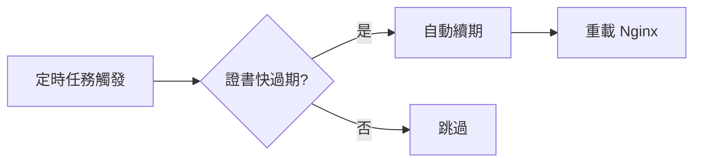

# 10.4.2 HTTPS 證書怎麼配——SSL 終止：HTTPS 證書配置與自動續期

2024 年了，沒有 HTTPS 的網站會被瀏覽器標記爲"不安全"。

## SSL 終止原理



Nginx 負責 HTTPS 的加密/解密，後端服務只需處理 HTTP，簡化架構。

## 證書獲取方式

| 方式 | 費用 | 有效期 | 適用場景 |
|------|------|--------|----------|
| Let's Encrypt | 免費 | 90 天 | 個人/小型項目 |
| 阿里雲免費證書 | 免費 | 1 年 | 單域名 |
| 付費證書 | 收費 | 1-2 年 | 企業/高安全需求 |

## 1Panel 一鍵申請

1Panel 支持一鍵申請 Let's Encrypt 免費證書：

1. 網站 → 選擇站點 → HTTPS
2. 選擇"申請證書"
3. 選擇 Let's Encrypt
4. 驗證方式：DNS 驗證 或 HTTP 驗證
5. 點擊申請

::: tip 驗證方式選擇
- **HTTP 驗證**：需要域名已解析到當前服務器
- **DNS 驗證**：可申請泛域名證書（*.example.com）
:::

## 手動配置 SSL

### 基本 HTTPS 配置

```nginx
server {
    listen 80;
    server_name example.com;
    # HTTP 重定向到 HTTPS
    return 301 https://$server_name$request_uri;
}

server {
    listen 443 ssl http2;
    server_name example.com;
    
    # 證書文件
    ssl_certificate /etc/nginx/ssl/example.com.pem;
    ssl_certificate_key /etc/nginx/ssl/example.com.key;
    
    # SSL 配置
    ssl_protocols TLSv1.2 TLSv1.3;
    ssl_ciphers ECDHE-ECDSA-AES128-GCM-SHA256:ECDHE-RSA-AES128-GCM-SHA256;
    ssl_prefer_server_ciphers on;
    
    # 安全頭
    add_header Strict-Transport-Security "max-age=31536000" always;
    
    location / {
        proxy_pass http://127.0.0.1:3000;
    }
}
```

### 配置說明

| 配置 | 作用 |
|------|------|
| `listen 443 ssl http2` | 啓用 HTTPS 和 HTTP/2 |
| `ssl_certificate` | 證書文件路徑 |
| `ssl_certificate_key` | 私鑰文件路徑 |
| `ssl_protocols` | 支持的 TLS 版本 |
| `ssl_ciphers` | 加密套件 |
| `HSTS` | 強制瀏覽器使用 HTTPS |

## 證書自動續期

### Let's Encrypt 自動續期

1Panel 會自動處理 Let's Encrypt 證書的續期。手動配置時：

```bash
# 安裝 certbot
apt install certbot python3-certbot-nginx

# 申請證書
certbot --nginx -d example.com -d www.example.com

# 測試自動續期
certbot renew --dry-run

# 添加定時任務
crontab -e
# 每天凌晨 2 點檢查續期
0 2 * * * certbot renew --quiet
```

### 續期流程



## 多域名證書

### 主域名 + www

```nginx
server {
    listen 443 ssl http2;
    server_name example.com www.example.com;
    
    ssl_certificate /etc/nginx/ssl/example.com.pem;
    ssl_certificate_key /etc/nginx/ssl/example.com.key;
}
```

### 泛域名證書

```nginx
server {
    listen 443 ssl http2;
    server_name *.example.com;
    
    ssl_certificate /etc/nginx/ssl/wildcard.example.com.pem;
    ssl_certificate_key /etc/nginx/ssl/wildcard.example.com.key;
}
```

::: warning 泛域名證書
泛域名證書（*.example.com）只能匹配一級子域名，不能匹配 `a.b.example.com`。
:::

## SSL 優化

### 啓用 OCSP Stapling

```nginx
ssl_stapling on;
ssl_stapling_verify on;
ssl_trusted_certificate /etc/nginx/ssl/chain.pem;
resolver 8.8.8.8 8.8.4.4 valid=300s;
```

### 啓用 Session 緩存

```nginx
ssl_session_cache shared:SSL:10m;
ssl_session_timeout 1d;
ssl_session_tickets off;
```

## 安全檢測

配置完成後，使用在線工具檢測 SSL 配置：

- [SSL Labs](https://www.ssllabs.com/ssltest/) - 評分 A+ 爲最佳
- [Security Headers](https://securityheaders.com/) - 檢測安全頭

## 常見問題

| 問題 | 原因 | 解決方案 |
|------|------|----------|
| 證書不受信任 | 證書鏈不完整 | 使用包含中間證書的 fullchain.pem |
| 混合內容警告 | 頁面包含 HTTP 資源 | 將所有資源改爲 HTTPS |
| 證書過期 | 續期失敗 | 檢查 certbot 日誌 |
| ERR_SSL_PROTOCOL_ERROR | 配置錯誤 | 檢查 ssl_protocols 和 ssl_ciphers |

## 最佳實踐

1. **使用 HTTP/2**：`listen 443 ssl http2`
2. **禁用舊協議**：只允許 TLS 1.2 和 1.3
3. **啓用 HSTS**：強制瀏覽器使用 HTTPS
4. **定期檢查**：監控證書過期時間
5. **證書備份**：備份私鑰和證書文件
