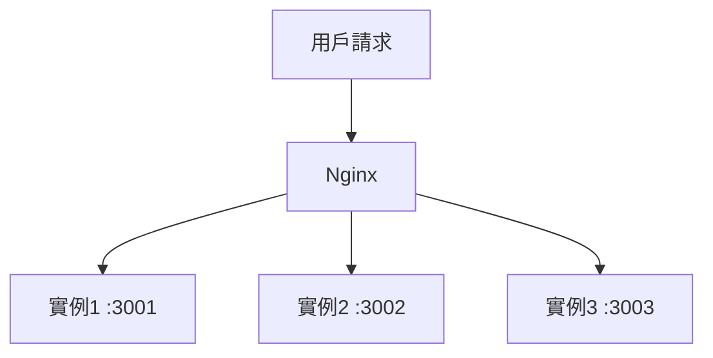
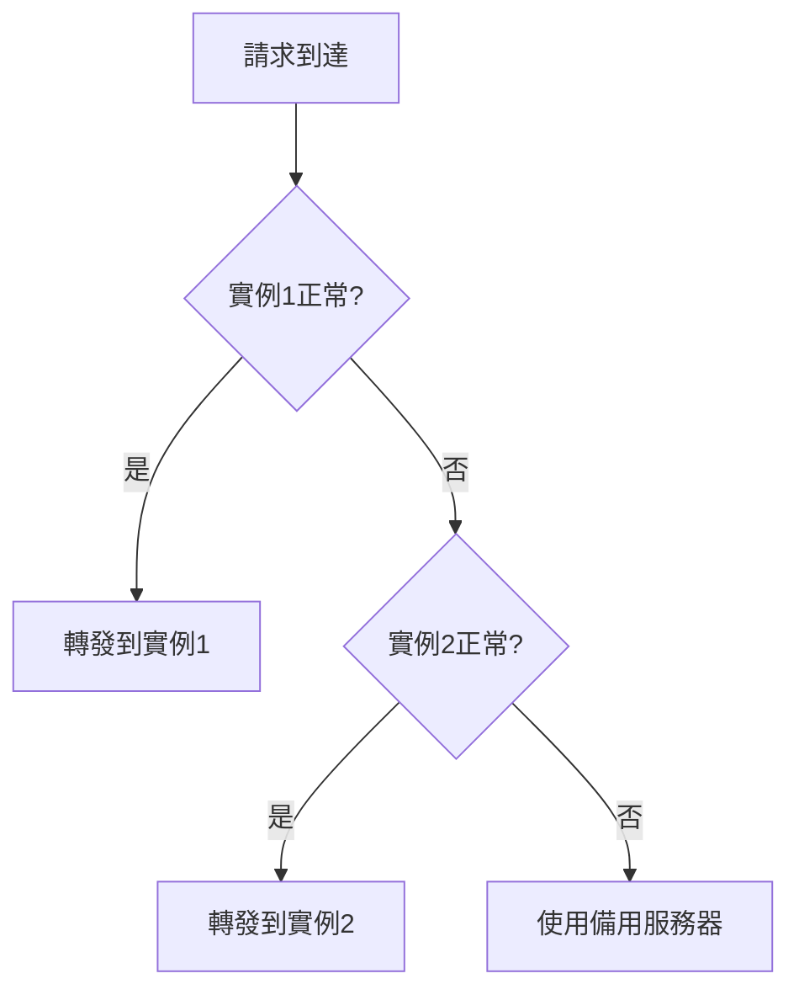

# 10.4.3 用戶太多了怎麼辦——負載均衡：多實例分發策略

單臺服務器扛不住？那就多來幾臺。

## 負載均衡原理



Nginx 將請求分發到多個後端實例，提升處理能力和可用性。

## 基礎配置

```nginx
upstream backend {
    server 127.0.0.1:3001;
    server 127.0.0.1:3002;
    server 127.0.0.1:3003;
}

server {
    listen 80;
    server_name api.example.com;
    
    location / {
        proxy_pass http://backend;
    }
}
```

## 負載均衡策略

### 輪詢（默認）

請求按順序分發到每個服務器：

```nginx
upstream backend {
    server 127.0.0.1:3001;
    server 127.0.0.1:3002;
    server 127.0.0.1:3003;
}
```

### 權重分配

根據服務器性能分配不同權重：

```nginx
upstream backend {
    server 127.0.0.1:3001 weight=3;  # 處理 3/6 請求
    server 127.0.0.1:3002 weight=2;  # 處理 2/6 請求
    server 127.0.0.1:3003 weight=1;  # 處理 1/6 請求
}
```

### IP Hash

同一用戶始終訪問同一服務器（解決 Session 問題）：

```nginx
upstream backend {
    ip_hash;
    server 127.0.0.1:3001;
    server 127.0.0.1:3002;
    server 127.0.0.1:3003;
}
```

### 最少連接

請求發送到當前連接數最少的服務器：

```nginx
upstream backend {
    least_conn;
    server 127.0.0.1:3001;
    server 127.0.0.1:3002;
    server 127.0.0.1:3003;
}
```

## 策略對比

| 策略 | 特點 | 適用場景 |
|------|------|----------|
| 輪詢 | 簡單均勻 | 服務器配置相同 |
| 權重 | 按性能分配 | 服務器配置不同 |
| IP Hash | 會話保持 | 有狀態應用 |
| 最少連接 | 動態均衡 | 請求處理時間差異大 |

## 健康檢查

### 被動健康檢查

```nginx
upstream backend {
    server 127.0.0.1:3001 max_fails=3 fail_timeout=30s;
    server 127.0.0.1:3002 max_fails=3 fail_timeout=30s;
    server 127.0.0.1:3003 backup;  # 備用服務器
}
```

| 參數 | 作用 |
|------|------|
| `max_fails` | 失敗次數閾值 |
| `fail_timeout` | 失敗後暫停時間 |
| `backup` | 僅在其他服務器不可用時使用 |
| `down` | 標記服務器爲下線 |

### 健康檢查流程



## Docker Compose 多實例

```yaml
services:
  api:
    image: my-api:latest
    deploy:
      replicas: 3  # 3個實例
    # 不映射端口，通過 Nginx 訪問
    
  nginx:
    image: nginx:alpine
    ports:
      - "80:80"
    depends_on:
      - api
```

配合 Docker 內部 DNS：

```nginx
upstream backend {
    server api:3001;  # Docker 會自動負載均衡到所有實例
}
```

## 會話保持

當使用負載均衡時，用戶可能被分發到不同服務器，導致會話丟失。

### 解決方案

| 方案 | 實現 | 優缺點 |
|------|------|--------|
| IP Hash | Nginx 配置 | 簡單，但 IP 變化會失效 |
| Session 共享 | Redis 存儲 | 推薦，無狀態應用 |
| JWT Token | 客戶端存儲 | 推薦，完全無狀態 |

### Redis Session 存儲

```typescript
// NestJS 配置
import * as session from 'express-session';
import * as RedisStore from 'connect-redis';

app.use(
  session({
    store: new RedisStore({ client: redisClient }),
    secret: 'your-secret',
    resave: false,
    saveUninitialized: false,
  }),
);
```

## 監控與調優

### 查看 upstream 狀態

```nginx
# 啓用狀態頁面
location /nginx_status {
    stub_status on;
    allow 127.0.0.1;
    deny all;
}
```

### 連接池配置

```nginx
upstream backend {
    server 127.0.0.1:3001;
    
    keepalive 32;  # 保持連接數
}

server {
    location / {
        proxy_pass http://backend;
        proxy_http_version 1.1;
        proxy_set_header Connection "";  # 啓用 keepalive
    }
}
```

## 常見問題

| 問題 | 原因 | 解決方案 |
|------|------|----------|
| Session 丟失 | 請求分發到不同實例 | 使用 IP Hash 或 Redis Session |
| 單點故障 | 某實例掛掉 | 配置健康檢查和備用服務器 |
| 負載不均 | 請求處理時間差異大 | 使用 least_conn 策略 |

## 最佳實踐

1. **無狀態設計**：應用不依賴本地 Session
2. **健康檢查**：配置 max_fails 和 fail_timeout
3. **備用服務器**：至少一個 backup 服務器
4. **監控**：關注各實例的負載情況
5. **漸進式擴容**：根據監控數據逐步增加實例
