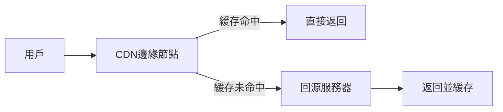
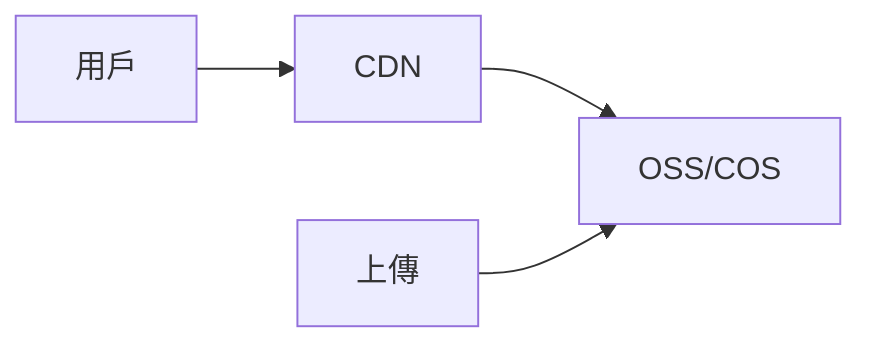

# 10.4.4 圖片如何加速訪問——靜態資源：緩存策略與 CDN 集成

靜態資源不走應用服務器，Nginx 直接返回最快。

## 靜態資源分類

| 類型 | 示例 | 緩存策略 |
|------|------|----------|
| 帶 hash 的文件 | `main.abc123.js` | 永久緩存 |
| 不帶 hash 的文件 | `logo.png` | 短期緩存 |
| HTML 文件 | `index.html` | 不緩存/短期 |

## Nginx 靜態資源配置

### 基礎配置

```nginx
server {
    listen 80;
    server_name www.example.com;
    
    # Next.js 靜態資源
    location /_next/static/ {
        alias /var/www/app/.next/static/;
        expires 1y;
        add_header Cache-Control "public, immutable";
    }
    
    # 公共資源
    location /public/ {
        alias /var/www/app/public/;
        expires 7d;
    }
    
    # 其他請求代理到應用
    location / {
        proxy_pass http://127.0.0.1:3000;
    }
}
```

### 緩存控制頭

```nginx
# 永久緩存（帶 hash 的文件）
location ~* \.(js|css)$ {
    expires 1y;
    add_header Cache-Control "public, immutable";
}

# 中期緩存
location ~* \.(jpg|jpeg|png|gif|ico|svg|webp)$ {
    expires 30d;
    add_header Cache-Control "public";
}

# 短期緩存
location ~* \.(html|json)$ {
    expires 1h;
    add_header Cache-Control "public, must-revalidate";
}
```

## Gzip 壓縮

```nginx
http {
    gzip on;
    gzip_vary on;
    gzip_min_length 1024;
    gzip_types 
        text/plain 
        text/css 
        text/javascript 
        application/javascript 
        application/json 
        application/xml
        image/svg+xml;
}
```

| 配置 | 作用 |
|------|------|
| `gzip on` | 啓用壓縮 |
| `gzip_vary` | 添加 Vary: Accept-Encoding |
| `gzip_min_length` | 最小壓縮大小 |
| `gzip_types` | 壓縮的 MIME 類型 |

## CDN 集成

### CDN 原理



### 配置 CDN 回源

1. 在雲服務商創建 CDN 加速域名（如 `cdn.example.com`）
2. 配置回源地址爲 `origin.example.com`
3. 在 Nginx 配置回源域名：

```nginx
server {
    listen 80;
    server_name origin.example.com;
    
    location / {
        root /var/www/static;
        expires 1y;
    }
}
```

### 前端使用 CDN

```javascript
// next.config.js
module.exports = {
  assetPrefix: process.env.NODE_ENV === 'production' 
    ? 'https://cdn.example.com' 
    : '',
}
```

## 對象存儲 + CDN

將靜態資源存儲到 OSS/COS，通過 CDN 加速：



### 優勢

| 對比項 | 服務器存儲 | OSS + CDN |
|--------|------------|-----------|
| 存儲成本 | 高 | 低 |
| 擴容 | 需要升級磁盤 | 自動 |
| 訪問速度 | 受服務器帶寬限制 | 全國節點加速 |
| 可用性 | 依賴服務器 | 99.99%+ |

### 上傳到 OSS 示例

```typescript
// NestJS 上傳服務
import * as OSS from 'ali-oss';

const client = new OSS({
  region: 'oss-cn-hangzhou',
  accessKeyId: process.env.OSS_ACCESS_KEY_ID,
  accessKeySecret: process.env.OSS_ACCESS_KEY_SECRET,
  bucket: 'my-bucket',
});

async function uploadFile(file: Express.Multer.File) {
  const result = await client.put(`uploads/${file.originalname}`, file.buffer);
  return result.url;  // 返回 CDN 地址
}
```

## 緩存策略最佳實踐

### Next.js 靜態資源

```nginx
# _next/static 目錄下的文件都帶有 hash，可以永久緩存
location /_next/static/ {
    alias /var/www/.next/static/;
    expires max;
    add_header Cache-Control "public, max-age=31536000, immutable";
}

# _next/image 圖片優化
location /_next/image {
    proxy_pass http://127.0.0.1:3000;
    proxy_cache_valid 200 60m;
}
```

### 版本化資源

```html
<!-- 帶版本號的資源引用 -->
<link rel="stylesheet" href="/css/style.css?v=1.0.0">
<script src="/js/app.js?v=1.0.0"></script>
```

## 監控與調優

### 查看緩存命中率

```nginx
# 添加緩存狀態頭
add_header X-Cache-Status $upstream_cache_status;
```

### 緩存狀態值

| 狀態 | 含義 |
|------|------|
| HIT | 緩存命中 |
| MISS | 緩存未命中 |
| EXPIRED | 緩存已過期 |
| BYPASS | 跳過緩存 |

## 常見問題

| 問題 | 原因 | 解決方案 |
|------|------|----------|
| 資源更新後用戶看不到 | 瀏覽器緩存 | 使用文件名 hash |
| CDN 不更新 | CDN 緩存未刷新 | 手動刷新 CDN 緩存 |
| 圖片加載慢 | 圖片太大 | 壓縮圖片、使用 WebP |
| CORS 錯誤 | CDN 未配置跨域 | 添加 Access-Control-Allow-Origin |
