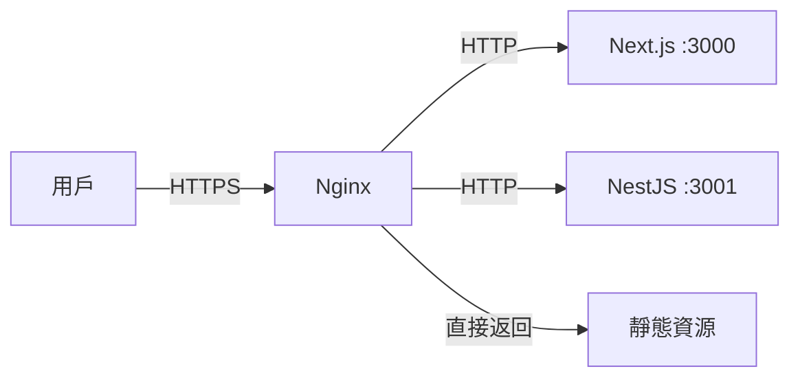
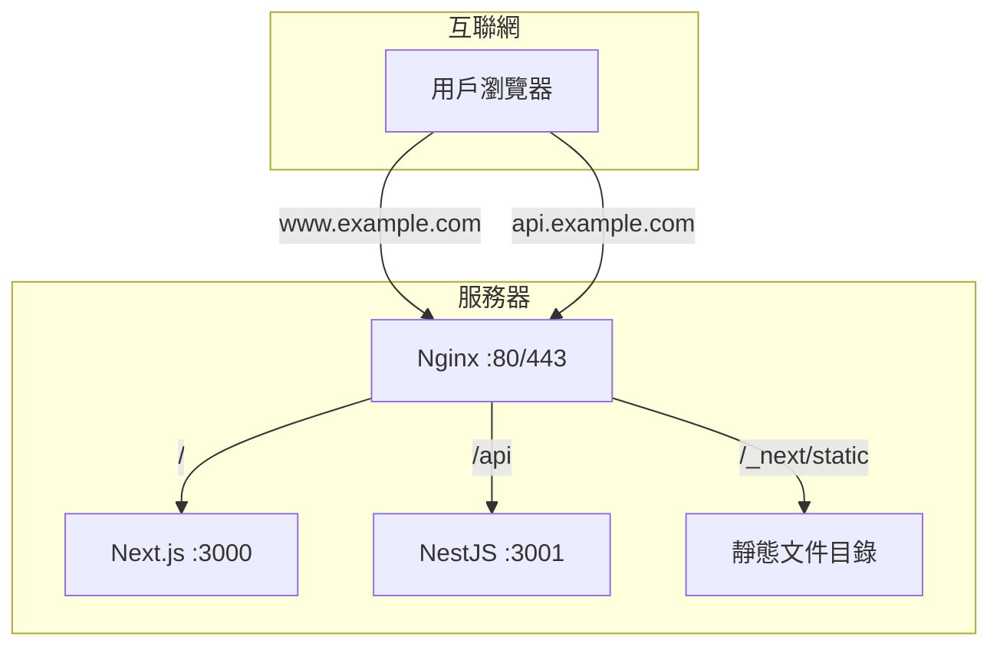

# 10.4 網站的交通指揮官——反向代理與負載均衡：Nginx 配置實戰

用戶訪問的是域名，Nginx 決定請求去哪。

## 爲什麼需要 Nginx

Nginx 在現代 Web 架構中扮演着"門衛"角色：



## 核心功能

| 功能 | 說明 |
|------|------|
| 反向代理 | 將請求轉發到後端服務 |
| SSL 終止 | 處理 HTTPS 加密/解密 |
| 負載均衡 | 將請求分發到多個實例 |
| 靜態文件 | 直接返回靜態資源 |
| 緩存 | 緩存響應，減少後端壓力 |
| 壓縮 | Gzip 壓縮響應內容 |

## 1Panel 中的 Nginx

1Panel 默認使用 **OpenResty**（Nginx 的增強版），通過 **網站** 功能管理：

| 操作 | 路徑 |
|------|------|
| 創建網站 | 網站 → 網站 → 創建網站 |
| 配置反向代理 | 網站 → 選擇站點 → 反向代理 |
| SSL 證書 | 網站 → 選擇站點 → HTTPS |
| 查看配置 | 網站 → 選擇站點 → 配置文件 |

## 本節目錄

- **10.4.1 請求該轉發給誰** — 反向代理基礎配置
- **10.4.2 HTTPS 證書怎麼配** — SSL 配置與自動續期
- **10.4.3 用戶太多了怎麼辦** — 負載均衡策略
- **10.4.4 圖片如何加速訪問** — 靜態資源與 CDN

## 典型配置架構



## 常用命令

```bash
# 測試配置語法
nginx -t

# 重載配置（不中斷服務）
nginx -s reload

# 查看 Nginx 狀態
systemctl status nginx

# 查看訪問日誌
tail -f /var/log/nginx/access.log

# 查看錯誤日誌
tail -f /var/log/nginx/error.log
```

## 配置文件結構

```nginx
# /etc/nginx/nginx.conf 主配置
http {
    # 全局設置
    include /etc/nginx/conf.d/*.conf;  # 包含站點配置
}

# /etc/nginx/conf.d/example.conf 站點配置
server {
    listen 80;
    server_name example.com;
    
    location / {
        proxy_pass http://localhost:3000;
    }
}
```
