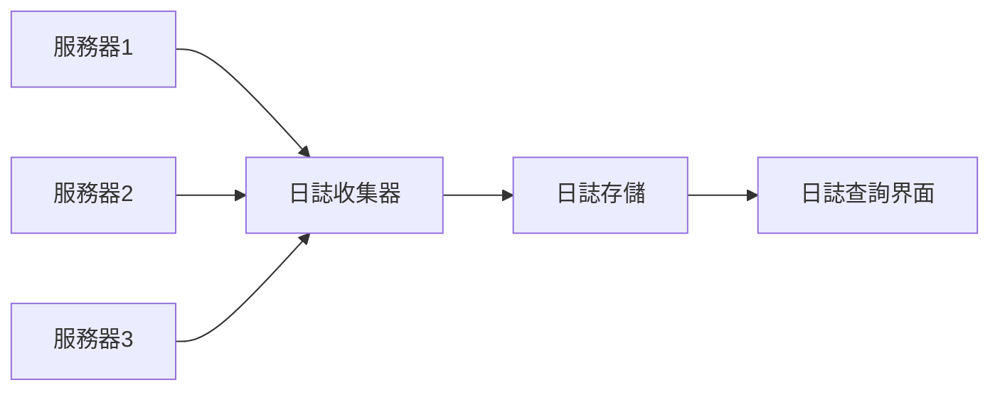

# 10.5.2 日誌太多了怎麼辦——日誌管理：結構化日誌與日誌輪轉

日誌是排查問題的第一手資料，但太多了也是災難。

## 日誌級別

| 級別 | 用途 | 生產環境 |
|------|------|----------|
| ERROR | 錯誤，需要處理 | 必須記錄 |
| WARN | 警告，可能有問題 | 建議記錄 |
| INFO | 重要信息 | 選擇性記錄 |
| DEBUG | 調試信息 | 不記錄 |
| VERBOSE | 詳細信息 | 不記錄 |

## 結構化日誌

### 爲什麼要結構化

```bash
# 非結構化日誌 - 難以搜索和分析
[2024-01-15 10:30:00] User login failed: invalid password for user@example.com

# 結構化日誌 - 易於查詢和聚合
{"timestamp":"2024-01-15T10:30:00Z","level":"warn","event":"login_failed","reason":"invalid_password","email":"user@example.com"}
```

### NestJS 日誌配置

```typescript
// logger.service.ts
import { Injectable, Logger } from '@nestjs/common';

@Injectable()
export class AppLogger extends Logger {
  private formatLog(level: string, message: string, context?: object) {
    return JSON.stringify({
      timestamp: new Date().toISOString(),
      level,
      message,
      ...context,
    });
  }

  log(message: string, context?: object) {
    console.log(this.formatLog('info', message, context));
  }

  error(message: string, trace?: string, context?: object) {
    console.error(this.formatLog('error', message, { trace, ...context }));
  }

  warn(message: string, context?: object) {
    console.warn(this.formatLog('warn', message, context));
  }
}
```

### 使用示例

```typescript
// 業務日誌
this.logger.log('Order created', {
  orderId: order.id,
  userId: user.id,
  amount: order.total,
});

// 錯誤日誌
this.logger.error('Payment failed', error.stack, {
  orderId: order.id,
  gateway: 'stripe',
  errorCode: error.code,
});
```

## Docker 日誌管理

### 查看日誌

```bash
# 即時查看日誌
docker logs -f container-name

# 查看最近 100 行
docker logs --tail 100 container-name

# 查看特定時間段
docker logs --since 2024-01-15T10:00:00 container-name
```

### 日誌驅動配置

```yaml
# docker-compose.yml
services:
  api:
    image: my-api
    logging:
      driver: "json-file"
      options:
        max-size: "10m"    # 單個日誌文件最大 10MB
        max-file: "5"      # 最多保留 5 個文件
```

## 日誌輪轉

### 爲什麼需要輪轉

| 問題 | 後果 |
|------|------|
| 日誌文件過大 | 磁盤空間耗盡 |
| 單文件太大 | 打開/搜索困難 |
| 歷史日誌堆積 | 無法有效管理 |

### logrotate 配置

```bash
# /etc/logrotate.d/app
/var/log/app/*.log {
    daily           # 每天輪轉
    rotate 7        # 保留 7 天
    compress        # 壓縮舊日誌
    delaycompress   # 延遲壓縮
    missingok       # 日誌不存在不報錯
    notifempty      # 空文件不輪轉
    create 0644 root root
}
```

### Docker 自動管理

Docker 配置 `max-size` 和 `max-file` 後自動輪轉：

```json
// /etc/docker/daemon.json
{
  "log-driver": "json-file",
  "log-opts": {
    "max-size": "10m",
    "max-file": "5"
  }
}
```

## 日誌最佳實踐

### 該記什麼

```typescript
// 1. 請求入口
this.logger.log('Request received', {
  method: req.method,
  path: req.path,
  userId: req.user?.id,
});

// 2. 關鍵業務操作
this.logger.log('Order status changed', {
  orderId,
  from: oldStatus,
  to: newStatus,
});

// 3. 外部調用
this.logger.log('API call', {
  service: 'payment',
  duration: 150,
  success: true,
});

// 4. 錯誤和異常
this.logger.error('Database query failed', error.stack, {
  query: 'findUser',
  userId,
});
```

### 不該記什麼

```typescript
// 敏感信息 - 絕對不要記錄！
this.logger.log('User login', {
  password: user.password,  // 永遠不要！
  creditCard: card.number,  // 永遠不要！
  token: jwt,               // 避免記錄完整 token
});

// 應該脫敏
this.logger.log('User login', {
  email: maskEmail(user.email),  // u***@example.com
  cardLast4: card.number.slice(-4),  // 1234
});
```

## 日誌查詢技巧

### 使用 grep 搜索

```bash
# 搜索錯誤日誌
docker logs api 2>&1 | grep -i error

# 搜索特定用戶
docker logs api | grep "userId\":\"123"

# 搜索時間範圍
docker logs api --since 1h | grep error
```

### 使用 jq 解析 JSON

```bash
# 只顯示錯誤級別的日誌
docker logs api | jq 'select(.level == "error")'

# 提取特定字段
docker logs api | jq '{time: .timestamp, msg: .message}'

# 統計錯誤數量
docker logs api | jq 'select(.level == "error")' | wc -l
```

## 集中化日誌（可選）

對於多服務器場景，考慮日誌集中管理：



### 簡單方案

| 工具 | 費用 | 特點 |
|------|------|------|
| Better Stack | 免費起步 | 簡單易用 |
| Papertrail | 免費起步 | 即時搜索 |
| Loki + Grafana | 免費 | 自託管 |

## 常見問題

| 問題 | 原因 | 解決方案 |
|------|------|----------|
| 磁盤空間不足 | 日誌未輪轉 | 配置日誌輪轉 |
| 日誌太多找不到 | 缺少結構化 | 使用 JSON 格式 |
| 性能影響 | 同步寫日誌 | 異步寫入/批量寫入 |
| 敏感信息泄露 | 日誌記錄不當 | 審查日誌內容，脫敏處理 |
