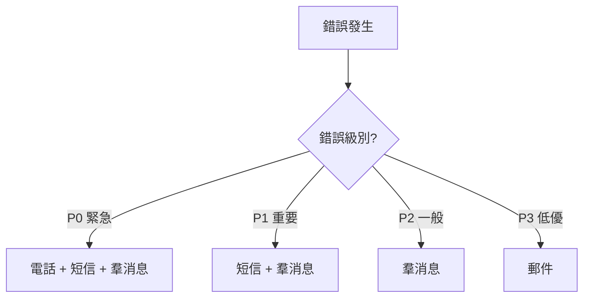

# 10.5.3 一出錯就通知我——錯誤追蹤：異常捕獲與告警機制

錯誤發生了不可怕，可怕的是你不知道。

## 錯誤追蹤 vs 日誌

| 對比項 | 日誌 | 錯誤追蹤 |
|--------|------|----------|
| 信息量 | 一行文本 | 完整上下文 |
| 堆棧 | 可能有 | 完整堆棧 |
| 聚合 | 無 | 相同錯誤自動聚合 |
| 通知 | 需要額外配置 | 內置告警 |
| 用戶信息 | 手動記錄 | 自動關聯 |

## Sentry 集成

Sentry 是最流行的錯誤追蹤服務，免費版夠用。

### 後端集成（NestJS）

```bash
npm install @sentry/node
```

```typescript
// main.ts
import * as Sentry from '@sentry/node';

Sentry.init({
  dsn: process.env.SENTRY_DSN,
  environment: process.env.NODE_ENV,
  tracesSampleRate: 0.1,  // 採樣 10% 的請求
});

// 全局異常過濾器
@Catch()
export class SentryExceptionFilter implements ExceptionFilter {
  catch(exception: any, host: ArgumentsHost) {
    Sentry.captureException(exception);
    
    const ctx = host.switchToHttp();
    const response = ctx.getResponse<Response>();
    
    response.status(500).json({
      message: 'Internal server error',
    });
  }
}
```

### 前端集成（Next.js）

```bash
npm install @sentry/nextjs
npx @sentry/wizard@latest -i nextjs
```

```typescript
// sentry.client.config.ts
import * as Sentry from '@sentry/nextjs';

Sentry.init({
  dsn: process.env.NEXT_PUBLIC_SENTRY_DSN,
  tracesSampleRate: 0.1,
});
```

### 捕獲自定義錯誤

```typescript
try {
  await processPayment(order);
} catch (error) {
  Sentry.captureException(error, {
    extra: {
      orderId: order.id,
      amount: order.total,
    },
    tags: {
      payment_gateway: 'stripe',
    },
    user: {
      id: user.id,
      email: user.email,
    },
  });
  throw error;
}
```

## 告警配置

### 告警渠道

| 渠道 | 優點 | 缺點 |
|------|------|------|
| 郵件 | 詳細、可追溯 | 容易被忽略 |
| 釘釘/飛書 | 即時、團隊可見 | 可能打擾 |
| 短信 | 緊急通知 | 成本高 |
| 電話 | 最緊急 | 成本最高 |

### 釘釘機器人告警

```typescript
async function sendDingTalkAlert(message: string) {
  const webhook = process.env.DINGTALK_WEBHOOK;
  
  await fetch(webhook, {
    method: 'POST',
    headers: { 'Content-Type': 'application/json' },
    body: JSON.stringify({
      msgtype: 'markdown',
      markdown: {
        title: '服務告警',
        text: `## 服務告警\n\n${message}\n\n時間：${new Date().toLocaleString()}`,
      },
    }),
  });
}
```

### 飛書機器人告警

```typescript
async function sendFeishuAlert(title: string, content: string) {
  const webhook = process.env.FEISHU_WEBHOOK;
  
  await fetch(webhook, {
    method: 'POST',
    headers: { 'Content-Type': 'application/json' },
    body: JSON.stringify({
      msg_type: 'interactive',
      card: {
        header: {
          title: { content: title, tag: 'plain_text' },
          template: 'red',
        },
        elements: [{
          tag: 'div',
          text: { content, tag: 'plain_text' },
        }],
      },
    }),
  });
}
```

## 告警規則設計

### 分級告警



| 級別 | 定義 | 響應時間 |
|------|------|----------|
| P0 | 服務完全不可用 | 5 分鐘 |
| P1 | 核心功能受損 | 30 分鐘 |
| P2 | 非核心功能問題 | 4 小時 |
| P3 | 用戶可接受的問題 | 1 天 |

### 避免告警疲勞

```typescript
// 錯誤聚合 - 相同錯誤 5 分鐘內只告警一次
const alertCache = new Map<string, number>();

function shouldAlert(errorKey: string): boolean {
  const lastAlert = alertCache.get(errorKey);
  const now = Date.now();
  
  if (lastAlert && now - lastAlert < 5 * 60 * 1000) {
    return false;
  }
  
  alertCache.set(errorKey, now);
  return true;
}
```

## UptimeRobot 告警

### 配置告警聯繫人

1. 設置 → Alert Contacts
2. 添加聯繫方式：
   - Email
   - Webhook（推薦，可集成釘釘/飛書）
   - Slack/Discord

### Webhook 轉發到釘釘

```javascript
// 接收 UptimeRobot webhook，轉發到釘釘
app.post('/webhook/uptime', async (req, res) => {
  const { monitorFriendlyName, alertType, alertDetails } = req.body;
  
  const isDown = alertType === '1';
  const message = isDown 
    ? `🔴 服務宕機：${monitorFriendlyName}\n${alertDetails}`
    : `🟢 服務恢復：${monitorFriendlyName}`;
  
  await sendDingTalkAlert(message);
  res.send('ok');
});
```

## 錯誤處理最佳實踐

### 全局異常處理

```typescript
// NestJS 全局異常過濾器
@Catch()
export class GlobalExceptionFilter implements ExceptionFilter {
  catch(exception: any, host: ArgumentsHost) {
    const ctx = host.switchToHttp();
    const response = ctx.getResponse();
    const request = ctx.getRequest();
    
    // 記錄錯誤
    console.error(JSON.stringify({
      level: 'error',
      message: exception.message,
      stack: exception.stack,
      path: request.url,
      method: request.method,
      userId: request.user?.id,
    }));
    
    // 發送到 Sentry
    Sentry.captureException(exception);
    
    // 返回用戶友好的錯誤
    response.status(500).json({
      statusCode: 500,
      message: 'Something went wrong',
    });
  }
}
```

### 不要暴露敏感信息

```typescript
// 錯誤的做法
res.status(500).json({ error: exception.message }); // 可能泄露數據庫信息

// 正確的做法
res.status(500).json({ message: 'Internal server error' });
```

## 常見問題

| 問題 | 原因 | 解決方案 |
|------|------|----------|
| 告警太多 | 閾值太敏感 | 調整閾值，錯誤聚合 |
| 告警太少 | 錯誤未捕獲 | 完善全局異常處理 |
| 告警延遲 | 檢查間隔太長 | 縮短檢查間隔 |
| 重複告警 | 未做去重 | 添加告警聚合邏輯 |
