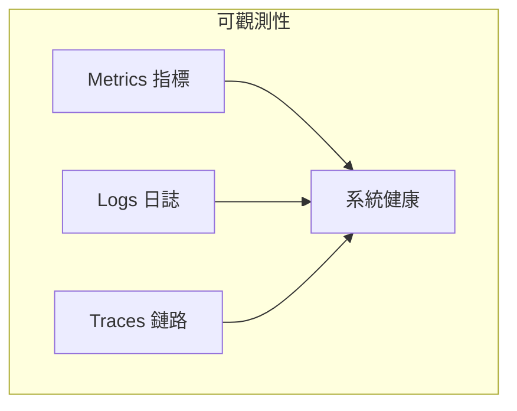
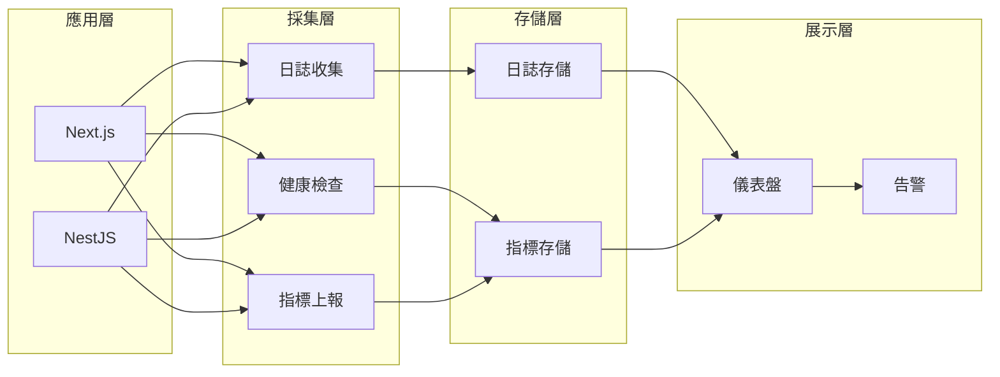

# 10.5 網站生病了怎麼辦——監控與日誌：可觀測性體系

用戶告訴你網站掛了？那你已經晚了。

## 可觀測性三支柱



| 支柱 | 說明 | 回答的問題 |
|------|------|------------|
| Metrics | 數字化指標 | 發生了什麼？多嚴重？ |
| Logs | 事件記錄 | 爲什麼發生？ |
| Traces | 請求鏈路 | 在哪裏發生？ |

## 爲什麼需要監控

| 場景 | 沒有監控 | 有監控 |
|------|----------|--------|
| 網站掛了 | 用戶投訴才知道 | 自動告警，快速響應 |
| 性能下降 | 憑感覺猜測 | 數據定位瓶頸 |
| 錯誤追蹤 | 翻日誌找半天 | 一鍵定位問題 |
| 容量規劃 | 拍腦袋擴容 | 基於數據決策 |

## 監控體系架構



## 本節目錄

- **10.5.1 網站還活着嗎** — 健康檢查與基礎指標
- **10.5.2 日誌太多了怎麼辦** — 結構化日誌與管理
- **10.5.3 一出錯就通知我** — 錯誤追蹤與告警
- **10.5.4 性能瓶頸在哪** — 性能分析與優化

## 適合獨立開發者的方案

不需要複雜的 ELK Stack，簡單方案也夠用：

| 工具 | 用途 | 費用 |
|------|------|------|
| 1Panel 監控 | 服務器資源監控 | 免費 |
| UptimeRobot | 網站可用性監控 | 免費/付費 |
| Sentry | 錯誤追蹤 | 免費/付費 |
| Better Stack | 日誌 + 告警 | 免費/付費 |
| Docker 日誌 | 容器日誌查看 | 免費 |

## 快速開始

### 1. 健康檢查端點

```typescript
// NestJS
@Get('health')
healthCheck() {
  return { status: 'ok', timestamp: new Date() };
}
```

### 2. 查看 Docker 日誌

```bash
# 查看應用日誌
docker logs -f --tail 100 app-container

# 查看所有服務日誌
docker-compose logs -f
```

### 3. 配置告警

在 UptimeRobot 創建監控：
- 監控地址：`https://example.com/api/health`
- 檢查間隔：5 分鐘
- 告警方式：郵件/Webhook
