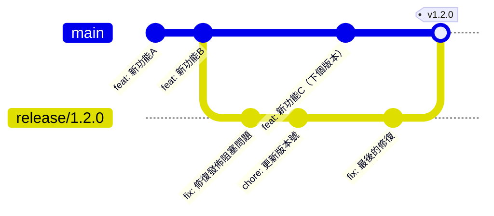

# 11.1.2 Release 分支：發佈準備與穩定化

## 一句話破題

**Release 分支**是從開發分支切出的臨時分支，專門用於發佈前的穩定化工作，確保發佈版本的質量。

## 核心價值

使用 Release 分支能讓你：
- 在穩定化期間繼續開發新功能
- 隔離發佈相關的修復和調整
- 確保發佈版本經過充分測試

## Release 分支工作流



## 快速上手

### 步驟一：創建 Release 分支

```bash
# 從 develop 或 main 分支創建 release 分支
git checkout develop
git checkout -b release/1.2.0
```

### 步驟二：穩定化工作

在 Release 分支上只做以下工作：

```bash
# 修復發佈阻塞問題
git commit -m "fix: 修復登錄頁面樣式問題"

# 更新版本號
npm version 1.2.0 --no-git-tag-version
git commit -am "chore: bump version to 1.2.0"

# 更新 CHANGELOG
git commit -m "docs: update CHANGELOG for 1.2.0"
```

### 步驟三：合併回主分支

```bash
# 合併到 main
git checkout main
git merge release/1.2.0 --no-ff

# 打標籤
git tag -a v1.2.0 -m "Release version 1.2.0"

# 同步回 develop（如果使用 Git Flow）
git checkout develop
git merge release/1.2.0 --no-ff

# 刪除 release 分支
git branch -d release/1.2.0
```

## 發佈檢查清單

在合併 Release 分支前，確保完成以下檢查：

```markdown
## 發佈檢查清單

### 代碼質量
- [ ] 所有測試通過
- [ ] 無 ESLint/TypeScript 錯誤
- [ ] 代碼已經過 Review

### 版本信息
- [ ] package.json 版本號已更新
- [ ] CHANGELOG 已更新
- [ ] 文檔已同步更新

### 環境驗證
- [ ] 在 staging 環境驗證通過
- [ ] 關鍵功能手動測試通過
- [ ] 性能無明顯退化

### 發佈準備
- [ ] 數據庫遷移腳本就緒
- [ ] 環境變量配置檢查
- [ ] 回滾方案准備好
```

## 避坑指南

::: danger 新手最容易犯的錯
1. 在 Release 分支上開發新功能
2. 忘記將 Release 分支的修復同步回開發分支
3. 發佈前沒有在類生產環境驗證
4. 沒有準備回滾方案就發佈
:::
