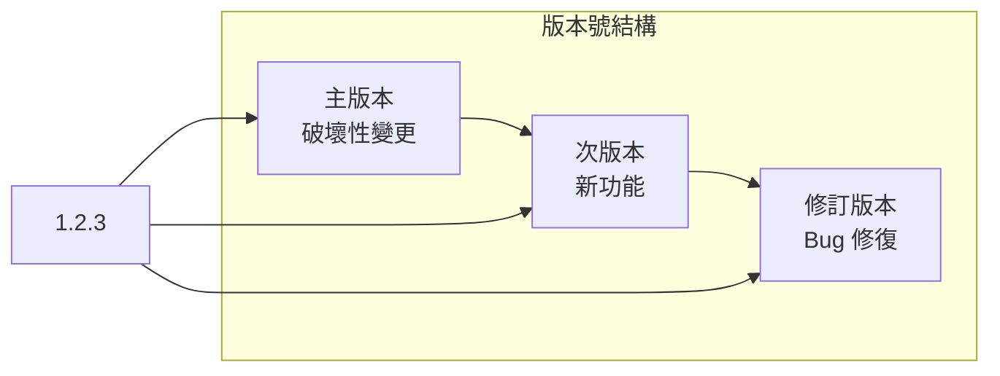
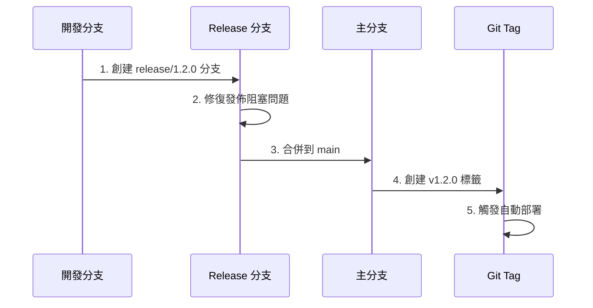

# 11.1 語義化版本與發佈流

## 認知重構

版本號不是隨便寫的數字，而是一種**與用戶溝通的語言**。通過版本號，用戶可以判斷這次更新是否會破壞現有功能、是否需要立即升級。

## 本節內容

| 小節 | 核心問題 | 你將學會 |
|------|----------|----------|
| 11.1.1 SemVer 規範 | 版本號怎麼定？ | 主版本/次版本/修訂版本的含義 |
| 11.1.2 Release 分支 | 發佈前做什麼？ | 發佈準備與穩定化流程 |
| 11.1.3 Git Tag | 如何標記版本？ | 版本標籤的創建與管理 |
| 11.1.4 發佈公告 | 如何通知用戶？ | CHANGELOG 與升級指南 |

## 發佈流程全景

## AI 協作提示

在進行版本發佈時，可以這樣與 AI 協作：

- "根據最近的提交記錄，判斷應該發佈什麼版本"
- "幫我生成這個版本的 CHANGELOG"
- "檢查這次變更是否有破壞性更新"

::: tip 版本號的承諾
版本號是你對用戶的承諾。`1.0.0` 到 `2.0.0` 意味着"有東西會壞"，用戶需要謹慎升級；`1.0.0` 到 `1.1.0` 意味着"只會變得更好"，用戶可以放心更新。
:::
