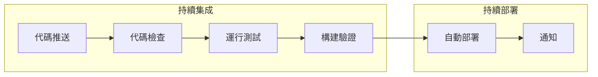

# 11.2 GitHub Actions 質量門禁與生產部署

## 認知重構

CI/CD 不是大公司的專利。通過 GitHub Actions，即使是個人項目也能實現**代碼提交後自動檢查、自動測試、自動部署**的完整流水線。



## 本節內容

| 小節 | 核心問題 | 你將學會 |
|------|----------|----------|
| 11.2.1 Workflow 配置 | 自動化流程怎麼寫？ | 觸發條件與執行環境 |
| 11.2.2 質量檢查 | 如何自動檢查代碼？ | 測試、構建、安全掃描 |
| 11.2.3 部署流水線 | 如何自動部署？ | 生產環境自動發佈 |
| 11.2.4 密鑰管理 | 密碼怎麼存？ | CI/CD 環境配置與安全 |

## GitHub Actions 核心概念

| 概念 | 說明 |
|------|------|
| **Workflow** | 自動化流程，定義在 `.github/workflows/*.yml` |
| **Event** | 觸發工作流的事件，如 push、pull_request |
| **Job** | 工作流中的一組步驟，可並行或串行執行 |
| **Step** | Job 中的單個任務，可以是命令或 Action |
| **Action** | 可複用的自動化單元 |

## 最小可用配置

```yaml
# .github/workflows/ci.yml
name: CI

on:
  push:
    branches: [main]
  pull_request:
    branches: [main]

jobs:
  build:
    runs-on: ubuntu-latest
    steps:
      - uses: actions/checkout@v4
      - uses: actions/setup-node@v4
        with:
          node-version: '20'
      - run: npm ci
      - run: npm run lint
      - run: npm run build
```

## AI 協作提示

在配置 CI/CD 時，可以這樣與 AI 協作：

- "幫我寫一個 Next.js 項目的 GitHub Actions 配置"
- "如何在 GitHub Actions 中緩存 node_modules"
- "配置 PR 合併前必須通過測試的門禁"

::: tip CI/CD 的價值
自動化的價值不僅在於節省時間，更在於**消除人爲失誤**。每次發佈都經過相同的檢查流程，保證一致性。
:::
