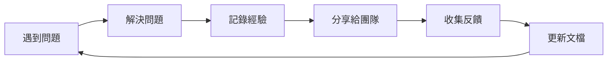

# 11.3.2 知識沉澱：經驗總結與最佳實踐

## 一句話破題

**最佳實踐**是從多次踩坑中提煉出的可複用經驗，寫下來才能避免團隊反覆犯同樣的錯誤。

## 核心價值

沉澱最佳實踐能讓你：
- 把個人經驗變成團隊資產
- 新人快速獲得"老司機"的智慧
- 形成持續改進的知識庫

## 最佳實踐文檔模板

```markdown
# [實踐名稱]

## 適用場景
描述在什麼情況下應該使用這個實踐

## 問題背景
我們遇到了什麼問題？爲什麼需要這個實踐？

## 推薦做法
✅ 這樣做

```代碼示例```

## 不推薦做法
❌ 不要這樣做

```反例代碼```

## 原因解釋
爲什麼推薦做法更好？

## 相關資源
- 鏈接到相關文檔
- 參考資料
```

## 實踐示例：API 錯誤處理

```markdown
# API 錯誤處理最佳實踐

## 適用場景
所有 Next.js API Routes 的錯誤處理

## 問題背景
不統一的錯誤處理導致前端難以解析，
調試困難，用戶看到不友好的錯誤信息

## 推薦做法
✅ 使用統一的錯誤響應格式：

```typescript
// lib/api-error.ts
export class ApiError extends Error {
  constructor(
    public statusCode: number,
    public code: string,
    message: string
  ) {
    super(message)
  }
}

// 使用方式
throw new ApiError(404, 'USER_NOT_FOUND', '用戶不存在')
```

## 不推薦做法
❌ 直接拋出原始錯誤：

```typescript
throw new Error('用戶不存在')  // 狀態碼和錯誤類型都丟失了
```

## 原因解釋
- 統一格式讓前端處理更簡單
- 錯誤碼便於追蹤和國際化
- 結構化錯誤便於日誌分析
```

## 知識沉澱的時機

| 時機 | 行動 |
|------|------|
| **解決了一個棘手問題** | 記錄問題和解決方案 |
| **發現一個更好的做法** | 更新或新增最佳實踐 |
| **Code Review 中反覆提到** | 總結成規範文檔 |
| **新人問了同樣的問題** | 寫成 FAQ 或入門指南 |

## 知識庫的持續維護



## 避坑指南

::: danger 新手最容易犯的錯
1. 只記錄"做什麼"不記錄"爲什麼"
2. 文檔寫完就扔，不持續更新
3. 最佳實踐太理論化，沒有代碼示例
4. 不收集團隊反饋，閉門造車
:::
