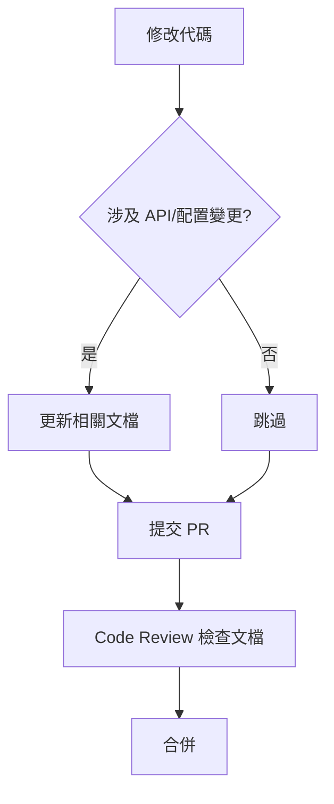

# 11.3.4 版本控制：文檔與代碼的同步更新

## 一句話破題

**過時的文檔比沒有文檔更糟糕**——它會誤導人。文檔必須和代碼一起更新。

## 核心價值

保持文檔同步能讓你：
- 避免新人被過時信息誤導
- 保證文檔的可信度
- 形成文檔更新的習慣

## 文檔與代碼同倉庫

```
project/
├── docs/           # 文檔和代碼在同一個倉庫
│   └── api.md
├── src/
│   └── api/
└── package.json
```

好處：
- 改代碼時順手改文檔
- PR 可以同時 Review 代碼和文檔
- 版本歷史一目瞭然

## 在 PR 模板中強制檢查

```markdown
<!-- .github/pull_request_template.md -->
## Checklist

- [ ] 代碼已測試
- [ ] 類型檢查通過
- [ ] **相關文檔已更新**
```

## 自動檢測文檔過時

```yaml
# .github/workflows/docs-check.yml
name: Check Docs

on:
  pull_request:
    paths:
      - 'src/api/**'

jobs:
  check:
    runs-on: ubuntu-latest
    steps:
      - uses: actions/checkout@v4
      
      - name: Check if docs updated
        run: |
          if ! git diff --name-only origin/main | grep -q "docs/api"; then
            echo "::warning::API 代碼有變更，請確認是否需要更新 docs/api 文檔"
          fi
```

## 文檔版本標記

在文檔中標註適用的代碼版本：

```markdown
<!-- docs/api/users.md -->
# 用戶 API

> 適用版本: v2.0.0+
> 最後更新: 2024-01-15

## 接口說明
...
```

## 使用 TypeDoc 自動生成 API 文檔

```bash
# 安裝
npm install -D typedoc

# 生成文檔
npx typedoc --entryPoints src/index.ts --out docs/api
```

配置文件：

```json
// typedoc.json
{
  "entryPoints": ["./src/index.ts"],
  "out": "./docs/api",
  "excludePrivate": true,
  "excludeInternal": true
}
```

## 文檔更新流程



## 文檔廢棄處理

當功能廢棄時，不要直接刪除文檔：

```markdown
# 舊版登錄 API

::: warning 已廢棄
此 API 將在 v3.0.0 移除，請遷移到 [新版登錄 API](./login-v2.md)
:::

## 遷移指南
1. 將 `/api/login` 改爲 `/api/v2/login`
2. 請求體增加 `clientId` 字段
```

## 避坑指南

::: danger 新手最容易犯的錯
1. 改了代碼忘了改文檔
2. 文檔放在單獨的倉庫，維護困難
3. 刪除功能時直接刪文檔，沒有遷移指引
4. 文檔沒有版本標記，不知道適用哪個版本
:::
