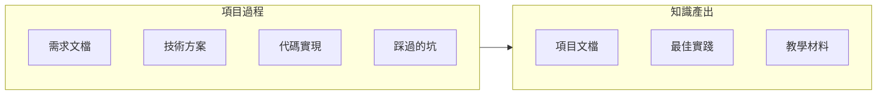

# 11.3 知識沉澱：課程化產出

## 認知重構

項目結束不是終點，**把過程中的經驗變成可複用的知識**纔是真正的收穫。好的知識沉澱能讓團隊避免重複踩坑，加速新人上手。



## 本節內容

| 小節 | 核心問題 | 你將學會 |
|------|----------|----------|
| 11.3.1 文檔結構 | 文檔放哪裏？ | 項目文檔的組織方式 |
| 11.3.2 知識沉澱 | 經驗如何傳承？ | 最佳實踐總結方法 |
| 11.3.3 教學材料 | 如何教別人？ | 案例研究與練習題 |
| 11.3.4 版本控制 | 文檔怎麼更新？ | 文檔與代碼同步 |

## 爲什麼要做知識沉澱

1. **避免重複踩坑**：把問題和解決方案記錄下來
2. **加速新人上手**：有據可查比口耳相傳更可靠
3. **形成團隊資產**：知識不會因人員流動而丟失
4. **促進持續改進**：覆盤總結推動流程優化

## 文檔即代碼

```
project/
├── docs/
│   ├── prd/           # 產品需求文檔
│   ├── design/        # 技術設計方案
│   ├── api/           # API 文檔
│   ├── deploy/        # 部署指南
│   └── postmortem/    # 覆盤報告
├── src/
└── package.json
```

## AI 協作提示

在進行知識沉澱時，可以這樣與 AI 協作：

- "根據這段代碼生成 API 文檔"
- "把這次排查問題的過程寫成覆盤報告"
- "將這個項目的架構整理成技術方案文檔"

::: tip 寫文檔的原則
好的文檔不是寫給現在的自己看的，而是寫給**三個月後的自己**或**新加入的同事**看的。寫完後問自己：一個完全不瞭解背景的人能看懂嗎？
:::
