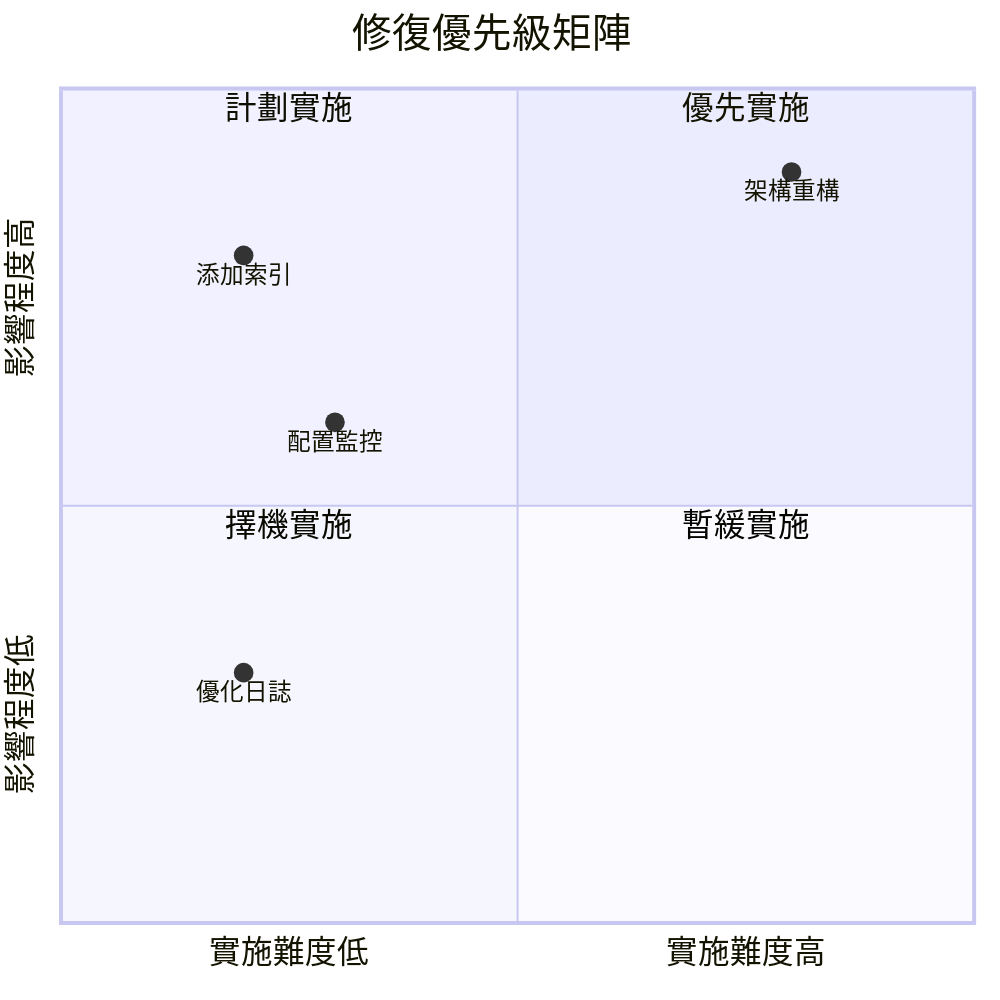

# 11.4.3 修復方案：臨時修復與根本解決

## 一句話破題

修復分兩步：先**止血**（臨時方案快速恢復服務），再**根治**（根本方案徹底解決問題）。

## 核心價值

區分臨時和根本方案能讓你：
- 快速恢復服務，減少影響
- 不因趕時間而留下技術債
- 有計劃地徹底解決問題

## 臨時方案 vs 根本方案

| 對比項 | 臨時方案 | 根本方案 |
|--------|----------|----------|
| **目標** | 快速恢復服務 | 徹底解決問題 |
| **時間** | 分鐘級 | 天/周級 |
| **風險** | 可能有副作用 | 經過充分測試 |
| **適用** | 緊急止血 | 長期穩定 |

## 臨時方案示例

```typescript
// 問題：數據庫連接池耗盡

// 臨時方案1：重啓服務（最快）
pm2 restart all

// 臨時方案2：增加連接數（快速配置）
DATABASE_URL="...?connection_limit=50"

// 臨時方案3：降級處理（保核心功能）
async function login(credentials: LoginCredentials) {
  try {
    return await normalLogin(credentials)
  } catch (error) {
    if (isDatabaseOverload(error)) {
      // 臨時降級：使用緩存驗證
      return await fallbackLogin(credentials)
    }
    throw error
  }
}
```

## 根本方案示例

```typescript
// 根本方案1：添加數據庫索引
// prisma/migrations/xxx_add_user_email_index.sql
CREATE INDEX idx_user_email ON users(email);

// 根本方案2：優化查詢
const user = await prisma.user.findFirst({
  where: { email },
  select: { id: true, email: true, passwordHash: true }
})

// 根本方案3：添加連接池監控
const pool = new Pool({
  connectionString: DATABASE_URL,
  max: 20,
  idleTimeoutMillis: 30000,
  connectionTimeoutMillis: 2000,
})

pool.on('error', (err) => {
  logger.error('Database pool error', err)
  metrics.increment('db.pool.error')
})
```

## 修復方案模板

```markdown
## 修復方案

### 臨時方案（已執行）
**操作**：重啓數據庫服務
**時間**：10:25
**效果**：服務恢復正常
**風險**：可能再次發生

### 根本方案（待實施）

| 措施 | 負責人 | 完成時間 | 驗證方式 |
|------|--------|----------|----------|
| 添加 email 字段索引 | 張三 | 1月20日 | 查詢時間 < 100ms |
| 配置連接池監控 | 李四 | 1月22日 | Grafana 看板 |
| 添加慢查詢告警 | 王五 | 1月25日 | 告警觸發測試 |
```

## 修復優先級矩陣



## 回滾計劃

每個修復方案都應該有回滾計劃：

```markdown
## 回滾計劃

### 索引修復
- 回滾命令：`DROP INDEX idx_user_email;`
- 回滾時間：< 1 分鐘
- 回滾影響：查詢變慢

### 配置變更
- 回滾方式：恢復舊的環境變量
- 回滾命令：`kubectl rollout undo deployment/api`
```

## 避坑指南

::: danger 新手最容易犯的錯
1. 只做臨時方案，忘了根本方案
2. 根本方案太激進，引入新問題
3. 沒有準備回滾計劃
4. 修復後沒有驗證效果
:::
