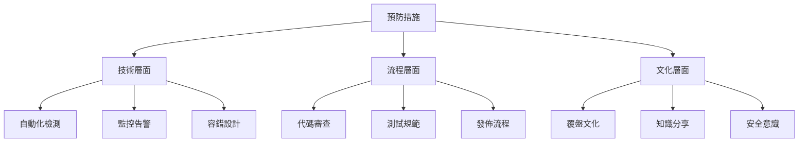
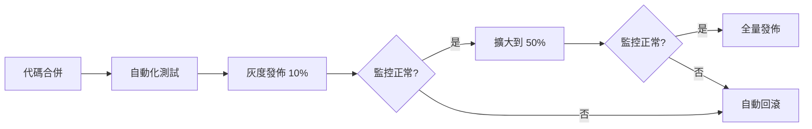

# 11.4.4 預防措施：流程改進與監控加強

## 一句話破題

好的預防措施要讓**同類問題無法再次發生**，而不只是"下次小心點"。

## 核心價值

制定預防措施能讓你：
- 把故障轉化爲系統改進
- 建立防禦性的工程文化
- 持續提高系統可靠性

## 預防措施的層次



## 技術層面的預防

### 添加監控告警

```yaml
# prometheus/rules/database.yml
groups:
  - name: database
    rules:
      - alert: HighConnectionPoolUsage
        expr: db_pool_active / db_pool_max > 0.8
        for: 5m
        labels:
          severity: warning
        annotations:
          summary: "數據庫連接池使用率過高"
          
      - alert: SlowQuery
        expr: db_query_duration_seconds > 1
        for: 1m
        labels:
          severity: warning
        annotations:
          summary: "檢測到慢查詢"
```

### 添加自動化測試

```typescript
// __tests__/performance/login.test.ts
describe('Login Performance', () => {
  it('should complete login within 500ms', async () => {
    const start = Date.now()
    await login({ email: 'test@example.com', password: 'password' })
    const duration = Date.now() - start
    
    expect(duration).toBeLessThan(500)
  })
  
  it('should handle 100 concurrent logins', async () => {
    const requests = Array(100).fill(null).map(() => 
      login({ email: 'test@example.com', password: 'password' })
    )
    
    const results = await Promise.allSettled(requests)
    const failures = results.filter(r => r.status === 'rejected')
    
    expect(failures.length).toBeLessThan(5) // 允許 5% 失敗率
  })
})
```

### 添加容錯設計

```typescript
// lib/database.ts
import { retry } from '@lifeomic/attempt'

export async function queryWithRetry<T>(
  queryFn: () => Promise<T>,
  options = { maxAttempts: 3, delay: 1000 }
): Promise<T> {
  return retry(queryFn, {
    maxAttempts: options.maxAttempts,
    delay: options.delay,
    factor: 2, // 指數退避
    handleError: (error, context) => {
      logger.warn(`Query failed, attempt ${context.attemptNum}`, error)
    }
  })
}
```

## 流程層面的預防

### 代碼審查清單

```markdown
## PR Review Checklist

### 性能
- [ ] 數據庫查詢是否有索引？
- [ ] 是否有 N+1 查詢問題？
- [ ] 是否設置了超時時間？

### 可觀測性
- [ ] 是否添加了必要的日誌？
- [ ] 是否添加了監控指標？
- [ ] 錯誤是否有足夠的上下文？

### 容錯
- [ ] 外部依賴失敗時如何處理？
- [ ] 是否有降級方案？
```

### 發佈流程改進



## 預防措施跟蹤表

```markdown
## 改進措施跟蹤

| 措施 | 類型 | 負責人 | 截止日期 | 狀態 | 驗證方式 |
|------|------|--------|----------|------|----------|
| 添加連接池監控 | 技術 | 張三 | 1月20日 | ✅ 完成 | Grafana 看板 |
| 添加性能測試 | 流程 | 李四 | 1月25日 | 🔄 進行中 | CI 集成 |
| 更新 Review 清單 | 流程 | 王五 | 1月22日 | ⏳ 待開始 | 文檔更新 |
| 覆盤分享會 | 文化 | 趙六 | 1月30日 | ⏳ 待開始 | 會議記錄 |
```

## 避坑指南

::: danger 新手最容易犯的錯
1. 預防措施太空泛（如"加強監控"）
2. 沒有明確負責人和截止日期
3. 制定了措施但沒有跟蹤落實
4. 只關注技術措施，忽略流程和文化
:::
