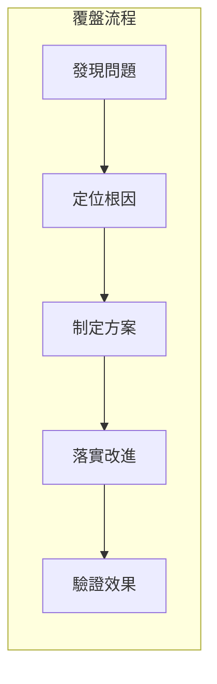

# 11.4 覆盤模板：問題分析與閉環改進

## 認知重構

覆盤不是追責大會，而是**從錯誤中學習的機會**。好的覆盤能讓團隊越來越強，壞的覆盤只會讓人互相甩鍋。



## 本節內容

| 小節 | 核心問題 | 你將學會 |
|------|----------|----------|
| 11.4.1 問題識別 | 出了什麼問題？ | 故障現象與影響範圍 |
| 11.4.2 根因分析 | 爲什麼會出問題？ | 5-Why 分析法 |
| 11.4.3 修復方案 | 怎麼解決？ | 臨時方案與根本方案 |
| 11.4.4 預防措施 | 如何避免再次發生？ | 流程改進與監控加強 |

## 覆盤會議原則

1. **對事不對人**：討論系統和流程，不追究個人責任
2. **假設每個人都是善意的**：當時的決策基於當時的信息
3. **聚焦改進**：目標是讓系統更強，而不是找替罪羊
4. **公開透明**：覆盤報告全員可見，促進知識共享

## 覆盤報告模板

```markdown
# [事件名稱] 覆盤報告

## 事件概述
- 發生時間：
- 持續時長：
- 影響範圍：
- 嚴重程度：P0/P1/P2/P3

## 時間線
| 時間 | 事件 | 操作人 |
|------|------|--------|
| 10:00 | 用戶反饋無法登錄 | - |
| 10:05 | 確認問題存在 | 張三 |
| 10:15 | 定位到數據庫連接問題 | 李四 |
| 10:30 | 重啓數據庫，服務恢復 | 李四 |

## 根因分析
（使用 5-Why 分析法）

## 改進措施
| 措施 | 負責人 | 完成時間 | 狀態 |
|------|--------|----------|------|
| 添加數據庫連接池監控 | 張三 | 2024-01-20 | 待開始 |

## 經驗教訓
1. ...
2. ...
```

## AI 協作提示

在覆盤時，可以這樣與 AI 協作：

- "幫我用 5-Why 分析法分析這個問題的根因"
- "根據這個時間線，幫我整理成覆盤報告"
- "這個問題有哪些可能的預防措施"

::: tip 覆盤的價值
每一次故障都是一次學習機會。不復盤的團隊會反覆踩同樣的坑，善於覆盤的團隊會越來越強。
:::
