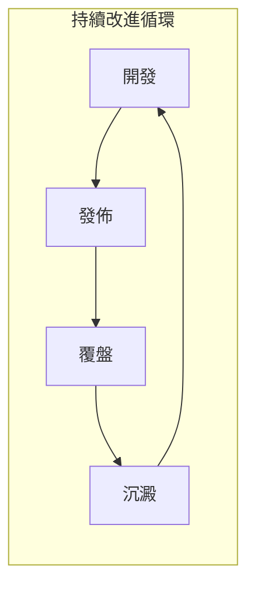

# 11 ｜發佈、覆盤與教學沉澱

## 認知重構

代碼寫完不是終點，**發佈出去、從中學習、把經驗傳承下去**纔是完整的閉環。本章將帶你掌握從個人項目到團隊協作都適用的發佈與覆盤方法論。

## 本章內容

| 小節 | 核心問題 | 你將學會 |
|------|----------|----------|
| 11.1 語義化版本與發佈流 | 版本號怎麼定？ | SemVer 規範、Release 流程、Git Tag |
| 11.2 GitHub Actions 部署 | 如何自動上線？ | CI/CD 配置、質量門禁、自動部署 |
| 11.3 知識沉澱 | 經驗如何傳承？ | 文檔結構、最佳實踐、教學材料 |
| 11.4 覆盤模板 | 問題如何閉環？ | 根因分析、修復方案、預防措施 |

## 爲什麼這一章很重要

對於 Vibe Coding 而言，這一章是把**個人能力轉化爲團隊資產**的關鍵：

1. **版本管理**：讓你的發佈可追溯、可回滾
2. **自動化部署**：減少人爲失誤，提升發佈效率
3. **知識沉澱**：踩過的坑變成地圖，下次不再重蹈覆轍
4. **覆盤機制**：從每次事故中提煉出可複用的經驗

## AI 協作提示

在進行發佈和覆盤工作時，可以這樣與 AI 協作：

- "幫我分析這次發佈的風險點"
- "根據這次事故寫一份覆盤報告"
- "把這個項目的經驗總結成文檔模板"
- "生成這個版本的 CHANGELOG"

::: warning 本章檢查清單
1. [ ] 理解 SemVer 版本號規範
2. [ ] 能夠配置基本的 GitHub Actions
3. [ ] 掌握文檔組織的最佳實踐
4. [ ] 會使用覆盤模板進行問題分析
:::
