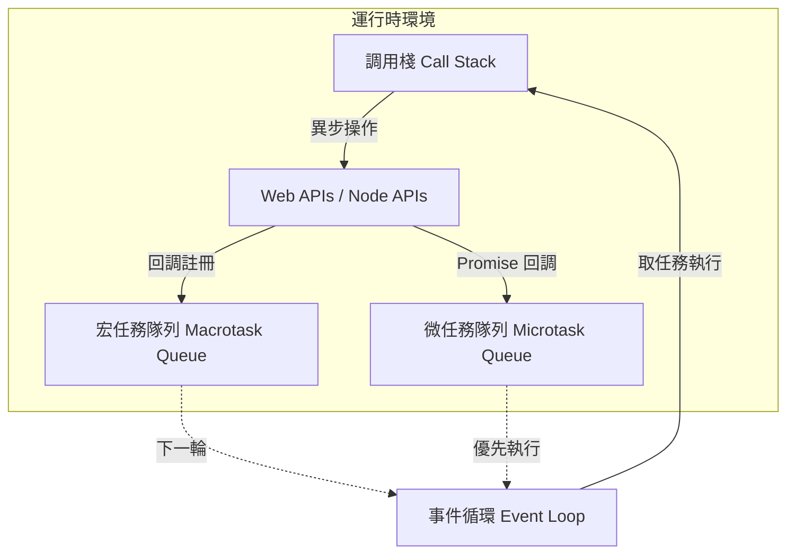
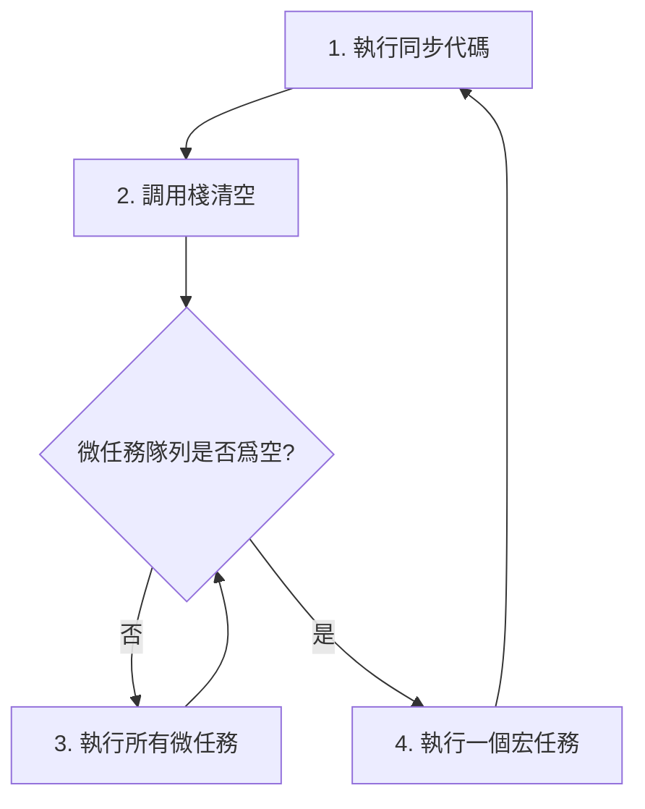

# 12.1.1 JS 的心臟——事件循環機制：Call Stack/Event Queue/Callback Queue

### 一句話破題

事件循環是 JavaScript 引擎的"心臟"，它不斷地從任務隊列中取出任務，放到調用棧中執行，如此循環往復，讓單線程的 JS 也能處理併發操作。

### 認知重構：單線程 ≠ 一次只能做一件事

很多人誤以爲"單線程"意味着 JavaScript 一次只能處理一件事。實際上，JavaScript **運行時**是單線程的，但它背後有一整套異步機制（由瀏覽器或 Node.js 提供），讓它可以"同時"發起多個操作。

真正的限制是：**JavaScript 一次只能執行一段代碼**。但在執行的間隙，其他操作（如網絡請求、定時器）可以在後臺進行，完成後再"排隊"等待執行。

### 本質還原：事件循環的核心組件



#### 1. 調用棧 (Call Stack)

調用棧是一個 LIFO（後進先出）的數據結構，記錄當前正在執行的函數。

```javascript
function multiply(a, b) {
    return a * b;
}

function square(n) {
    return multiply(n, n);
}

console.log(square(5)); // 調用棧：main → square → multiply → 返回 → 返回 → 輸出
```

**關鍵點**：如果調用棧中有正在執行的代碼，事件循環就會等待，不會取新任務。這就是爲什麼"同步阻塞代碼"會卡死頁面。

#### 2. 宏任務與微任務

異步任務分爲兩類，它們的執行優先級不同：

| 類型 | 示例 | 優先級 |
|------|------|--------|
| **微任務 Microtask** | `Promise.then/catch/finally`、`queueMicrotask`、`MutationObserver` | 高（當前宏任務結束後立即執行） |
| **宏任務 Macrotask** | `setTimeout`、`setInterval`、`setImmediate`、I/O 操作、UI 渲染 | 低（下一輪事件循環） |

#### 3. 事件循環的執行順序



**黃金法則**：每執行完一個宏任務，都會清空所有微任務，然後才執行下一個宏任務。

### 經典面試題：預測輸出順序

```javascript
console.log('1'); // 同步

setTimeout(() => {
    console.log('2'); // 宏任務
}, 0);

Promise.resolve().then(() => {
    console.log('3'); // 微任務
});

console.log('4'); // 同步
```

**輸出**：`1 → 4 → 3 → 2`

**分析**：
1. 同步代碼先執行：`1`、`4`
2. 調用棧清空，執行微任務隊列：`3`
3. 進入下一輪事件循環，執行宏任務：`2`

### 覺知：審查 AI 生成代碼的要點

當 AI 幫你寫異步代碼時，你需要檢查：

1. **執行順序**：代碼的實際執行順序是否符合業務預期？
2. **阻塞風險**：是否有大量同步計算阻塞事件循環？
3. **資源競爭**：多個異步操作是否會競爭同一資源？

### 避坑指南

- **不要在主線程做重計算**：循環百萬次的計算會阻塞事件循環，導致頁面卡頓。可用 Web Worker 或分片處理。
- **`setTimeout(fn, 0)` 不是"立即執行"**：它只是把回調放入宏任務隊列，至少要等當前同步代碼和所有微任務執行完。
- **微任務可以"無限套娃"**：如果在微任務中不斷創建新的微任務，會阻塞宏任務，導致 UI 無法響應。
