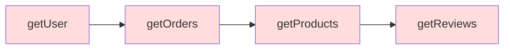

# 12.1.2 套娃式回調——異步編程模式：回調函數與回調地獄

### 一句話破題

回調函數是 JavaScript 異步編程的"原始形態"——簡單直接，但當異步操作層層嵌套時，代碼就會變成一場"套娃噩夢"。

### 核心價值

回調是理解所有異步模式的基礎。即使你已經習慣了 `async/await`，在閱讀老項目代碼、使用某些 Node.js API 或調試底層問題時，回調模式仍然無處不在。

### 本質還原：什麼是回調函數

回調函數的本質是：**把一個函數作爲參數傳給另一個函數，等某個操作完成後再調用它**。

```javascript
// 最簡單的回調示例
function fetchData(callback) {
    setTimeout(() => {
        const data = { name: 'Vibe Coder' };
        callback(data); // 操作完成，調用回調
    }, 1000);
}

fetchData((result) => {
    console.log(result); // { name: 'Vibe Coder' }
});
```

**執行流程**：
1. 調用 `fetchData`，傳入一個匿名函數作爲回調
2. `setTimeout` 註冊一個 1 秒後執行的任務
3. 主線程繼續執行後續代碼（不阻塞）
4. 1 秒後，回調被放入宏任務隊列
5. 事件循環取出回調並執行

### 回調地獄：當套娃失控

當多個異步操作存在依賴關係時，回調會層層嵌套：

```javascript
// 回調地獄示例：讀取用戶 → 獲取訂單 → 查詢商品
getUser(userId, (user) => {
    getOrders(user.id, (orders) => {
        getProducts(orders[0].productId, (product) => {
            getReviews(product.id, (reviews) => {
                // 終於拿到了評論...
                console.log(reviews);
            });
        });
    });
});
```



**這種代碼的問題**：

1. **可讀性差**：縮進越來越深，邏輯難以追蹤
2. **錯誤處理複雜**：每一層都需要單獨處理錯誤
3. **難以複用**：邏輯耦合在嵌套結構中
4. **難以測試**：無法單獨測試某一層的邏輯

### Node.js 的錯誤優先回調

Node.js 社區約定了一種回調風格：**第一個參數永遠是錯誤對象**。

```javascript
const fs = require('fs');

fs.readFile('/path/to/file', 'utf8', (err, data) => {
    if (err) {
        console.error('讀取失敗:', err);
        return;
    }
    console.log('文件內容:', data);
});
```

這種約定雖然統一了錯誤處理方式，但並沒有解決嵌套問題：

```javascript
fs.readFile('config.json', 'utf8', (err, config) => {
    if (err) return handleError(err);
    
    fs.readFile('data.json', 'utf8', (err, data) => {
        if (err) return handleError(err);
        
        fs.writeFile('output.json', merge(config, data), (err) => {
            if (err) return handleError(err);
            console.log('完成');
        });
    });
});
```

### 早期解決方案：命名函數

在 Promise 出現之前，開發者會用命名函數來"扁平化"代碼：

```javascript
function handleUser(user) {
    getOrders(user.id, handleOrders);
}

function handleOrders(orders) {
    getProducts(orders[0].productId, handleProducts);
}

function handleProducts(product) {
    getReviews(product.id, handleReviews);
}

function handleReviews(reviews) {
    console.log(reviews);
}

// 入口
getUser(userId, handleUser);
```

這種方式雖然減少了嵌套，但邏輯被分散到多個函數中，上下文也難以共享。

### AI 協作指南

當遇到老項目中的回調代碼時，可以這樣與 AI 協作：

- **核心意圖**：告訴 AI 你想把回調風格的代碼重構爲現代的 `async/await` 形式。
- **需求定義公式**：`"請將這段回調風格的代碼重構爲 async/await，保持相同的功能，並添加適當的錯誤處理。"`
- **關鍵術語**：`回調地獄 (callback hell)`、`錯誤優先回調 (error-first callback)`、`promisify`、`util.promisify`

**示例對話**：

> "請幫我把這個 Node.js 風格的回調代碼轉換成 Promise 版本。我希望能用 `async/await` 來調用它。"

AI 通常會使用 `util.promisify` 或手動封裝 Promise：

```javascript
const { promisify } = require('util');
const readFile = promisify(fs.readFile);

async function processFiles() {
    const config = await readFile('config.json', 'utf8');
    const data = await readFile('data.json', 'utf8');
    await fs.promises.writeFile('output.json', merge(config, data));
    console.log('完成');
}
```

### 避坑指南

- **避免"回調金字塔"**：如果嵌套超過 3 層，考慮重構爲 Promise 或 async/await。
- **始終處理錯誤**：回調中的錯誤如果不處理，會被靜默吞掉。
- **注意 `this` 綁定**：回調函數中的 `this` 可能不是你期望的對象，尤其是在類方法中。
