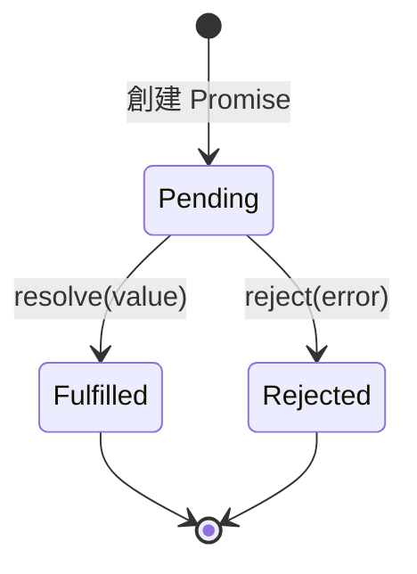
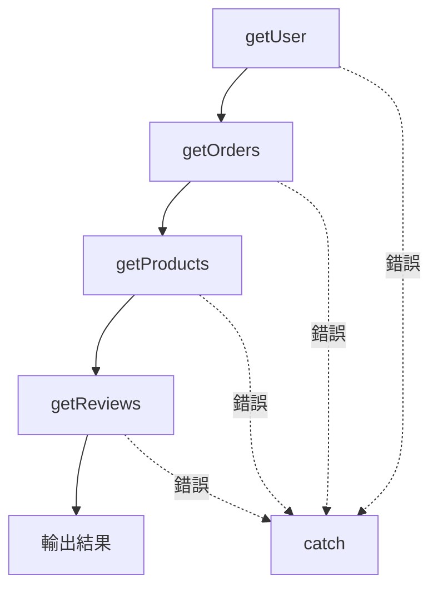

# 12.1.3 鏈式調用——Promise 鏈式調用：then/catch/finally

### 一句話破題

Promise 是 JavaScript 對"未來會發生的事"的抽象——它代表一個異步操作的最終結果，可能成功，也可能失敗，但無論如何都會有個交代。

### 核心價值

Promise 解決了回調地獄的問題，它帶來了：

1. **鏈式調用**：用 `.then()` 串聯多個異步操作，告別嵌套
2. **統一錯誤處理**：用 `.catch()` 集中捕獲整條鏈上的錯誤
3. **狀態不可變**：一旦 resolve 或 reject，狀態就固定了，避免回調被多次調用的問題
4. **爲 async/await 鋪路**：async 函數本質上就是 Promise 的語法糖

### 本質還原：Promise 的三種狀態



- **Pending（待定）**：初始狀態，既沒成功也沒失敗
- **Fulfilled（已兌現）**：操作成功完成，有了結果值
- **Rejected（已拒絕）**：操作失敗，有了失敗原因

**關鍵點**：狀態只能從 Pending 轉變爲 Fulfilled 或 Rejected，且**不可逆**。

### 創建和使用 Promise

```javascript
// 創建一個 Promise
const fetchData = new Promise((resolve, reject) => {
    setTimeout(() => {
        const success = Math.random() > 0.5;
        if (success) {
            resolve({ data: '獲取成功' });
        } else {
            reject(new Error('獲取失敗'));
        }
    }, 1000);
});

// 使用 Promise
fetchData
    .then((result) => {
        console.log('成功:', result.data);
    })
    .catch((error) => {
        console.error('失敗:', error.message);
    })
    .finally(() => {
        console.log('無論成功失敗，都會執行');
    });
```

### 鏈式調用的魔力

每個 `.then()` 都會返回一個新的 Promise，因此可以無限串聯：

```javascript
getUser(userId)
    .then((user) => getOrders(user.id))        // 返回 Promise
    .then((orders) => getProducts(orders[0].productId))  // 返回 Promise
    .then((product) => getReviews(product.id)) // 返回 Promise
    .then((reviews) => {
        console.log(reviews);
    })
    .catch((error) => {
        // 統一處理鏈上任何一環的錯誤
        console.error('出錯了:', error);
    });
```

對比回調地獄，代碼從"橫向嵌套"變成了"縱向流水"：



### 常用的 Promise 靜態方法

| 方法 | 用途 | 示例場景 |
|------|------|----------|
| `Promise.all([...])` | 等待所有 Promise 完成，任一失敗則整體失敗 | 同時請求多個 API，全部成功後渲染頁面 |
| `Promise.allSettled([...])` | 等待所有 Promise 完成，無論成功失敗都返回結果 | 批量操作，需要知道每個的狀態 |
| `Promise.race([...])` | 返回第一個完成的 Promise | 請求超時控制 |
| `Promise.any([...])` | 返回第一個成功的 Promise | 多源取數，取最快的一個 |

```javascript
// Promise.all 示例：並行請求
const [users, products, orders] = await Promise.all([
    fetch('/api/users'),
    fetch('/api/products'),
    fetch('/api/orders')
]);

// Promise.race 示例：超時控制
const timeout = new Promise((_, reject) => 
    setTimeout(() => reject(new Error('超時')), 5000)
);

const result = await Promise.race([
    fetch('/api/slow-endpoint'),
    timeout
]);
```

### 常見陷阱

#### 1. 忘記 return

```javascript
// ❌ 錯誤：then 中沒有 return，下一個 then 收到 undefined
getUser(userId)
    .then((user) => {
        getOrders(user.id); // 忘記 return
    })
    .then((orders) => {
        console.log(orders); // undefined!
    });

// ✅ 正確：
getUser(userId)
    .then((user) => {
        return getOrders(user.id);
    })
    .then((orders) => {
        console.log(orders);
    });
```

#### 2. 錯誤被靜默吞掉

```javascript
// ❌ 錯誤：沒有 catch，錯誤會被靜默忽略
fetchData.then((data) => {
    throw new Error('處理出錯');
});

// ✅ 正確：始終添加 catch
fetchData
    .then((data) => {
        throw new Error('處理出錯');
    })
    .catch((error) => {
        console.error(error);
    });
```

### AI 協作指南

- **核心意圖**：告訴 AI 你需要處理多個異步操作，並指明它們是串行還是並行。
- **需求定義公式**：`"請用 Promise 實現：先獲取用戶信息，再根據用戶 ID 獲取訂單列表，最後返回合併後的數據。"`
- **關鍵術語**：`Promise.all`、`Promise.race`、`鏈式調用 (chaining)`、`錯誤處理 (error handling)`

**審查要點**：
1. 每個 `.then()` 是否正確 `return`？
2. 是否有 `.catch()` 處理錯誤？
3. 並行操作是否使用了 `Promise.all`？
4. 是否有不必要的嵌套 Promise？

### 避坑指南

- **避免 Promise 嵌套**：如果在 `.then()` 裏又創建新的 Promise 鏈，說明你沒有正確使用鏈式調用。
- **`.finally()` 不能改變結果**：它只用於清理操作，不能修改 resolve 或 reject 的值。
- **注意 `Promise.all` 的失敗策略**：任一 Promise 失敗，整體就失敗。如果需要容錯，使用 `Promise.allSettled`。
