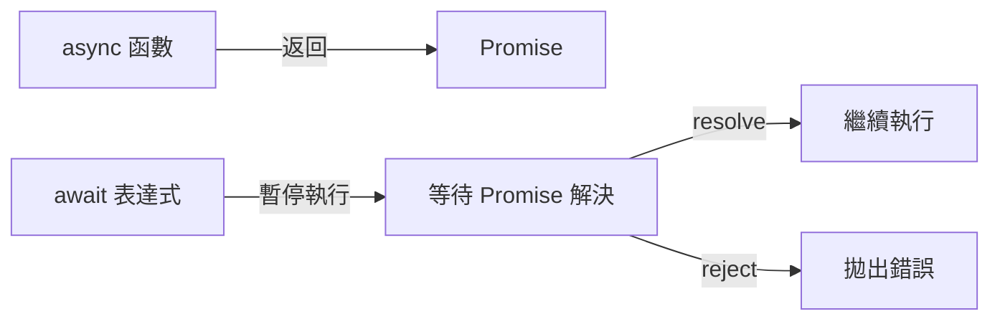
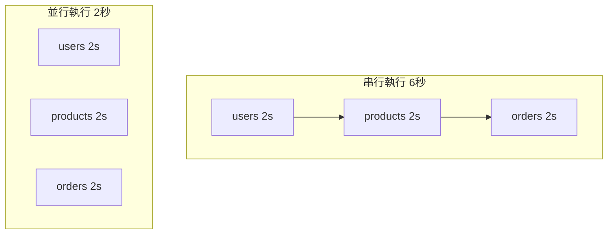

# 12.1.4 像寫同步一樣寫異步——async/await 語法：同步風格的異步編程

### 一句話破題

`async/await` 是 Promise 的語法糖，它讓異步代碼看起來像同步代碼，讀起來像散文，調起來不想死。

### 核心價值

`async/await` 是現代 JavaScript 異步編程的首選方式：

1. **可讀性極佳**：代碼從上往下讀，邏輯一目瞭然
2. **錯誤處理簡單**：用熟悉的 `try/catch` 替代 `.catch()`
3. **調試友好**：可以像同步代碼一樣設置斷點
4. **與 Promise 完全兼容**：`async` 函數返回 Promise，`await` 解包 Promise

### 本質還原：async/await 的底層機制



**關鍵理解**：
- `async` 函數**總是**返回一個 Promise
- `await` 會**暫停**函數執行，直到 Promise 解決
- 暫停期間，事件循環可以執行其他任務（非阻塞）

### 從 Promise 到 async/await

```javascript
// Promise 風格
function getUserData(userId) {
    return getUser(userId)
        .then((user) => getOrders(user.id))
        .then((orders) => getProducts(orders[0].productId))
        .then((product) => {
            return { product };
        });
}

// async/await 風格（完全等價）
async function getUserData(userId) {
    const user = await getUser(userId);
    const orders = await getOrders(user.id);
    const product = await getProducts(orders[0].productId);
    return { product };
}
```

兩者在功能上完全等價，但 `async/await` 版本明顯更易讀。

### 錯誤處理：try/catch 的迴歸

```javascript
async function fetchData() {
    try {
        const user = await getUser(userId);
        const orders = await getOrders(user.id);
        return { user, orders };
    } catch (error) {
        // 統一處理任何一步的錯誤
        console.error('獲取數據失敗:', error);
        throw error; // 可選：繼續向上拋出
    } finally {
        // 清理操作
        console.log('請求結束');
    }
}
```

### 並行執行：不要過度 await

**常見錯誤**：串行執行本可並行的操作

```javascript
// ❌ 串行執行，總耗時 = 各操作耗時之和
async function fetchAll() {
    const users = await fetch('/api/users');       // 2s
    const products = await fetch('/api/products'); // 2s
    const orders = await fetch('/api/orders');     // 2s
    // 總耗時：6s
}

// ✅ 並行執行，總耗時 = 最慢操作的耗時
async function fetchAll() {
    const [users, products, orders] = await Promise.all([
        fetch('/api/users'),      // 2s
        fetch('/api/products'),   // 2s ← 並行
        fetch('/api/orders')      // 2s
    ]);
    // 總耗時：2s
}
```



### 在循環中使用 async/await

```javascript
// ❌ 錯誤：forEach 不會等待 async 回調
const ids = [1, 2, 3];
ids.forEach(async (id) => {
    const data = await fetchData(id);
    console.log(data);
});
console.log('完成'); // 這行會先執行！

// ✅ 正確：串行處理
for (const id of ids) {
    const data = await fetchData(id);
    console.log(data);
}
console.log('完成'); // 所有請求完成後執行

// ✅ 正確：並行處理
const results = await Promise.all(
    ids.map((id) => fetchData(id))
);
console.log('完成');
```

### 頂層 await

在 ES 模塊中，可以直接使用頂層 `await`：

```javascript
// config.mjs
const response = await fetch('/api/config');
export const config = await response.json();

// app.mjs
import { config } from './config.mjs';
console.log(config); // 已經是解析後的數據
```

**注意**：頂層 `await` 只能在 ES 模塊中使用，不能在 CommonJS 或普通腳本中使用。

### AI 協作指南

與 AI 協作編寫異步代碼時：

- **核心意圖**：明確告訴 AI 操作之間的依賴關係——哪些必須串行，哪些可以並行。
- **需求定義公式**：`"請實現一個 async 函數，先獲取用戶信息，然後並行獲取用戶的訂單和收藏列表，最後合併返回。"`
- **關鍵術語**：`async/await`、`Promise.all`、`串行 (sequential)`、`並行 (parallel)`、`try/catch`

**審查要點**：

1. 有無不必要的串行 `await`？能否用 `Promise.all` 優化？
2. 錯誤處理是否完整？是否有未捕獲的 Promise rejection？
3. 循環中的 `await` 是否符合預期（串行 vs 並行）？
4. 是否正確理解了 `async` 函數的返回值是 Promise？

### 避坑指南

- **不要在 `forEach` 中使用 `await`**：`forEach` 不會等待 async 回調完成。使用 `for...of` 或 `Promise.all` + `map`。
- **記住 `async` 函數返回 Promise**：調用 `async` 函數後，如果不 `await`，代碼會繼續執行而不等待結果。
- **避免 `await` 嵌套**：如果發現自己在寫 `await (await ...)`，說明代碼結構可能有問題。
- **Top-level await 需要 ES 模塊**：在 Node.js 中，需要使用 `.mjs` 擴展名或在 `package.json` 中設置 `"type": "module"`。
