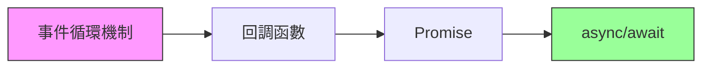

# 12.1 爲什麼 JS 能一心多用——Node 進程與事件循環：回調/Promise/async-await

### 一句話破題

JavaScript 是**單線程**語言，卻能同時處理網絡請求、文件讀寫、用戶交互——這一切的祕密，都藏在**事件循環**這個"任務調度員"身上。

### 核心價值

理解事件循環，是從"會寫異步代碼"到"能調試異步 Bug"的分水嶺。當你遇到以下問題時，事件循環就是你的診斷工具：

- 爲什麼 `setTimeout(fn, 0)` 不會立即執行？
- 爲什麼 `Promise.then` 比 `setTimeout` 先執行？
- 爲什麼頁面會"卡死"？
- 爲什麼數據庫查詢後拿到的是 `undefined`？

### 本章導覽

本節將從底層機制出發，帶你理解 JavaScript 異步編程的演進之路：

1. **事件循環機制**：理解 Call Stack、Event Queue、微任務與宏任務的調度規則。
2. **回調函數**：異步編程的起點，以及它帶來的"回調地獄"問題。
3. **Promise**：用鏈式調用解決嵌套問題，並引入統一的錯誤處理。
4. **async/await**：讓異步代碼"看起來像同步"，提升可讀性和可維護性。

### 爲什麼 Vibe Coder 必須懂這些？

在 AI 輔助編程的時代，你可以讓 AI 幫你寫異步代碼。但當代碼出問題時，AI 給出的解釋往往是"照本宣科"的。**只有你真正理解事件循環，才能在 AI 的建議中識別出正確的方向，而非盲目接受一個"看起來合理"的答案。**

> 面對 AI 生成的異步代碼，你的核心審查點是：
> - 這段代碼的執行順序是否符合預期？
> - 是否存在競態條件？
> - 錯誤是否被正確捕獲？
