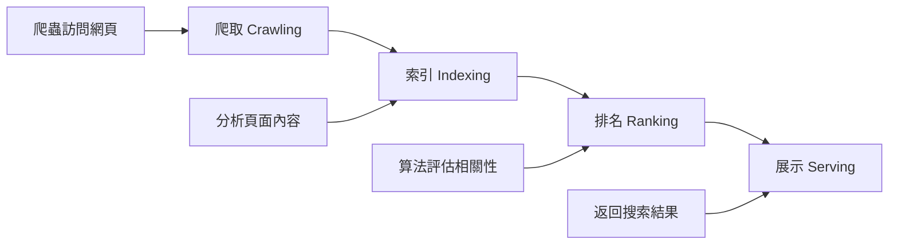
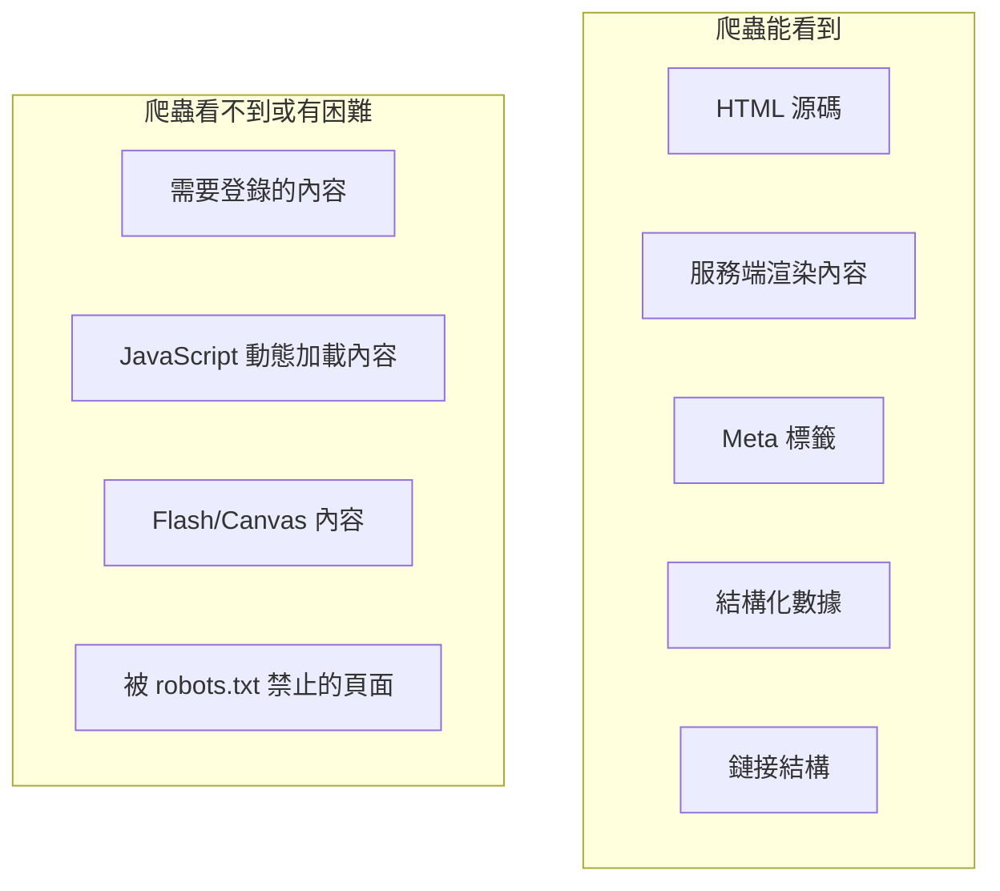

# 12.2.1 搜索引擎如何工作——搜索引擎優化基礎：爬蟲與索引原理

### 一句話破題

搜索引擎通過"爬蟲"抓取網頁、"索引"整理內容、"排名"決定展示順序——理解這三步，就掌握了 SEO 優化的底層邏輯。

### 本質還原：搜索引擎的工作流程



#### 1. 爬取階段

搜索引擎的"爬蟲"（如 Googlebot、Baiduspider）是一個自動化程序，它會：

1. 從已知頁面的鏈接出發，發現新頁面
2. 請求頁面的 HTML 內容
3. 解析 HTML，提取文本、鏈接、圖片等信息
4. 將發現的新鏈接加入待爬取隊列

**關鍵點**：
- 爬蟲主要看的是 **HTML 源碼**，而不是渲染後的頁面
- 現代爬蟲（如 Googlebot）可以執行 JavaScript，但有延遲和限制
- 爬蟲會遵守 `robots.txt` 的規則

#### 2. 索引階段

爬取到的內容會被處理並存入"索引庫"：

- **內容分析**：提取關鍵詞、識別頁面主題
- **去重處理**：識別並過濾重複內容
- **質量評估**：判斷頁面的權威性、原創性
- **關係建立**：理解頁面之間的鏈接關係

#### 3. 排名階段

當用戶搜索時，搜索引擎會從索引庫中找出相關頁面，並根據數百個因素進行排名：

- **內容相關性**：頁面內容與搜索詞的匹配程度
- **頁面質量**：內容的深度、原創性、更新頻率
- **用戶體驗**：加載速度、移動端適配、交互體驗
- **外部信號**：其他網站的鏈接（外鏈）、社交分享

### 爬蟲眼中的你的網頁



### robots.txt：與爬蟲的"君子協定"

`robots.txt` 是放在網站根目錄的文件，用於告訴爬蟲哪些內容可以抓取：

```txt
# 允許所有爬蟲訪問所有內容
User-agent: *
Allow: /

# 禁止爬蟲訪問管理後臺
Disallow: /admin/

# 指定站點地圖位置
Sitemap: https://example.com/sitemap.xml
```

### AI 協作指南

- **核心意圖**：讓 AI 幫你生成 `robots.txt` 或檢查現有配置是否合理。
- **需求定義公式**：`"請幫我生成一個 robots.txt 文件，允許搜索引擎抓取所有公開頁面，但禁止抓取 /api/ 和 /admin/ 目錄。"`
- **關鍵術語**：`robots.txt`、`User-agent`、`Disallow`、`Sitemap`、`noindex`

### 避坑指南

- **不要屏蔽 CSS 和 JS**：現代爬蟲需要這些資源來正確渲染頁面。
- **注意 noindex 和 Disallow 的區別**：`Disallow` 阻止爬取，`noindex` 阻止索引。被 Disallow 的頁面如果有外鏈指向，仍可能被索引。
- **定期檢查爬取狀態**：使用 Google Search Console 或百度站長工具監控爬蟲行爲。
