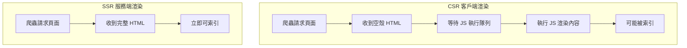

# 12.2.2 SSR 對 SEO 的好處——SSR 優勢：首屏渲染與 SEO 友好

### 一句話破題

SSR 讓搜索引擎爬蟲"一眼就能看到"頁面的完整內容，而不是一堆等待 JavaScript 執行的空標籤。

### 認知重構：爬蟲不是瀏覽器

雖然現代搜索引擎（如 Google）的爬蟲已經能執行 JavaScript，但這個過程存在顯著的**延遲和不確定性**：

1. **兩階段爬取**：先抓取 HTML，稍後才執行 JS 並重新處理
2. **渲染隊列**：JS 渲染需要排隊，可能延遲數小時甚至數天
3. **資源限制**：爬蟲對 JS 執行時間和資源有限制
4. **兼容性問題**：某些 JS 特性可能不被完全支持

### 本質還原：CSR vs SSR 的 SEO 差異



**CSR 返回的 HTML**：

```html
<!DOCTYPE html>
<html>
<body>
  <div id="root"></div>
  <script src="/bundle.js"></script>
</body>
</html>
```

爬蟲第一時間看到的只是一個空的 `<div>`。

**SSR 返回的 HTML**：

```html
<!DOCTYPE html>
<html>
<body>
  <div id="root">
    <h1>歡迎來到我的博客</h1>
    <article>
      <h2>如何學習 Next.js</h2>
      <p>Next.js 是一個強大的 React 框架...</p>
    </article>
  </div>
</body>
</html>
```

爬蟲立即就能看到完整的內容結構。

### Next.js 中的 SEO 友好實踐

Next.js 的 App Router 默認使用服務器組件，天然對 SEO 友好：

```tsx
// app/blog/[slug]/page.tsx
import { Metadata } from 'next';

// 動態生成 Meta 信息
export async function generateMetadata({ params }): Promise<Metadata> {
  const post = await getPost(params.slug);
  return {
    title: post.title,
    description: post.excerpt,
    openGraph: {
      title: post.title,
      images: [post.coverImage],
    },
  };
}

// 服務端渲染頁面內容
export default async function BlogPost({ params }) {
  const post = await getPost(params.slug);
  
  return (
    <article>
      <h1>{post.title}</h1>
      <div dangerouslySetInnerHTML={{ __html: post.content }} />
    </article>
  );
}
```

### 什麼時候用 SSR，什麼時候用 CSR？

| 場景 | 推薦方案 | 原因 |
|------|----------|------|
| 博客、新聞、產品頁 | SSR/SSG | 需要被搜索引擎索引 |
| 用戶儀表盤 | CSR | 無需 SEO，需要登錄 |
| 電商商品頁 | SSR + ISR | 需要 SEO，內容定期更新 |
| 即時聊天 | CSR | 高度動態，無需索引 |

### AI 協作指南

- **核心意圖**：讓 AI 幫你判斷頁面應該使用哪種渲染策略，並生成相應的代碼。
- **需求定義公式**：`"這是一個博客文章頁面，需要對 SEO 友好。請使用 Next.js App Router 的服務器組件實現，幷包含動態 Meta 標籤。"`
- **關鍵術語**：`SSR`、`generateMetadata`、`服務器組件`、`靜態生成 (SSG)`、`ISR`

**審查要點**：

1. 頁面的核心內容是否在服務端渲染？
2. `'use client'` 指令是否只用在真正需要客戶端交互的組件上？
3. 動態 Meta 標籤是否正確反映頁面內容？

### 避坑指南

- **不要過度使用 `'use client'`**：這會讓組件變成客戶端渲染，影響 SEO。
- **注意數據獲取時機**：在服務器組件中獲取數據，確保內容在首次渲染時就存在。
- **測試爬蟲視角**：使用 Google Search Console 的"URL 檢查"工具查看頁面在爬蟲眼中的樣子。
