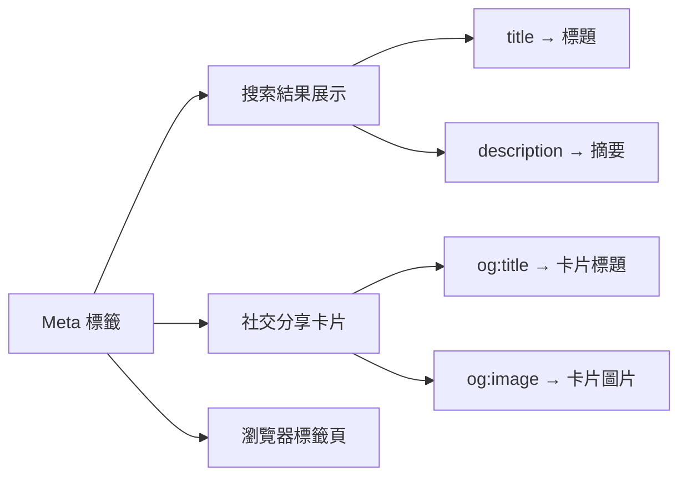

# 12.2.3 網頁的身份證——Meta 標籤：title/description/keywords

### 一句話破題

Meta 標籤是網頁的"身份證"，它告訴搜索引擎和社交平臺"我是誰、我有什麼內容"，直接影響搜索結果的展示和點擊率。

### 核心價值

Meta 標籤雖然不直接影響排名權重，但它決定了用戶在搜索結果中看到什麼：

1. **Title 標籤**：顯示在搜索結果的標題位置，是用戶第一眼看到的內容
2. **Description 標籤**：顯示在標題下方的描述文字，影響用戶是否點擊
3. **Open Graph 標籤**：控制在社交媒體分享時的展示效果

### 本質還原：Meta 標籤的工作原理



### 核心 Meta 標籤詳解

```html
<head>
  <!-- 基礎 Meta 標籤 -->
  <title>如何學習 Next.js - Vibe Coding 教程</title>
  <meta name="description" content="從零開始學習 Next.js，掌握服務端渲染、App Router 等核心概念。適合前端開發者的進階教程。">
  <meta name="keywords" content="Next.js,React,SSR,前端開發">
  
  <!-- Open Graph 標籤（社交分享） -->
  <meta property="og:title" content="如何學習 Next.js">
  <meta property="og:description" content="從零開始學習 Next.js 的完整教程">
  <meta property="og:image" content="https://example.com/og-image.jpg">
  <meta property="og:type" content="article">
  
  <!-- Twitter 卡片 -->
  <meta name="twitter:card" content="summary_large_image">
  <meta name="twitter:title" content="如何學習 Next.js">
  <meta name="twitter:image" content="https://example.com/twitter-image.jpg">
</head>
```

### 最佳實踐：Title 標籤

| 要素 | 建議 | 示例 |
|------|------|------|
| 長度 | 50-60 字符（中文約 25-30 字） | ✅ 適中 |
| 結構 | 核心關鍵詞 - 補充信息 - 品牌名 | `Next.js 入門教程 - 從零到一 | Vibe Coding` |
| 唯一性 | 每個頁面的 title 必須不同 | ❌ 不要所有頁面用同一個 title |
| 關鍵詞 | 核心關鍵詞靠前 | ✅ `Next.js 教程` 而非 `教程 Next.js` |

### 最佳實踐：Description 標籤

| 要素 | 建議 |
|------|------|
| 長度 | 120-160 字符（中文約 60-80 字） |
| 內容 | 簡潔概括頁面核心內容，包含 1-2 個關鍵詞 |
| 行動召喚 | 可以包含引導性語言，如"瞭解更多"、"立即學習" |
| 唯一性 | 每個頁面應有獨特的描述 |

### Next.js 中的 Meta 標籤管理

```tsx
// app/layout.tsx - 全局默認 Meta
import { Metadata } from 'next';

export const metadata: Metadata = {
  title: {
    default: 'Vibe Coding 教程',
    template: '%s | Vibe Coding', // 子頁面會自動套用此模板
  },
  description: '從零開始學習全棧開發',
  openGraph: {
    siteName: 'Vibe Coding',
    locale: 'zh_CN',
    type: 'website',
  },
};

// app/blog/[slug]/page.tsx - 動態頁面 Meta
export async function generateMetadata({ params }): Promise<Metadata> {
  const post = await getPost(params.slug);
  
  return {
    title: post.title, // 會變成 "文章標題 | Vibe Coding"
    description: post.excerpt,
    openGraph: {
      title: post.title,
      description: post.excerpt,
      images: [
        {
          url: post.coverImage,
          width: 1200,
          height: 630,
          alt: post.title,
        },
      ],
    },
  };
}
```

### AI 協作指南

- **核心意圖**：讓 AI 爲特定頁面生成合適的 Meta 標籤。
- **需求定義公式**：`"請爲這篇關於 [主題] 的博客文章生成 SEO 友好的 Meta 標籤，包括 title、description 和 Open Graph 標籤。目標關鍵詞是 [關鍵詞]。"`
- **關鍵術語**：`Metadata`、`generateMetadata`、`Open Graph`、`Twitter Card`

**審查要點**：

1. title 是否簡潔且包含核心關鍵詞？
2. description 是否準確概括頁面內容？
3. og:image 是否設置且尺寸正確（建議 1200x630）？
4. 每個頁面的 Meta 是否唯一？

### 避坑指南

- **不要堆砌關鍵詞**：`keywords` 標籤已被大多數搜索引擎忽略，堆砌關鍵詞可能被視爲作弊。
- **Description 不要複製正文**：應該是精心編寫的摘要，而非直接截取正文。
- **注意特殊字符**：引號、尖括號等需要正確轉義。
- **測試社交分享**：使用 Facebook Sharing Debugger 或 Twitter Card Validator 測試分享效果。
