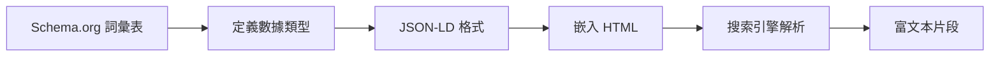

# 12.2.5 幫爬蟲看懂內容——結構化數據：Schema.org 與 JSON-LD

### 一句話破題

結構化數據是一種"語義標記"，它用搜索引擎能理解的格式描述頁面內容，從而讓你的網站在搜索結果中展示富文本片段，獲得更高的點擊率。

### 核心價值

結構化數據可以讓搜索結果變得更"豐富"：

1. **富文本片段**：顯示評分、價格、作者等額外信息
2. **知識面板**：在搜索結果右側展示詳細信息卡片
3. **精選摘要**：內容被直接展示在搜索結果頂部
4. **語音搜索**：更容易被語音助手引用

### 本質還原：Schema.org 與 JSON-LD

**Schema.org** 是由 Google、Bing、Yahoo 等搜索引擎共同維護的詞彙表，定義了數百種內容類型和屬性。

**JSON-LD** 是在 HTML 中嵌入結構化數據的推薦格式，它是一段 JSON 腳本，放在 `<script type="application/ld+json">` 標籤中。



### 常見結構化數據類型

#### 文章

```json
{
  "@context": "https://schema.org",
  "@type": "Article",
  "headline": "如何學習 Next.js",
  "author": {
    "@type": "Person",
    "name": "Vibe Coder"
  },
  "datePublished": "2024-01-15",
  "dateModified": "2024-01-20",
  "image": "https://example.com/images/nextjs-cover.jpg",
  "publisher": {
    "@type": "Organization",
    "name": "Vibe Coding",
    "logo": {
      "@type": "ImageObject",
      "url": "https://example.com/logo.png"
    }
  }
}
```

#### 產品

```json
{
  "@context": "https://schema.org",
  "@type": "Product",
  "name": "Next.js 實戰課程",
  "image": "https://example.com/course.jpg",
  "description": "從零到一學習 Next.js 全棧開發",
  "offers": {
    "@type": "Offer",
    "price": "99.00",
    "priceCurrency": "CNY",
    "availability": "https://schema.org/InStock"
  },
  "aggregateRating": {
    "@type": "AggregateRating",
    "ratingValue": "4.8",
    "reviewCount": "256"
  }
}
```

#### FAQ

```json
{
  "@context": "https://schema.org",
  "@type": "FAQPage",
  "mainEntity": [
    {
      "@type": "Question",
      "name": "Next.js 是什麼？",
      "acceptedAnswer": {
        "@type": "Answer",
        "text": "Next.js 是一個基於 React 的全棧 Web 框架，支持服務端渲染、靜態生成等多種渲染模式。"
      }
    }
  ]
}
```

### Next.js 中添加結構化數據

```tsx
// app/blog/[slug]/page.tsx
export default async function BlogPost({ params }) {
  const post = await getPost(params.slug);
  
  const jsonLd = {
    '@context': 'https://schema.org',
    '@type': 'Article',
    headline: post.title,
    author: {
      '@type': 'Person',
      name: post.author.name,
    },
    datePublished: post.publishedAt,
    dateModified: post.updatedAt,
    image: post.coverImage,
  };

  return (
    <>
      <script
        type="application/ld+json"
        dangerouslySetInnerHTML={{ __html: JSON.stringify(jsonLd) }}
      />
      <article>
        <h1>{post.title}</h1>
        {/* ... */}
      </article>
    </>
  );
}
```

### 驗證結構化數據

使用 Google 的工具驗證你的結構化數據：

1. **Rich Results Test**：測試是否能生成富文本片段
2. **Schema Markup Validator**：驗證語法是否正確

### AI 協作指南

- **核心意圖**：讓 AI 爲特定頁面類型生成合適的結構化數據。
- **需求定義公式**：`"請爲這個博客文章頁面生成 JSON-LD 格式的結構化數據，類型是 Article，需要包含作者、發佈時間、封面圖片等信息。"`
- **關鍵術語**：`Schema.org`、`JSON-LD`、`@type`、`Rich Snippets`、`結構化數據`

**審查要點**：

1. `@context` 和 `@type` 是否正確？
2. 必填字段是否完整？
3. 數據與頁面實際內容是否一致？
4. 日期格式是否正確（ISO 8601）？

### 避坑指南

- **數據必須與頁面內容一致**：虛假的結構化數據可能導致懲罰。
- **不要過度標記**：只標記頁面的核心內容，不要標記廣告或無關內容。
- **測試後再上線**：使用驗證工具確保沒有語法錯誤。
- **關注警告信息**：即使驗證通過，也要注意警告信息，它們可能影響富文本片段的展示。
