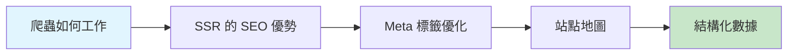

# 12.2 如何讓谷歌/百度搜到你——SEO：SSR/Meta/站點地圖/結構化數據

### 一句話破題

SEO 是讓搜索引擎"讀懂"你的網站、並願意把它推薦給用戶的技術。對於想要獲得自然流量的產品來說，這是一項必修課。

### 核心價值

在流量越來越貴的今天，SEO 是少數"免費"的流量來源之一。做好 SEO 意味着：

1. **自然曝光**：用戶主動搜索時找到你，轉化意向更強
2. **長期收益**：一次優化，持續獲客
3. **品牌可信度**：排名靠前的網站更容易獲得用戶信任
4. **降低獲客成本**：相比付費廣告，SEO 的邊際成本趨近於零

### 本章導覽

1. **搜索引擎爬蟲**：理解爬蟲的工作原理和"看頁面"的方式
2. **SSR 與 SEO**：爲什麼服務端渲染對 SEO 至關重要
3. **Meta 標籤**：網頁的"身份證"——title、description、keywords
4. **站點地圖**：給爬蟲畫一張網站的"導遊圖"
5. **結構化數據**：用 Schema.org 幫爬蟲"深度理解"你的內容

### 爲什麼 Vibe Coder 需要關注 SEO？

AI 可以幫你生成技術上正確的代碼，但 SEO 是一門需要**理解搜索引擎和用戶意圖**的學問。你需要：

- 知道哪些內容應該被索引，哪些不應該
- 理解不同渲染策略對 SEO 的影響
- 能夠審查 AI 生成的 Meta 標籤是否恰當

> **核心審查點**：AI 生成的頁面是否對搜索引擎友好？首屏內容是服務端渲染還是客戶端渲染？Meta 信息是否準確反映頁面內容？
