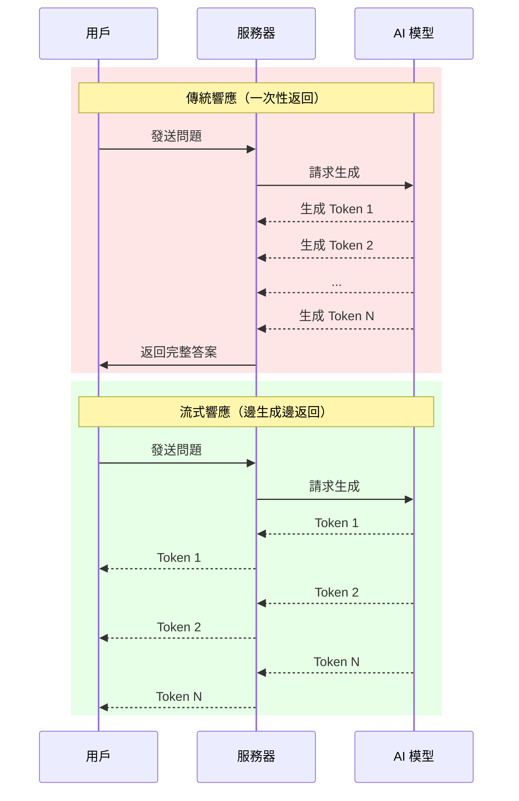

# 12.3.1 AI 應用的核心模式——流式響應原理：爲什麼需要 Streaming UI

### 一句話破題

流式響應讓 AI 的回答像"打字機"一樣逐字出現，將用戶的等待焦慮轉化爲閱讀體驗，這是現代 AI 應用的核心交互模式。

### 認知重構：爲什麼等待 5 秒感覺像 50 秒

當你向 ChatGPT 提問時，模型實際上是**逐個 Token 生成**答案的。傳統的 HTTP 請求會等待所有 Token 生成完畢後才返回，這意味着：

- 用戶需要盯着空白屏幕等待數秒
- 如果回答很長，等待時間可能超過 10 秒
- 用戶無法判斷請求是否卡住了

流式響應的做法是：**一邊生成，一邊返回**。

### 本質還原：傳統響應 vs 流式響應



### 技術實現：Server-Sent Events

流式響應通常基於 **Server-Sent Events (SSE)** 或 **WebSocket** 實現。Vercel AI SDK 默認使用 SSE：

```javascript
// 服務端發送的格式
data: {"content": "你"}
data: {"content": "好"}
data: {"content": "！"}
data: [DONE]
```

客戶端通過 `EventSource` 或 `fetch` + `ReadableStream` 接收：

```javascript
const response = await fetch('/api/chat', {
  method: 'POST',
  body: JSON.stringify({ message: 'Hello' }),
});

const reader = response.body.getReader();
const decoder = new TextDecoder();

while (true) {
  const { done, value } = await reader.read();
  if (done) break;
  
  const text = decoder.decode(value);
  console.log(text); // 逐步輸出
}
```

### 用戶體驗的質變

| 指標 | 傳統響應 | 流式響應 |
|------|----------|----------|
| 首字節時間 | 5-10 秒 | < 1 秒 |
| 感知等待時間 | 很長 | 幾乎無感 |
| 中斷能力 | 無法中斷 | 可隨時停止 |
| 錯誤反饋 | 超時後才知道 | 即時感知 |

### 流式響應的挑戰

雖然流式響應體驗更好，但也帶來了一些技術挑戰：

1. **狀態管理**：需要追蹤"正在生成"、"已完成"、"發生錯誤"等狀態
2. **錯誤處理**：流式傳輸中途出錯如何恢復？
3. **渲染性能**：頻繁更新 DOM 可能導致卡頓
4. **取消機制**：用戶中途取消如何優雅處理？

這些問題，Vercel AI SDK 都提供瞭解決方案。

### AI 協作指南

- **核心意圖**：讓 AI 幫你理解或實現流式響應的底層機制。
- **需求定義公式**：`"請解釋 Server-Sent Events 如何工作，並給出一個 Next.js 中實現流式 AI 響應的基礎示例。"`
- **關鍵術語**：`SSE`、`ReadableStream`、`TextDecoder`、`流式傳輸 (streaming)`

### 避坑指南

- **不要忘記處理連接中斷**：網絡不穩定時，流可能意外關閉。
- **注意內存管理**：長時間的流式響應可能累積大量數據。
- **測試弱網環境**：流式響應在弱網下可能表現異常。
