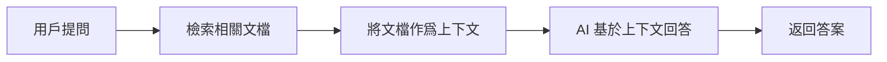

# 12.3.5 高級應用場景——RAG 與多模態：檢索增強生成與圖文混合

### 一句話破題

RAG 讓 AI 能"查閱資料"後回答問題，多模態讓 AI 能"看圖說話"——這兩項技術大幅擴展了 AI 應用的能力邊界。

### RAG：檢索增強生成

#### 什麼是 RAG？



RAG 的核心思想是：**先搜索，再回答**。這解決了 AI 知識過時、無法訪問私有數據等問題。

#### 基礎實現

```typescript
// app/api/chat/route.ts
import { openai } from '@ai-sdk/openai';
import { streamText } from 'ai';
import { searchDocuments } from '@/lib/search'; // 你的搜索邏輯

export async function POST(req: Request) {
  const { messages } = await req.json();
  
  // 獲取用戶最新問題
  const lastMessage = messages[messages.length - 1];
  
  // 檢索相關文檔
  const relevantDocs = await searchDocuments(lastMessage.content);
  
  // 構建上下文
  const context = relevantDocs
    .map((doc) => `---\n${doc.title}\n${doc.content}\n---`)
    .join('\n');

  const result = streamText({
    model: openai('gpt-4o'),
    system: `你是一個知識助手。請根據以下資料回答用戶問題。如果資料中沒有相關信息，請誠實地說不知道。

參考資料：
${context}`,
    messages,
  });

  return result.toDataStreamResponse();
}
```

#### 向量搜索

更高級的 RAG 實現會使用向量數據庫進行語義搜索：

```typescript
import { embed } from 'ai';
import { openai } from '@ai-sdk/openai';

// 生成文本嵌入
async function getEmbedding(text: string) {
  const { embedding } = await embed({
    model: openai.embedding('text-embedding-3-small'),
    value: text,
  });
  return embedding;
}

// 在向量數據庫中搜索
async function semanticSearch(query: string) {
  const queryEmbedding = await getEmbedding(query);
  
  // 使用 Pinecone、Supabase Vector 等進行相似度搜索
  const results = await vectorDB.search(queryEmbedding, { topK: 5 });
  
  return results;
}
```

### 多模態：圖文混合

#### 發送圖片給 AI

```typescript
// app/api/vision/route.ts
import { openai } from '@ai-sdk/openai';
import { streamText } from 'ai';

export async function POST(req: Request) {
  const { messages } = await req.json();

  const result = streamText({
    model: openai('gpt-4o'), // 支持視覺的模型
    messages: messages.map((m) => ({
      role: m.role,
      content: m.image
        ? [
            { type: 'text', text: m.content },
            { type: 'image', image: m.image }, // base64 或 URL
          ]
        : m.content,
    })),
  });

  return result.toDataStreamResponse();
}
```

#### 前端上傳圖片

```tsx
'use client';

import { useChat } from 'ai/react';
import { useState } from 'react';

export default function VisionChat() {
  const { messages, append, isLoading } = useChat();
  const [input, setInput] = useState('');
  const [image, setImage] = useState<string | null>(null);

  const handleImageUpload = (e: React.ChangeEvent<HTMLInputElement>) => {
    const file = e.target.files?.[0];
    if (file) {
      const reader = new FileReader();
      reader.onloadend = () => {
        setImage(reader.result as string);
      };
      reader.readAsDataURL(file);
    }
  };

  const handleSubmit = () => {
    if (!input.trim() && !image) return;
    
    append({
      role: 'user',
      content: input,
      // 擴展字段，需要在 API 端處理
      data: { image },
    });
    
    setInput('');
    setImage(null);
  };

  return (
    <div>
      {/* 消息列表 */}
      
      <div className="flex gap-2 p-4">
        <input
          type="file"
          accept="image/*"
          onChange={handleImageUpload}
          className="hidden"
          id="image-upload"
        />
        <label htmlFor="image-upload" className="cursor-pointer">
          📎
        </label>
        
        {image && (
          
        )}
        
        <input
          value={input}
          onChange={(e) => setInput(e.target.value)}
          placeholder="描述這張圖片..."
          className="flex-1 p-2 border rounded"
        />
        
        <button onClick={handleSubmit} disabled={isLoading}>
          發送
        </button>
      </div>
    </div>
  );
}
```

### AI 協作指南

- **核心意圖**：讓 AI 幫你實現 RAG 或多模態功能。
- **需求定義公式**：
  - RAG：`"請幫我實現一個基於向量搜索的 RAG 系統，使用 Supabase 作爲向量數據庫，用戶可以上傳 PDF 文檔並進行問答。"`
  - 多模態：`"請幫我實現一個支持圖片上傳的 AI 聊天界面，用戶可以上傳圖片並詢問圖片內容。"`
- **關鍵術語**：`RAG`、`embedding`、`向量搜索`、`多模態 (multimodal)`、`vision`

### 避坑指南

- **RAG 的檢索質量決定回答質量**：垃圾進，垃圾出。
- **圖片大小限制**：大圖片會消耗大量 Token，建議壓縮後上傳。
- **向量數據庫選擇**：考慮成本、性能和易用性的平衡。
- **上下文窗口限制**：檢索的文檔不能太長，否則會超出模型限制。
