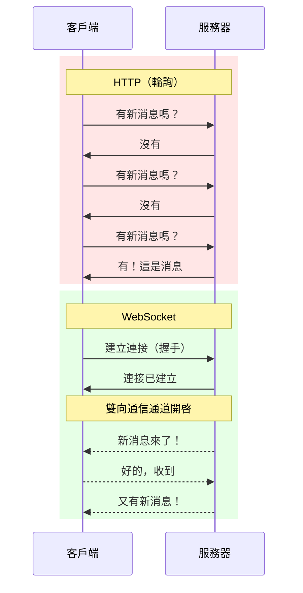

# 12.4.1 爲什麼需要即時通信——WebSocket vs HTTP：長連接的優勢

### 一句話破題

HTTP 是"你問我答"，WebSocket 是"保持通話"——後者讓服務器能在任何時候主動給你發消息。

### 本質還原：兩種通信模式



### HTTP 輪詢的問題

```javascript
// 輪詢：每秒詢問一次有沒有新消息
setInterval(async () => {
  const response = await fetch('/api/messages');
  const messages = await response.json();
  updateUI(messages);
}, 1000);
```

問題：
- **浪費資源**：大多數請求返回"沒有新消息"
- **延遲高**：最壞情況下延遲 = 輪詢間隔
- **服務器壓力**：1000 用戶 × 每秒 1 次 = 1000 QPS

### WebSocket 的優勢

```javascript
// WebSocket：建立一次連接，持續接收消息
const ws = new WebSocket('wss://example.com/socket');

ws.onmessage = (event) => {
  const message = JSON.parse(event.data);
  updateUI(message);
};

// 發送消息也很簡單
ws.send(JSON.stringify({ text: 'Hello!' }));
```

| 特性 | HTTP 輪詢 | WebSocket |
|------|----------|-----------|
| 連接方式 | 每次請求新連接 | 持久連接 |
| 通信方向 | 單向（客戶端發起） | 雙向 |
| 即時性 | 取決於輪詢間隔 | 毫秒級 |
| 資源消耗 | 高 | 低 |
| 服務器推送 | 不支持 | 原生支持 |

### WebSocket 握手過程

WebSocket 連接從 HTTP 升級開始：

```
// 客戶端請求
GET /socket HTTP/1.1
Host: example.com
Upgrade: websocket
Connection: Upgrade
Sec-WebSocket-Key: dGhlIHNhbXBsZSBub25jZQ==
Sec-WebSocket-Version: 13

// 服務器響應
HTTP/1.1 101 Switching Protocols
Upgrade: websocket
Connection: Upgrade
Sec-WebSocket-Accept: s3pPLMBiTxaQ9kYGzzhZRbK+xOo=
```

握手完成後，連接從 HTTP 升級爲 WebSocket，雙方可以自由發送數據幀。

### 何時使用 WebSocket

| 場景 | 推薦方案 |
|------|----------|
| 即時通訊、聊天 | WebSocket |
| 即時協作編輯 | WebSocket |
| 股票行情、體育比分 | WebSocket / SSE |
| 表單提交、API 調用 | HTTP |
| 文件下載 | HTTP |
| 偶爾獲取數據（間隔 > 30s） | HTTP |

### AI 協作指南

- **核心意圖**：讓 AI 幫你理解何時以及如何使用 WebSocket。
- **需求定義公式**：`"請解釋 WebSocket 和 HTTP 長輪詢的區別，並說明在什麼場景下應該選擇哪種方案。"`
- **關鍵術語**：`WebSocket`、`握手 (handshake)`、`全雙工 (full-duplex)`、`持久連接 (persistent connection)`

### 避坑指南

- **不要爲所有場景都用 WebSocket**：簡單的 CRUD 操作用 HTTP 更合適。
- **注意連接限制**：瀏覽器對單個域名的 WebSocket 連接數有限制。
- **考慮負載均衡**：WebSocket 的長連接對負載均衡有特殊要求（需要 sticky session）。
